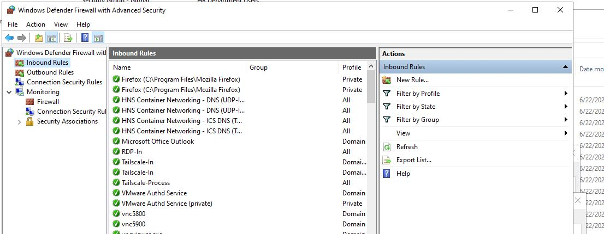

# Project 01 — Server Baseline, Hardening, and Admin Model

**Status:** 🔄 In Progress (Phases 1–6 complete, Phase 7 final documentation pass underway)
**Skill:** `/winserver-p01` — [skills/project-01-server-baseline-hardening.md](../../skills/project-01-server-baseline-hardening.md)

## Actual Server State (Discovered 2026-06-05)

This is NOT a clean install. Live SSH audit of WIN-PRQD8TJG04M revealed:

- **DomainRole: 5** — already promoted as Primary Domain Controller for `Chongong.local`
- **Installed roles:** AD DS, DHCP, DNS, NPS/RADIUS, File Server, Hyper-V (13 VMs),
  RDS full farm, IIS, GPMC, RSAT, BitLocker, Containers, WSL
- **AD users:** 10 real users + testuser (enabled, undocumented) + radius-service
- **Computers joined:** WIN-PRQD8TJG04M, RADIUS01, GITEA, 5× DESKTOP machines
- **GPOs:** Only Default Domain Policy + Default Domain Controllers Policy (no custom GPOs)

## Critical Security Gaps Found

| Gap | Severity |
|-----|----------|
| LockoutThreshold = 0 | 🔴 CRITICAL — no account lockout |
| MinPasswordLength = 7 | 🔴 HIGH — too weak |
| RDS full farm on DC | 🟠 HIGH — privilege escalation path |
| IIS on DC | 🟠 HIGH — web exploit = domain exploit |
| No tiered admin accounts | 🟠 HIGH — all admin via builtin Administrator |
| DefaultInboundAction = NotConfigured | 🟡 MEDIUM — firewall not blocking by default |
| No custom GPOs | 🟡 MEDIUM — only defaults exist |

## Objective

Audit, document, harden, and formalize the existing AD environment.
Establish the secure admin model that all future projects depend on.

**Why first:** Everything else — DNS, Hyper-V, NPS, M365 — assumes this foundation is
documented, hardened, and cleanly administered.

## Phases

| # | Phase | Key Action |
|---|-------|------------|
| 1 | Audit Documentation | Document all roles, users, policy, firewall as-found |
| 2 | Fix Password Policy + Lockout | LockoutThreshold→5, MinLength→14, GPO backup first |
| 3 | Tiered Admin Model | adm-leonel (Tier0 DA), srv-leonel (Tier1), PSO for Tier0 |
| 4 | Assess RDS/IIS on DC | Document risk, no changes — migration in Project 08 |
| 5 | Firewall Baseline | Port inventory; RDP/Tailscale deliberately left unrestricted per explicit instruction |
| 6 | Break/Fix Lockout Exercise | testuser lockout confirmed, then quarantined |
| 7 | Document + Push | All scripts saved, GitHub push, mark P01 complete |

## What I Did

I started by auditing `WIN-PRQD8TJG04M` as it actually existed in production —
not a lab box, but the live Primary Domain Controller for `Chongong.local`, already
running AD DS, DNS, DHCP, NPS, RDS, IIS, and Hyper-V hosting 13 VMs. That audit
surfaced the critical gaps listed above, and everything from there was about closing
the dangerous ones without breaking a domain that real accounts already depended on.

**Phase 2 — Password policy and lockout.** I backed up the Default Domain Policy
before touching it, then raised `MinPasswordLength` from 7 to 14, set
`LockoutThreshold` from 0 (meaning accounts could be brute-forced forever) to 5,
and set a 30-minute lockout duration and observation window. I left
`PasswordHistoryCount` and `ComplexityEnabled` as they were since they weren't part
of the identified gaps.

**Phase 3 — Tiered admin model.** I built a `_Admin` OU with four sub-OUs
(`Tier0-DomainAdmins`, `Tier1-ServerAdmins`, `Tier2-WorkstationAdmins`,
`ServiceAccounts`) and created `adm-leonel` (Tier 0, Domain Admins) and `srv-leonel`
(Tier 1, scoped to a dedicated `GG-ServerAdmins` group only — deliberately kept out
of any built-in privileged group). I created a fine-grained password policy,
`PSO-Tier0-Admins`, requiring 20-character minimums and a 3-attempt lockout
threshold for Tier 0 accounts specifically, tighter than the domain default.

While doing this, I found something the original Phase 1 audit had missed entirely:
**Domain Admins had 12 members**, most of them ordinary personal accounts that had
no business holding domain-wide admin rights. With Leonel's explicit approval, I
removed 9 personal accounts and `testuser` from the group — without deleting any of
them, they kept working normally outside Domain Admins — bringing membership down to
exactly 3: the built-in `Administrator`, the new `adm-leonel`, and
`chongong.leonel` (Leonel's day-to-day account, which he made a deliberate, informed
choice to keep in Domain Admins rather than fully separating from admin access).

**Phase 4 — RDS/IIS/NPS risk assessment.** This phase was document-only by design,
so I made zero live changes. I found that the RD Connection Broker reports
unreachable in Server Manager even though the broker process itself is actually
listening locally — a finding I flagged for Project 08 rather than trying to patch
in place on a live PDC. I confirmed IIS exists solely to serve RD Web Access and
RPC-over-HTTPS, not general web hosting. I confirmed NPS has zero custom
configuration — no RADIUS clients, only Windows' stock default policies — which
told me the RADIUS buildout for Project 13 genuinely hasn't started yet. And I
tracked down the mysterious `__vmware__` AD group: it's empty, unmanaged, and tied
to a VMware Workstation installation on the host, so I left it alone and deferred
real investigation to Project 02.

**Phase 5 — Firewall baseline.** I inventoried every TCP and UDP listener on the
host and confirmed the firewall is on across all three profiles with default
behavior unchanged. Leonel explicitly told me to leave RDP and Tailscale exactly as
they are — no scoping, no restriction — so I documented that as a deliberate
decision rather than a gap to "fix" later. Along the way I found two things worth
flagging: the RD Connection Broker process is genuinely running (refining the Phase
4 finding), and there's a VNC server (`winvnc`) with its own explicit, enabled
firewall rules — a second remote-access path into the PDC alongside RDP and
Tailscale that I noted for Leonel to decide on, not something I touched myself.

**Phase 6 — Lockout break/fix exercise.** With explicit approval, I reset
`testuser`'s password (the value was never displayed or stored anywhere), ran one
failed-logon attempt to confirm the mechanism before committing to a full test, then
ran four more to deliberately trigger the lockout policy I'd set in Phase 2. It
locked at exactly the 5th attempt, exactly as configured, and I confirmed Event 4740
logged the lockout correctly. I then unlocked, disabled, created a new `Quarantine`
OU (protected from accidental deletion), and moved `testuser` into it. No AD object
was deleted at any point. I also caught something unplanned: failed-logon events
(4625/4776/4771) aren't appearing in the Security log at all, even though AD
internally tracked the bad password count correctly — a real audit-policy gap I
flagged for whoever picks up GPO or log-forwarding work later, rather than trying to
fix it mid-exercise.

**Phase 7 — Final documentation.** I'm pulling the verified end-state across every
phase, saving the actual scripts I ran, and writing this account of the work. The
last few GUI screenshots (GPMC policy view, ADUC OU/membership tabs, ADAC PSO
settings, the Quarantine OU, and the Event Viewer 4740 entry) are still pending —
once those are in, Project 01 gets marked complete.

Throughout, I worked under a fixed set of guardrails I held myself to: never delete
an AD object, get explicit approval before any live AD or GPO change, and stop and
report on failure rather than retry blindly. Mid-project, Leonel also gave me a
working SSH key to the server, so later phases were executed directly rather than
relayed as PowerShell for him to paste manually — but the approval requirement for
live changes never went away, it just changed who was physically typing the command.

## Evidence — Screenshots

Full-resolution images live in [`screenshots/`](screenshots/). The findings behind
each one are written up in
[`docs/p01-rds-iis-risk-assessment.md`](docs/p01-rds-iis-risk-assessment.md) and
[`docs/p01-phase5-firewall-baseline.md`](docs/p01-phase5-firewall-baseline.md).

**Phase 4 — RDS / IIS / NPS Risk Assessment**

- 
  RDS Overview — RD Connection Broker reported unreachable.
- 
  RDS Servers pool — host shows Online; the broker process is actually listening locally.
- 
  RDS-Users group — broad, cross-department membership.
- 
  IIS Application Pools — all running as the default ApplicationPoolIdentity.
- 
  IIS Default Web Site — bindings on `*:80` and `*:443`.
- 
  IIS app pool Identity column, full and unabbreviated — confirms no named domain accounts.
- 
  NPS Policies overview.
- 
  NPS Connection Request Policies — stock Windows default only.
- 
  RADIUS Clients and Servers overview.
- 
  RADIUS Clients — empty list, confirming NPS buildout hasn't started.
- 
  Remote RADIUS Server Groups — also empty.
- 
  Network Policies — stock default deny rules only.
- 
  Connection Request Policy detail — no custom conditions configured.

**Phase 5 — Firewall Baseline**

- 
  Windows Firewall with Advanced Security — all three profiles on, defaults unchanged.
- 
  Inbound Rules — includes explicit VNC (`vnc5800`/`vnc5900`) and VMware Authd rules.

## STAR Summary

**Situation:** The server was an existing, production-like Primary Domain Controller
with critical security gaps — no account lockout, a weak password policy, no tiered
admin model, and RDS plus IIS both co-located directly on the DC.

**Task:** Audit the as-found state, close the critical gaps, and establish a secure
tiered admin model before any other project in this homelab built on top of this
server.

**Action:** I fixed the password and lockout policy with a GPO backup taken first,
built out a four-tier admin OU structure with dedicated Tier 0/Tier 1 accounts and a
fine-grained password policy for Tier 0, discovered and remediated a Domain Admins
over-provisioning issue that the original audit had missed, documented the RDS/IIS/NPS
risk picture without touching any live role, inventoried the firewall and port surface
while respecting an explicit instruction to leave RDP/Tailscale alone, and proved the
new lockout policy actually works end-to-end by deliberately triggering and then
remediating a lockout on a disposable test account.

**Result:** Six of seven phases are complete and pushed to GitHub with full evidence —
screenshots, PowerShell output, and narrative docs for each. The domain now has a real
lockout policy, a tiered admin model that separates day-to-day and privileged access,
and a documented, honest picture of what's risky on this server and what isn't — plus
a short list of carried-forward items (RD Connection Broker, NPS buildout, the
`__vmware__` group, an audit-logging gap, and an exposed VNC service) handed off to the
specific later projects that own fixing them, rather than patched ad hoc here.
