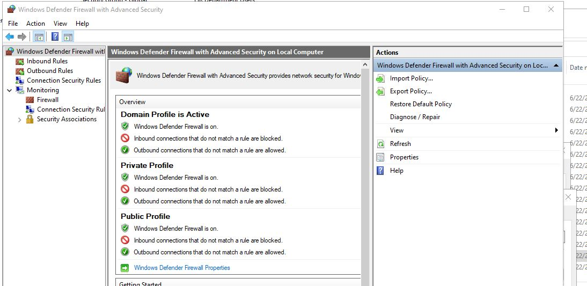

# Project 01 - Server Baseline, Hardening, and Admin Model

| Field | Value |
|-------|-------|
| Status | Complete |
| Completed | 2026-06-23 |
| System | `WIN-PRQD8TJG04M` - live Primary Domain Controller for `Chongong.local` |
| Goal | Secure and document the existing Windows Server foundation before building later projects. |

## Summary

I audited the live Domain Controller, fixed the critical identity gaps, documented risky services, and left larger migrations for the right future projects.

## Starting Problems

| Area | Finding |
|------|---------|
| Passwords | Minimum length was 7 |
| Lockout | Account lockout was disabled |
| Domain Admins | Too many users had Domain Admin rights |
| Admin model | No clean Tier 0 / Tier 1 separation |
| RDS/IIS | Both were running on the Domain Controller |
| Firewall | Remote-access and listener exposure needed review |

## What Changed

| Area | Result | Proof |
|------|--------|-------|
| Password policy | Minimum length now 14 | [Phase 2](docs/p01-phase2-evidence.md) |
| Account lockout | 5 bad attempts, 30-minute lockout | [Phase 2](docs/p01-phase2-evidence.md) |
| Admin model | `_Admin` OU, `adm-leonel`, `srv-leonel`, Tier 0 PSO | [Phase 3](docs/p01-phase3-evidence.md) |
| Domain Admins | Reduced from 12 to 3 approved members | [Phase 3](docs/p01-phase3-evidence.md) |
| RDS/IIS/NPS | Documented only, no roles removed | [Risk assessment](docs/p01-rds-iis-risk-assessment.md) |
| Firewall | TCP/UDP listeners and firewall profile state documented | [Firewall baseline](docs/p01-phase5-firewall-baseline.md) |
| `testuser` | Lockout tested, then account disabled and quarantined | [Break/fix](docs/p01-phase6-lockout-breakfix.md) |

## Project Phases

| Phase | Name | Status |
|-------|------|--------|
| Phase 1 | Audit Documentation | Complete |
| Phase 2 | Password Policy + Lockout | Complete |
| Phase 3 | Tiered Admin Model | Complete |
| Phase 4 | RDS/IIS/NPS Risk Assessment | Complete |
| Phase 5 | Firewall Baseline | Complete |
| Phase 6 | Lockout Break/Fix | Complete |
| Phase 7 | Document + Push | Complete |

## Phase Details

### Phase 1 - Audit Documentation

I audited the live server before changing anything.

What I did:

- Confirmed `WIN-PRQD8TJG04M` is the live Primary Domain Controller.
- Documented installed roles: AD DS, DNS, DHCP, NPS, File Server, Hyper-V,
  RDS, and IIS.
- Reviewed users, groups, GPOs, firewall posture, and joined computers.
- Identified the main risks: weak password policy, no lockout, too many Domain
  Admins, and RDS/IIS running on the DC.

Why it matters: I treated the server as a live production-style DC, not as a
fresh install.

Evidence: [Final state](docs/p01-verified-final-state.md)

PowerShell used/proof:

```powershell
Get-ADDomain | Select-Object DNSRoot, DomainMode
Get-WindowsFeature | Where-Object Installed
Get-ADUser -Filter * | Select-Object SamAccountName, Enabled
Get-GPO -All | Select-Object DisplayName, GpoStatus
```

Image to insert later: `screenshots/phase1-01-server-role-inventory.png`

### Phase 2 - Password Policy + Lockout

I fixed the most important account-security gap first.

What I did:

- Backed up the current policy state.
- Set minimum password length to 14.
- Enabled account lockout at 5 bad attempts.
- Verified the new domain account policy.

Why it matters: the domain no longer allows weak 7-character passwords, and
brute-force attempts now lock accounts.

Evidence: [Phase 2 evidence](docs/p01-phase2-evidence.md)

PowerShell used/proof:

```powershell
Get-ADDefaultDomainPasswordPolicy |
  Select-Object MinPasswordLength, LockoutThreshold, LockoutDuration, LockoutObservationWindow
```

Image to insert later: `screenshots/phase2-01-password-lockout-policy.png`

### Phase 3 - Tiered Admin Model

I separated privileged access from daily-user access.

What I did:

- Created the `_Admin` OU structure.
- Created `adm-leonel` for Tier 0 domain administration.
- Created `srv-leonel` for Tier 1 server administration.
- Created `GG-Tier0-Admins` and `GG-ServerAdmins`.
- Reduced Domain Admin membership from 12 to 3 approved members.
- Created the Tier 0 fine-grained password policy.

Why it matters: Domain Admin access is now limited and easier to audit.

Evidence: [Phase 3 evidence](docs/p01-phase3-evidence.md)

PowerShell used/proof:

```powershell
Get-ADOrganizationalUnit -SearchBase "OU=_Admin,DC=Chongong,DC=local" -Filter * |
  Select-Object Name, DistinguishedName

Get-ADGroupMember "Domain Admins" |
  Select-Object Name, SamAccountName

Get-ADFineGrainedPasswordPolicy -Filter * |
  Select-Object Name, MinPasswordLength, LockoutThreshold
```

Image to insert later: `screenshots/phase3-01-tiered-admin-ou-and-groups.png`

### Phase 4 - RDS/IIS/NPS Risk Assessment

I documented risky roles without removing anything from the live DC.

What I did:

- Reviewed Remote Desktop Services.
- Reviewed IIS application pools and web role usage.
- Reviewed NPS/RADIUS configuration.
- Confirmed NPS had no custom RADIUS clients yet.
- Documented that RDS/IIS migration belongs in Project 08.

Why it matters: removing RDS or IIS from a live DC without a migration plan
could break access. This phase documented the risk and moved remediation to the
right project.

Evidence: [RDS/IIS/NPS risk assessment](docs/p01-rds-iis-risk-assessment.md)

PowerShell used/proof:

```powershell
Get-Service -Name Tssdis,RDMS,IAS -ErrorAction SilentlyContinue

Import-Module WebAdministration
Get-ChildItem IIS:\AppPools |
  Select-Object Name, State, @{Name='Identity';Expression={$_.processModel.identityType}}
```

Images already captured:

- `screenshots/phase4-01-rds-overview-broker-error.jpg`
- `screenshots/phase4-04-iis-application-pools.jpg`
- `screenshots/phase4-09-nps-radius-clients-servers-overview.jpg`

### Phase 5 - Firewall Baseline

I captured the firewall and listener baseline without tightening rules too early.

What I did:

- Documented Windows Firewall profile state.
- Captured TCP and UDP listening services.
- Verified NPS-related UDP listeners.
- Left RDP/Tailscale scope unchanged by explicit instruction.
- Deferred full default-block hardening to Project 05.

Why it matters: firewall hardening needs a tested AD/GPO allowlist first, not a
random live change on the Domain Controller.

Evidence: [Firewall baseline](docs/p01-phase5-firewall-baseline.md)

PowerShell used/proof:

```powershell
Get-NetFirewallProfile |
  Select-Object Name, Enabled, DefaultInboundAction

Get-NetTCPConnection -State Listen |
  Select-Object LocalAddress, LocalPort, OwningProcess

Get-NetUDPEndpoint |
  Select-Object LocalAddress, LocalPort, OwningProcess
```

Images already captured:

- `screenshots/phase5-01-wfas-overview.jpg`
- `screenshots/phase5-02-wfas-inbound-rules.jpg`

### Phase 6 - Lockout Break/Fix

I tested the lockout policy with a disposable account.

What I did:

- Used `testuser` for the lockout simulation.
- Triggered lockout after 5 failed attempts.
- Verified Event 4740.
- Disabled `testuser`.
- Moved `testuser` to `OU=Quarantine`.
- Documented the audit gap for missing failed-logon events.

Why it matters: this proved the new lockout policy works and created a real
break/fix exercise for future SOC documentation.

Evidence: [Lockout break/fix](docs/p01-phase6-lockout-breakfix.md)

PowerShell used/proof:

```powershell
Search-ADAccount -LockedOut |
  Select-Object SamAccountName, Enabled, LockedOut

Get-ADUser testuser -Properties Enabled, DistinguishedName |
  Select-Object SamAccountName, Enabled, DistinguishedName

Get-WinEvent -FilterHashtable @{LogName='Security'; Id=4740} -MaxEvents 5
```

Image to insert later: `screenshots/phase6-01-testuser-locked-and-quarantined.png`

### Phase 7 - Document + Push

I closed the project by saving the evidence and updating the repo.

What I did:

- Updated the Project 01 README.
- Saved the phase evidence documents.
- Confirmed sensitive NPS exports were not committed.
- Updated project status references.
- Pushed the documentation to GitHub.

Why it matters: the project is not only configured; it is also documented and
usable as portfolio evidence.

Evidence: [Final state](docs/p01-verified-final-state.md)

PowerShell/Git proof:

```powershell
Get-ADDefaultDomainPasswordPolicy
Search-ADAccount -LockedOut
```

```bash
git status --short
git log --oneline -5
```

Image to insert later: `screenshots/phase7-01-project-01-final-github-state.png`

## Verified State

| Check | Result |
|-------|--------|
| Password policy | `MinPasswordLength=14`, `LockoutThreshold=5` |
| Tier 0 | `adm-leonel` has the Tier 0 password policy |
| Tier 1 | `srv-leonel` is not in built-in admin groups |
| Lockout test | `testuser` locked on the 5th failed attempt |
| Quarantine | `testuser` is disabled in `OU=Quarantine` |
| NPS | Installed and listening, no custom RADIUS clients yet |

Full state: [p01-verified-final-state.md](docs/p01-verified-final-state.md)

## Visual Evidence

Each image is separated so the reader knows what the screenshot proves.

### RDS Broker Issue


- **What it shows:** Server Manager could not reach the RD Connection Broker cleanly.
- **Manual check:** Server Manager -> Remote Desktop Services -> Overview.
- **Why:** RDS needs to move off the Domain Controller in Project 08 instead of being patched randomly in P01.
- **PowerShell equivalent:**

```powershell
Get-Service -Name Tssdis,RDMS -ErrorAction SilentlyContinue
Get-NetTCPConnection -State Listen | Where-Object {$_.LocalPort -eq 51175}
```

### IIS Application Pools


- **What it shows:** IIS application pools were running on the Domain Controller.
- **Manual check:** IIS Manager -> server name -> Application Pools.
- **Why:** IIS is tied to RDS Web Access and should migrate with RDS in Project 08.
- **PowerShell equivalent:**

```powershell
Import-Module WebAdministration
Get-ChildItem IIS:\AppPools |
    Select-Object Name, State, @{Name='Identity';Expression={$_.processModel.identityType}}
```

### Windows Firewall Profiles



- **What it shows:** Windows Firewall profiles were enabled, but inbound default behavior was not hardened yet.
- **Manual check:** Windows Firewall with Advanced Security -> root overview page.
- **Why:** Firewall default-block needs a full AD allowlist GPO first, so it belongs in Project 05.
- **PowerShell equivalent:**

```powershell
Get-NetFirewallProfile | Select-Object Name, Enabled, DefaultInboundAction
```

Full screenshots: [screenshots/](screenshots/)

## Deferred On Purpose

| Item | Reason | Future owner |
|------|--------|--------------|
| RDS/IIS migration | Too risky to remove from the live DC during baseline hardening | Project 08 |
| RDP/Tailscale scope | Left unchanged by explicit instruction | Project 05 or remote-access review |
| VNC exposure | Flagged, not removed | Leonel decision |
| NPS/RADIUS policies | No clients configured yet | Project 13 |
| Failed-logon audit gap | 4740 worked, but 4625/4776/4771 need audit policy work | Project 05 / SOC |
| `__vmware__` group | Empty VMware-related Domain Local group, confirmed again in P02 and left untouched | No action |

## Technical Links

| Detail | Link |
|--------|------|
| Password and lockout | [docs/p01-phase2-evidence.md](docs/p01-phase2-evidence.md) |
| Admin model | [docs/p01-phase3-evidence.md](docs/p01-phase3-evidence.md) |
| RDS/IIS/NPS | [docs/p01-rds-iis-risk-assessment.md](docs/p01-rds-iis-risk-assessment.md) |
| Firewall | [docs/p01-phase5-firewall-baseline.md](docs/p01-phase5-firewall-baseline.md) |
| Lockout break/fix | [docs/p01-phase6-lockout-breakfix.md](docs/p01-phase6-lockout-breakfix.md) |
| Final state | [docs/p01-verified-final-state.md](docs/p01-verified-final-state.md) |
| Scripts | [scripts/](scripts/) |

## Portfolio Summary

**Situation:** The Domain Controller had weak account policy, too many Domain Admins, and undocumented services.

**Task:** Secure the foundation without breaking the live Windows environment.

**Action:** I backed up policy, hardened passwords and lockout, built tiered admin accounts, cleaned Domain Admins, documented RDS/IIS/NPS, captured the firewall baseline, and tested lockout with `testuser`.

**Result:** Project 01 is complete. The Windows identity foundation is safer, verified, and ready for Project 02.
