# Project 01 — Phase 4: RDS / IIS / NPS Risk Assessment

**Date:** 2026-06-22
**Method:** Manual GUI walkthrough on `WIN-PRQD8TJG04M` (Server Manager, ADUC, IIS Manager,
Network Policy Server), plus one read-only AD query for `__vmware__` (no GUI screenshot
captured for that console, query run directly).
**Scope:** Document only. **No changes were made to any role, service, or group** during
this phase.

---

## 1. Remote Desktop Services

**Finding:** RD Connection Broker service(s) (`rdms`/`tssdis`/`tscpubrpc`) are not
responding on `WIN-PRQD8TJG04M`, even though the server itself is reachable and healthy.

- Server Manager → RDS → **Overview**: reports "The server pool does not match the RD
  Connection Broker that are in it" / cannot connect to any specified RD Connection
  Broker server.

  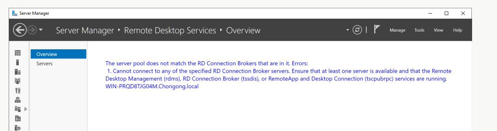

- Server Manager → RDS → **Servers**: 1 server in pool (`WIN-PRQD8TJG04M`), status
  **Online — Performance counters not started**, 0 events logged. Confirms the host
  is up; the failure is specific to the broker role, not host connectivity.

  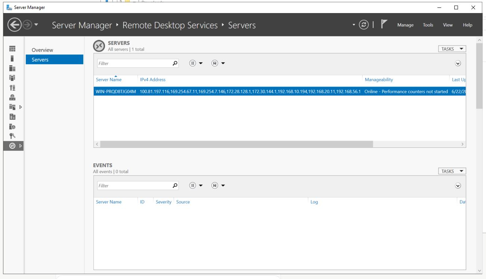

```
RISK: RD Connection Broker service(s) not responding on PDC (single-server, all-in-one
      RDS deployment co-located with Active Directory)
SEVERITY: High
MITIGATION: Project 08 — rebuild RDS deployment on dedicated WIN-RDS01 (Session Host) /
            WIN-RDWEB01 (Gateway/Web/Broker/Licensing)
DO NOT TOUCH NOW: Restarting RDS services or reconfiguring the deployment here is a live
            role change — out of scope for Phase 4 (document-only) and for Project 01
            generally. Removing/rebuilding without a target server breaks the farm.
```

**RDS-Users group membership** (ADUC → Groups → RDS-Users → Members): 11 members
spanning every department — Finance (Achiril Desmond, Mickelle Tson...), IT (Akaseng
Fran..., Test User, Vushueh Banks), Management (Chongong Le..., Gefter Mbi), HR
(Elsa-Jinelle C..., Michell-Flore...), Sales (Joiceline Kinyuy, Lionel-Asher...).

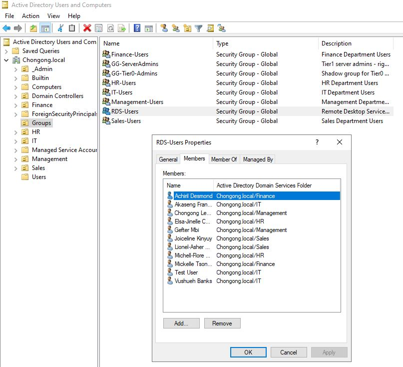

```
RISK: RDS-Users group has broad, cross-department membership on a single-server,
      co-located RDS deployment
SEVERITY: Medium
NOTE: Includes 'Test User' (testuser) — already removed from Domain Admins this
      session, slated for Phase 6 lockout + quarantine. It will lose RDS access as a
      side effect of that disable/move; no separate action needed now.
MITIGATION: Reassess RDS-Users membership/scoping after the Project 08 rebuild.
DO NOT TOUCH NOW: out of scope for Phase 4.
```

---

## 2. IIS

**Finding:** IIS on the PDC exists solely to serve RD Web Access and RPC-over-HTTPS —
it is not a general-purpose web host.

- Sites (IIS Manager → Sites): one site, `Default Web Site`, bound to `*:80 (http)` and
  `*:443 (https)`. Child applications: `aspnet_client`, `RDWeb`, `Rpc`, `RpcWithCert`.

  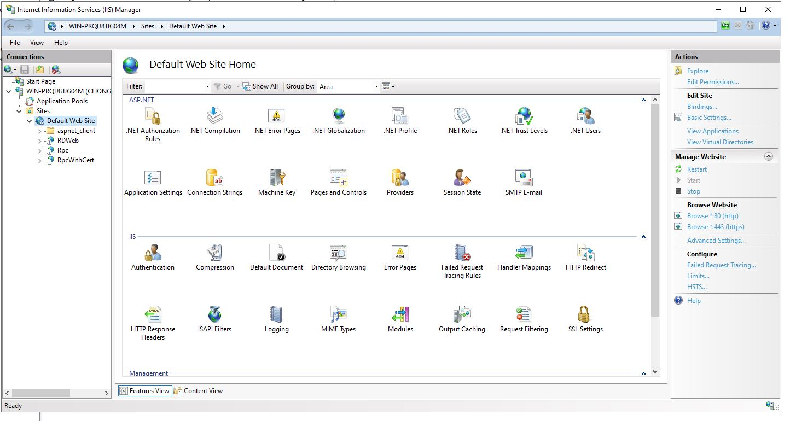

- Application Pools: `.NET v4.5`, `.NET v4.5 Classic`, `DefaultAppPool`, `RDWebAccess` —
  all **Started**, all identity **ApplicationPoolIdentity** (confirmed via full,
  unabbreviated Identity column — no named domain account running any pool).

  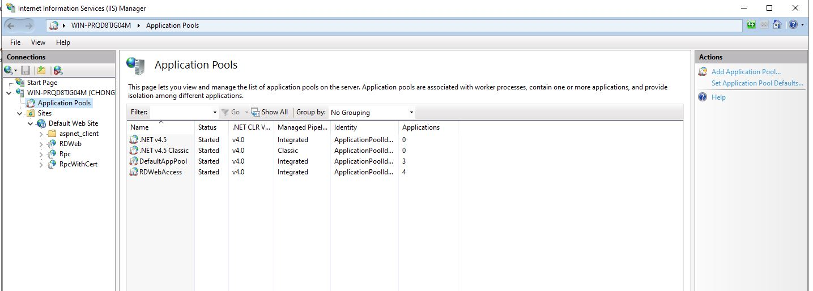
  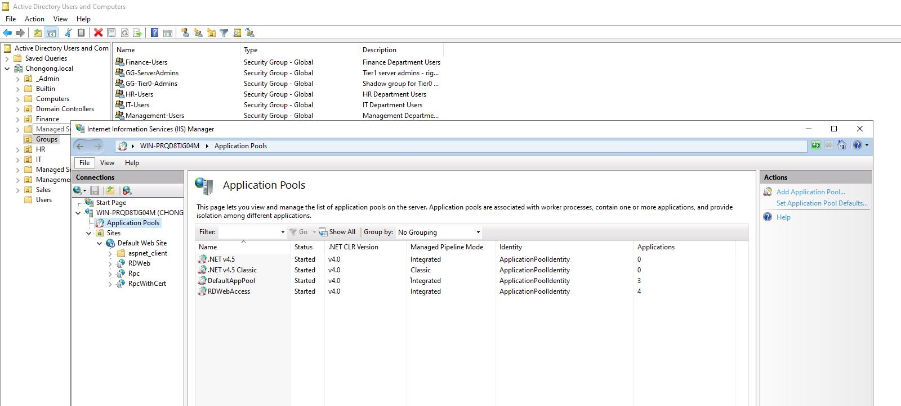

```
FINDING: IIS on PDC exists solely to serve RD Web Access + RPC-over-HTTPS
SEVERITY: Medium (inherits the RDS-on-PDC risk above; no IIS-specific misconfiguration
          found — pools use safe default identities, no unusual bindings)
MITIGATION: Migrates to WIN-RDS01/WIN-RDWEB01 alongside RDS in Project 08.
```

---

## 3. Network Policy Server (NPS)

**Finding:** NPS is installed but entirely unconfigured — stock defaults only, no
custom policies, no clients.

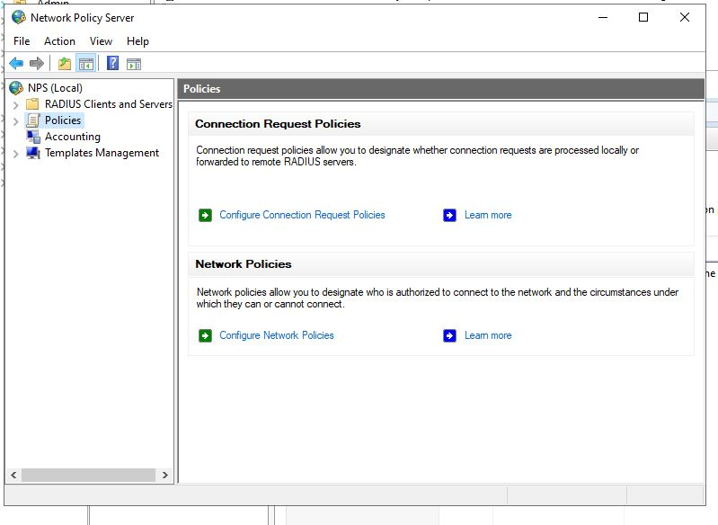

- **RADIUS Clients**: empty (0 entries).
- **Remote RADIUS Server Groups**: empty (0 entries).

  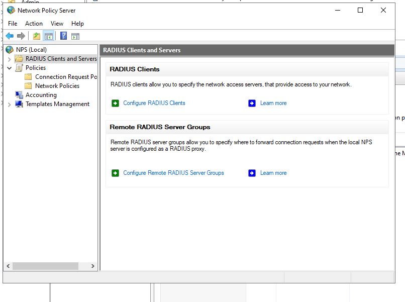
  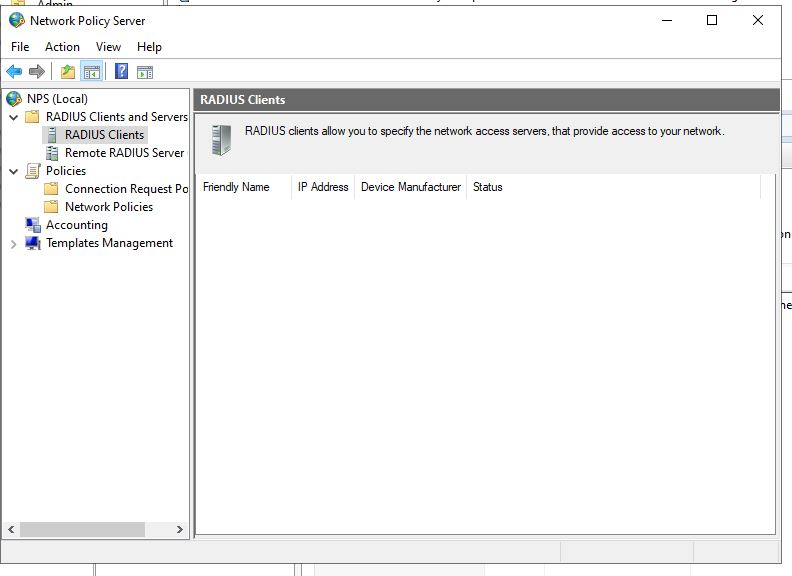
  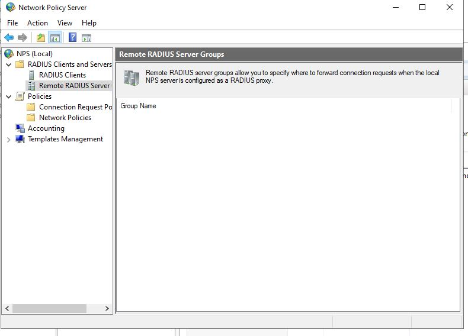

- **Connection Request Policies**: 1 entry, `Use Windows authentication for all users`
  (Enabled, order 999999, Source: Unspecified) — the Windows out-of-box default.

  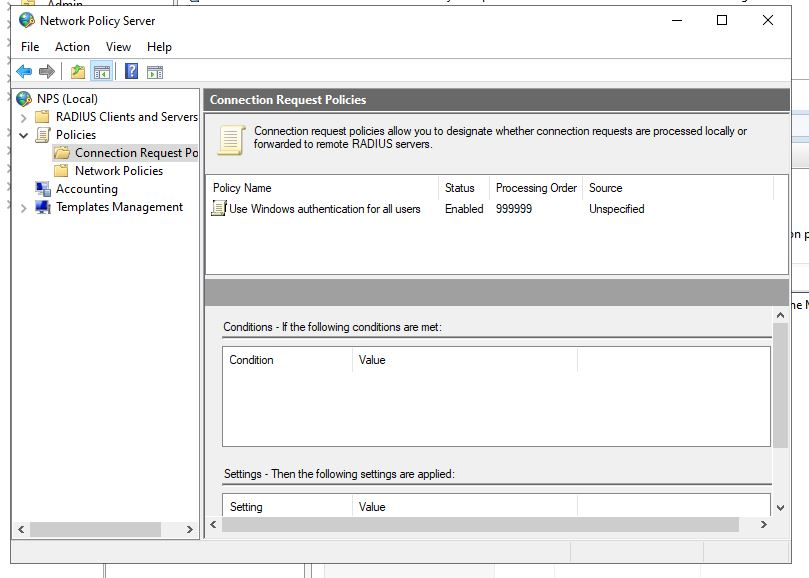
  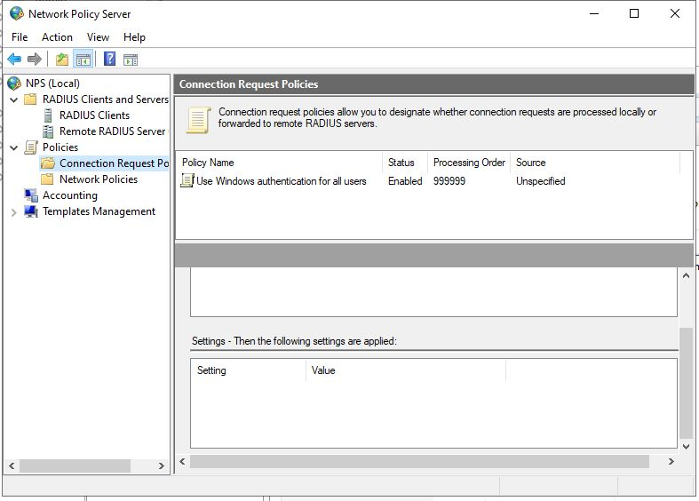

- **Network Policies**: 2 entries, both Windows defaults — `Connections to Microsoft
  Routing and Remote Access server` and `Connections to other access servers`, both
  **Enabled / Deny Access**, orders 999998/999999. Neither has any Conditions
  configured.

  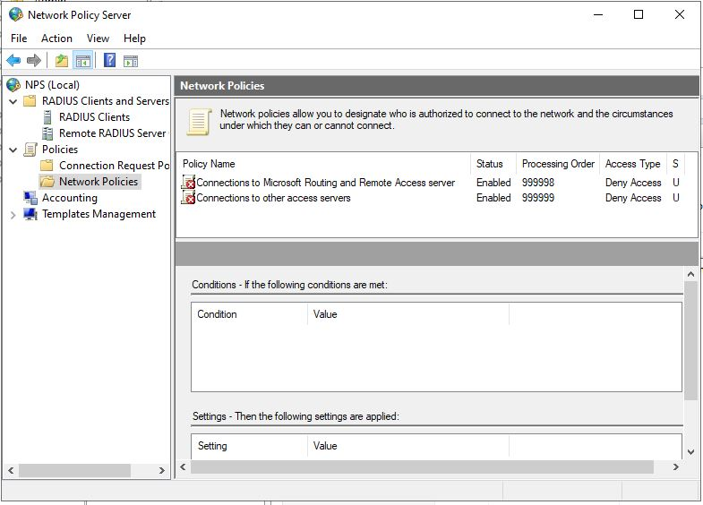

**`radius-service` investigation:** Not found anywhere. Confirmed by inspecting the
Conditions tab of every policy in both lists (none have any conditions at all) and by
the RADIUS Clients list being empty — there is no custom policy or client for the term
to appear in. No NPS config export was needed or performed; the GUI inspection alone
was conclusive, so no XML export exists to manage around the "never commit NPS XML"
rule.

```
FINDING: NPS has zero custom configuration — stock defaults only
SEVERITY: Informational
radius-service: NOT referenced anywhere in NPS (confirmed via GUI, no export needed)
NOTE: Confirms NPS/RADIUS buildout has not started — consistent with Project 13 being
      the project that will configure RADIUS01 and network device auth.
```

---

## 4. `__vmware__` group

Queried directly via `Get-ADGroup` / `Get-ADGroupMember` (read-only) plus a check for
VMware-related services on the host, since this console wasn't separately
screenshotted but the data was already captured this session.

**Command:**
```powershell
Get-ADGroup "__vmware__" -Properties Description, whenCreated, ManagedBy |
    Select-Object Name, GroupScope, Description, whenCreated, ManagedBy
Get-ADGroupMember "__vmware__" -ErrorAction SilentlyContinue | Select-Object SamAccountName, ObjectClass
Get-Service | Where-Object {$_.Name -match "vmware|vmauth|vmnet|vmtools"} | Select-Object Name, DisplayName, Status
```

- **Group:** `__vmware__`, scope `DomainLocal`, Description: "VMware User Group",
  created `8/21/2025`, `ManagedBy`: blank.
- **Members:** none (empty group).
- **Host services:** `VMware NAT Service` (Running), `VMware Autostart Service`
  (Stopped) — confirms a VMware desktop virtualization product (consistent with
  VMware Workstation, not ESXi) is installed on this host and is this group's owner.

```
__vmware__: DomainLocal group, "VMware User Group", zero members, no ManagedBy.
RECOMMENDATION: Leave as-is. Empty and unmanaged means low risk either way, but
  removing it could break the VMware product's AD integration if one exists.
  Defer full investigation to Project 02 (AD Architecture).
DO NOT TOUCH NOW: out of scope for Phase 4 and outside P01's remit generally.
```

---

## 5. Documentation checklist (from `phase-4-rds-iis-risk.md`)

- [x] Screenshot: RDS Overview deployment topology (captured broker error, which is
      itself the finding)
- [x] Screenshot: RDS-Users group members
- [x] Screenshot: IIS sites list
- [x] Screenshot: NPS Network Policies list
- [x] Screenshot: NPS Conditions tab (confirmed absence of `radius-service`)
- [x] `radius-service` NPS search result documented (not found, no export needed)
- [x] `__vmware__` group metadata documented (via direct AD query)
- [x] NO changes made to any role, service, or group
- [x] No NPS XML was exported or committed
- [x] This file written

**Phase 4 complete. Proceeding to Phase 5 (firewall baseline).**
