# Project 02 - Active Directory Architecture

**Status:** AD architecture complete on `2026-06-23`; replica DC build pending

**Domain:** `Chongong.local` / `CHONGONG`

**Primary DC:** `WIN-PRQD8TJG04M` (`192.168.20.11`)

## What I Built

I cleaned up the live domain so users, computers, admin accounts, and security
groups now have predictable locations. This gives the rest of the Windows,
NetOps, SOC, Proxmox, Microsoft 365, and FreePBX work a stable identity base.

Project 02 now provides:

| Area | Result |
|------|--------|
| Managed computer OUs | `ManagedComputers/Servers` and `ManagedComputers/Workstations` |
| Managed user OUs | `ManagedUsers/Finance`, `HR`, `IT`, `Management`, `Sales` |
| Group structure | `Groups/GlobalGroups` and `Groups/DomainLocalGroups` |
| AGDLP groups | `GG-*` global groups nested into `DL-*` domain local groups |
| Admin/service accounts | `ws-leonel`, `svc-backup`, and `svc-sync` staged disabled |
| Helpdesk delegation | `GG-Helpdesk` can reset passwords, force password change, and unlock users under `ManagedUsers` |
| AD Recycle Bin | Enabled for the forest |
| FSMO roles | Still on `WIN-PRQD8TJG04M` |

No AD objects were deleted.

## Project Phases

Project 02 has 9 phases. Phases 1-6 and 8-9 are complete. Phase 7 is pending
because the `WIN-DC02` VM does not exist yet.

| Phase | Name | Status |
|-------|------|--------|
| Phase 1 | OU Structure Design | Complete |
| Phase 2 | Move Existing Objects | Complete |
| Phase 3 | Tiered Admin Accounts | Complete for P02 |
| Phase 4 | AGDLP Group Model | Complete |
| Phase 5 | Service Account Provisioning | Complete |
| Phase 6 | Delegated Administration + AD Recycle Bin | Complete |
| Phase 7 | Replica DC Deployment | Pending |
| Phase 8 | Functional Level Verification | Complete |
| Phase 9 | Document + Verify | Complete |

Screenshot checklist: [docs/p02-screenshot-plan.md](docs/p02-screenshot-plan.md)

## Phase Details

### Phase 1 - OU Structure Design

I created the managed OU structure that future GPOs, file shares, admin accounts,
and user lifecycle work will depend on.

What I did:

- Created `ManagedUsers`.
- Created `ManagedComputers`.
- Created `ManagedComputers/Servers`.
- Created `ManagedComputers/Workstations`.
- Created `Groups/GlobalGroups`.
- Created `Groups/DomainLocalGroups`.

Why it matters: this gives the domain a clean structure without touching the
built-in `CN=Users` and `CN=Computers` containers.

PowerShell used/proof:

```powershell
.\scripts\p02-apply-ad-architecture.ps1 -Mode Apply

Get-ADOrganizationalUnit -Filter * |
  Select-Object Name, DistinguishedName |
  Sort-Object DistinguishedName
```

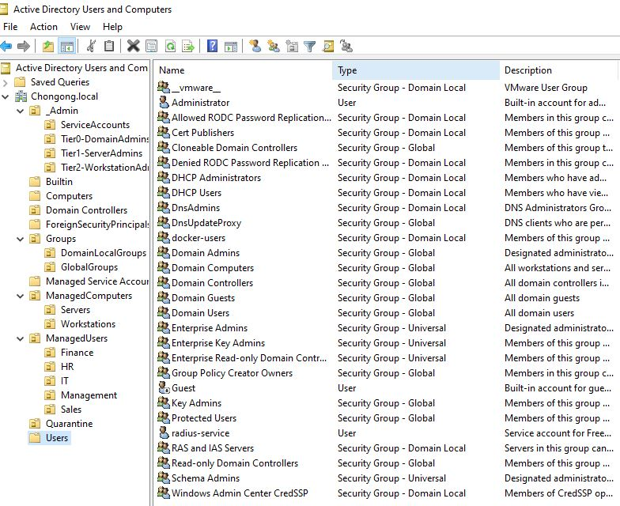
*Managed OU layout (`ManagedUsers`, `ManagedComputers`, `_Admin`, `Groups`, `Quarantine`, `Domain Controllers`) in Active Directory Users and Computers.*

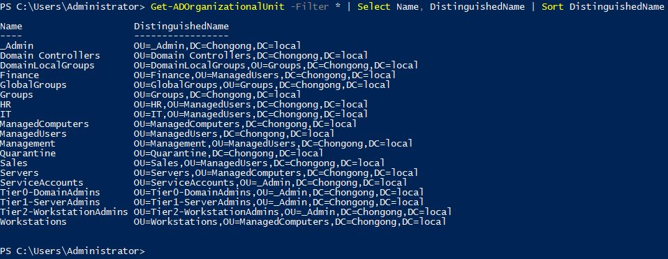
*PowerShell output confirming the managed OU structure matches what ADUC shows.*

### Phase 2 - Move Existing Objects

I moved existing AD objects into the new managed structure.

What I did:

- Moved `Finance`, `HR`, `IT`, `Management`, and `Sales` under `ManagedUsers`.
- Moved `DESKTOP-*` computer accounts under `ManagedComputers/Workstations`.
- Moved `GITEA` and `RADIUS01` under `ManagedComputers/Servers`.
- Left `WIN-PRQD8TJG04M` in `Domain Controllers`.

Why it matters: servers, workstations, and users can now receive the right GPOs
without applying everything from the domain root.

PowerShell used/proof:

```powershell
.\scripts\p02-apply-ad-architecture.ps1 -Mode Apply

Get-ADOrganizationalUnit -SearchBase "OU=ManagedUsers,DC=Chongong,DC=local" -Filter * |
  Select-Object Name, DistinguishedName |
  Sort-Object Name

Get-ADComputer -Filter * -Properties OperatingSystem |
  Select-Object Name, OperatingSystem, DistinguishedName |
  Sort-Object Name
```

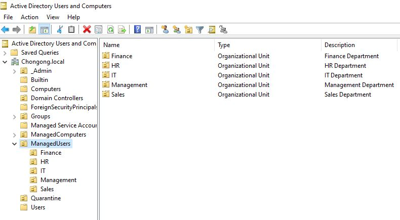
*Finance, HR, IT, Management, and Sales moved under `ManagedUsers`.*


*Servers and Workstations correctly placed under `ManagedComputers`.*

### Phase 3 - Tiered Admin Accounts

I kept the Project 01 admin model and staged the Tier 2 workstation admin account
for future workstation work.

What I did:

- Verified the `_Admin` structure exists.
- Kept `Tier0-DomainAdmins`, `Tier1-ServerAdmins`, `Tier2-WorkstationAdmins`,
  and `ServiceAccounts`.
- Created `ws-leonel` under `Tier2-WorkstationAdmins`.
- Left `ws-leonel` disabled until a future workstation-admin task needs it.

Why it matters: admin accounts stay separated by purpose, and no new admin
access is enabled before it is needed.

PowerShell used/proof:

```powershell
.\scripts\p02-apply-ad-architecture.ps1 -Mode Apply

Get-ADUser ws-leonel -Properties Enabled, DistinguishedName |
  Select-Object SamAccountName, Enabled, DistinguishedName
```

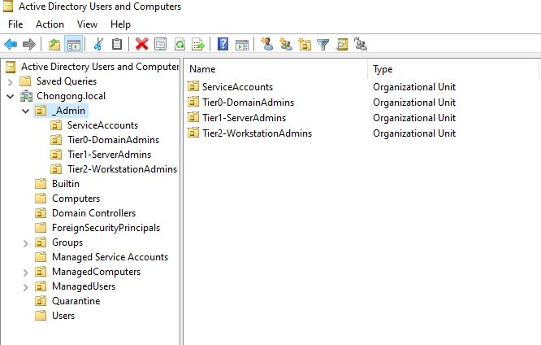
*`_Admin` structure with `Tier0-DomainAdmins`, `Tier1-ServerAdmins`, `Tier2-WorkstationAdmins`, and `ServiceAccounts`.*

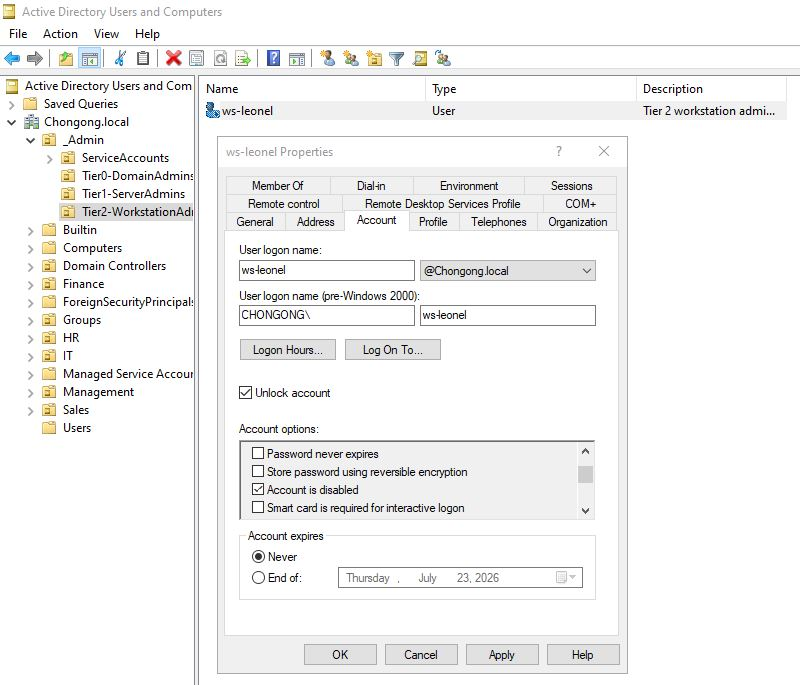
*`ws-leonel` staged under `Tier2-WorkstationAdmins`, disabled until needed.*

### Phase 4 - AGDLP Group Model

I built the group model that Project 06 file shares and Project 13 identity
integration will use.

What I did:

- Created department global groups such as `GG-Finance-Users`,
  `GG-HR-Users`, `GG-IT-Users`, `GG-Management-Users`, and
  `GG-Sales-Users`.
- Created domain local groups such as `DL-Finance-Share-RW`,
  `DL-HR-Share-RW`, `DL-IT-Share-RW`, `DL-Management-Share-RW`, and
  `DL-Sales-Share-RW`.
- Nested each department `GG-*` group into the matching `DL-*` group.
- Created cross-family groups including `GG-NetAdmins`, `GG-Net-ReadOnly`,
  `GG-SOC-Analysts`, `GG-Helpdesk`, and `GG-WorkstationAdmins`.

Why it matters: users go into global groups, and resource permissions later go
on domain local groups. That keeps access clean and easy to audit.

PowerShell used/proof:

```powershell
.\scripts\p02-apply-ad-architecture.ps1 -Mode Apply

Get-ADGroup -Filter 'Name -like "GG-*" -or Name -like "DL-*"' |
  Select-Object Name, GroupScope, DistinguishedName |
  Sort-Object Name

Get-ADGroupMember DL-Finance-Share-RW |
  Select-Object Name, SamAccountName, ObjectClass
```

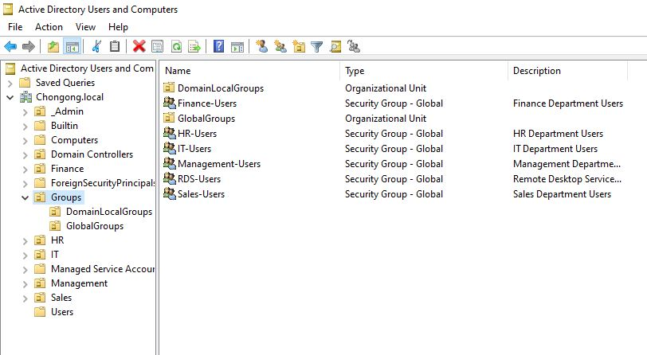
*`GlobalGroups` and `DomainLocalGroups` under `Groups`.*

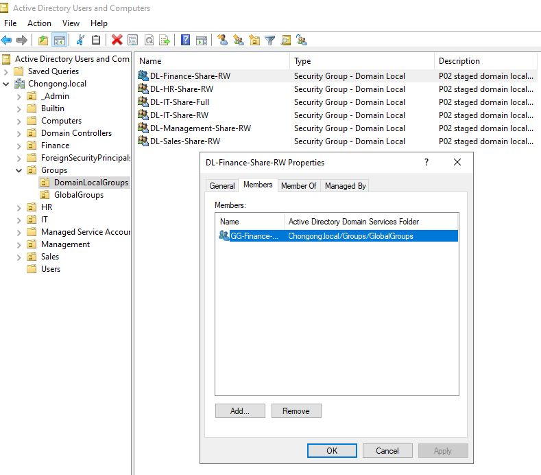
*`DL-Finance-Share-RW` with `GG-Finance-Users` nested as a member — proves the AGDLP model is actually nested, not just named.*

### Phase 5 - Service Account Provisioning

I staged service accounts for future automation and backup work.

What I did:

- Created `svc-backup`.
- Created `svc-sync`.
- Left both accounts disabled.
- Placed both accounts under `_Admin/ServiceAccounts`.

Why it matters: service accounts exist for future projects, but they cannot be
used until their owning workflow is ready and approved.

PowerShell used/proof:

```powershell
.\scripts\p02-apply-ad-architecture.ps1 -Mode Apply

Get-ADUser -LDAPFilter '(|(sAMAccountName=svc-backup)(sAMAccountName=svc-sync))' -Properties Enabled, DistinguishedName |
  Select-Object SamAccountName, Enabled, DistinguishedName
```

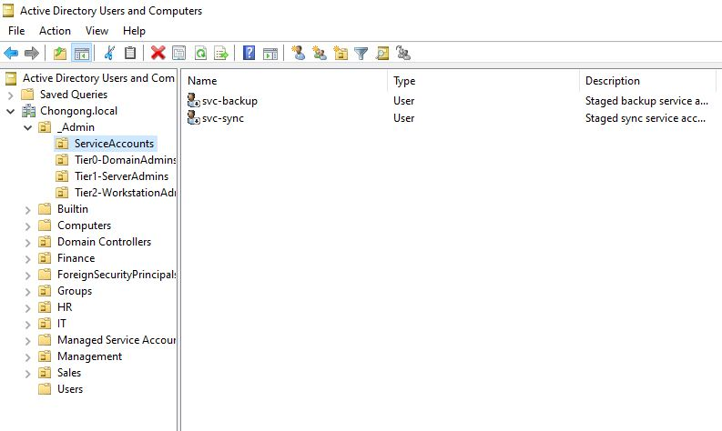
*`svc-backup` and `svc-sync` staged under `_Admin/ServiceAccounts`, disabled.*

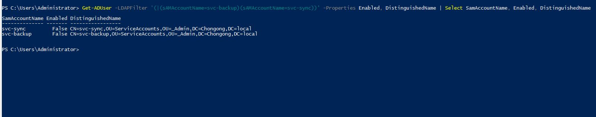
*PowerShell confirming `svc-backup` and `svc-sync` are disabled and correctly placed.*

### Phase 6 - Delegated Administration And AD Recycle Bin

I added basic recovery and helpdesk delegation without giving broad admin rights.

What I did:

- Enabled AD Recycle Bin.
- Delegated password reset rights to `GG-Helpdesk` on `ManagedUsers`.
- Delegated force-password-change support through `pwdLastSet`.
- Delegated unlock support through `lockoutTime`.

Why it matters: accidental deletions have a recovery path, and helpdesk-style
tasks do not require Domain Admin rights.

PowerShell used/proof:

```powershell
.\scripts\p02-apply-ad-architecture.ps1 -Mode Apply

Get-ADOptionalFeature "Recycle Bin Feature" |
  Select-Object Name, EnabledScopes

dsacls "OU=ManagedUsers,DC=Chongong,DC=local" | findstr /i "GG-Helpdesk Reset pwdLastSet lockoutTime"
```

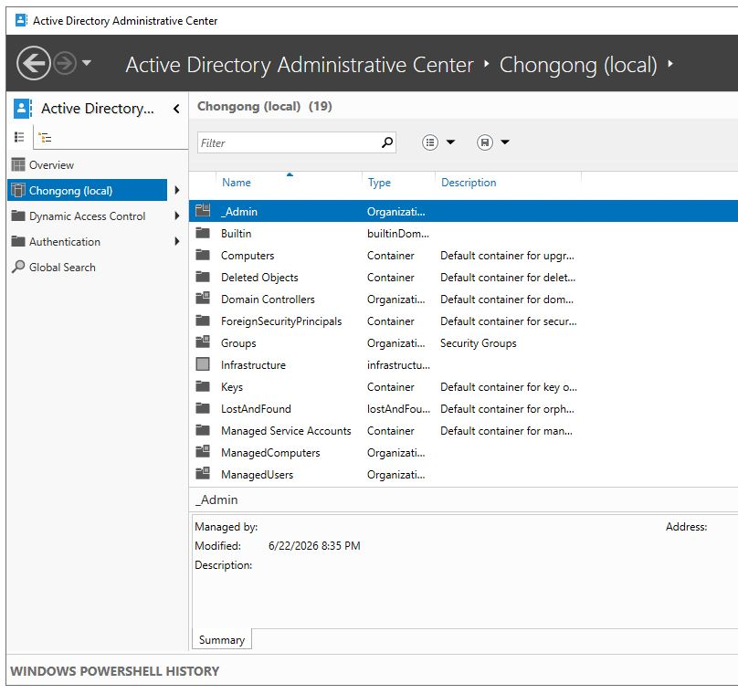
*AD Recycle Bin enabled for the forest — gives accidental deletions a recovery path.*

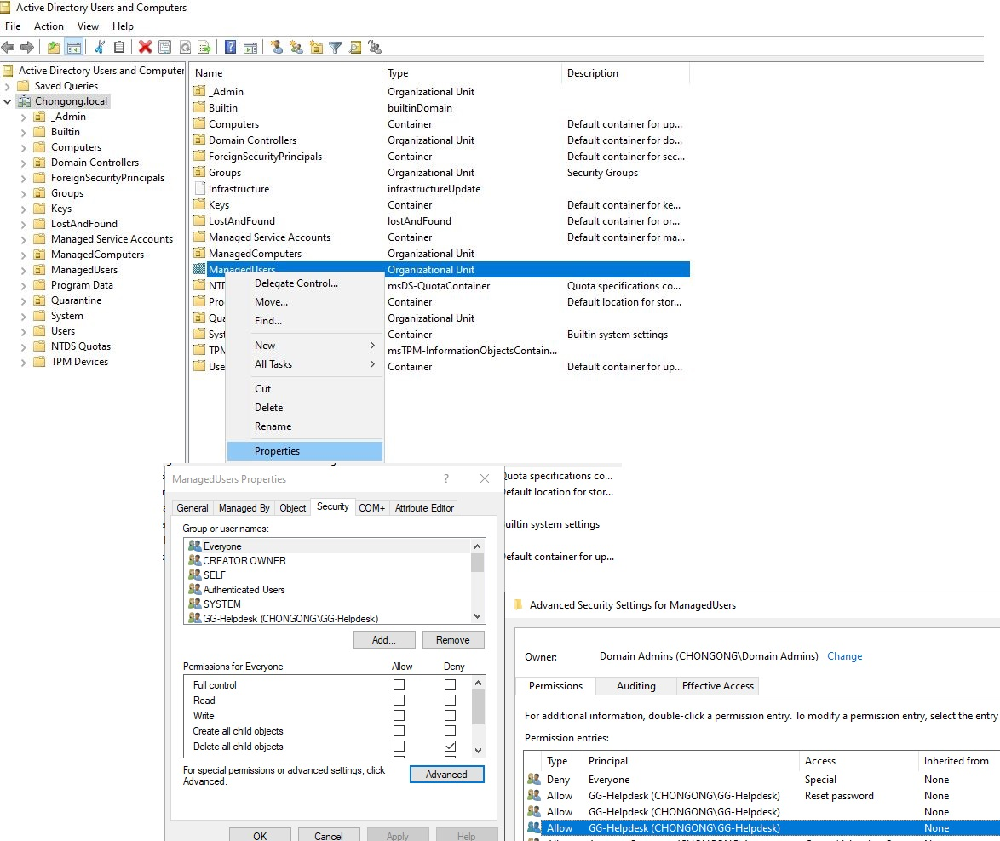
*`GG-Helpdesk` delegated reset/unlock rights on `ManagedUsers` without Domain Admin access.*

### Phase 7 - Replica DC Deployment

This phase is pending. I did not complete it because `WIN-DC02` does not exist
as a Hyper-V VM yet.

What is needed before I can do it:

- Windows Server 2022 ISO or prepared source VM.
- Hyper-V switch/VLAN decision.
- Static IP address for `WIN-DC02`.
- DNS on `WIN-DC02` pointed to `192.168.20.11` before domain join.
- DSRM password typed by Leonel only.
- Explicit approval before promoting it as a domain controller.
- System state backup plan before changing DC replication.

What I will do when ready:

- Create or prepare the `WIN-DC02` VM.
- Join it to `Chongong.local`.
- Promote it as an additional domain controller with DNS.
- Verify replication with `repadmin /replsummary` and `repadmin /showrepl`.
- Keep FSMO roles on `WIN-PRQD8TJG04M` unless a later DR project approves a
  transfer.

Current proof that Phase 7 is pending:

```powershell
Get-VM WIN-DC02

Get-ADComputer -LDAPFilter '(name=WIN-DC02)'
```

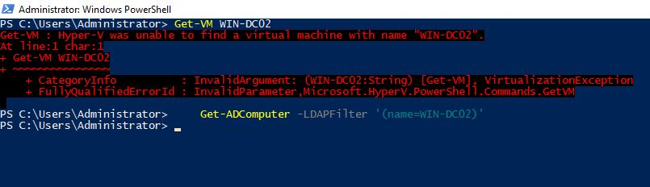
*`WIN-DC02` does not exist yet in Hyper-V or the `Domain Controllers` OU — proves Phase 7 is genuinely pending, not skipped.*

Future PowerShell commands:

```powershell
Install-WindowsFeature AD-Domain-Services -IncludeManagementTools

Install-ADDSDomainController `
  -DomainName "Chongong.local" `
  -InstallDns `
  -NoGlobalCatalog:$false `
  -SafeModeAdministratorPassword (Read-Host -AsSecureString "DSRM password") `
  -Force

repadmin /replsummary
repadmin /showrepl
```

Future images to insert:

- `screenshots/phase7-01-win-dc02-hyperv-vm.png`
- `screenshots/phase7-02-win-dc02-domain-controllers-ou.png`
- `screenshots/phase7-03-replication-healthy.png`

### Phase 8 - Functional Level Verification

I verified the domain and forest functional levels.

What I did:

- Confirmed `DomainMode` is `Windows2016Domain`.
- Confirmed `ForestMode` is `Windows2016Forest`.
- Confirmed no functional-level change was needed.

Why it matters: Windows Server 2022 AD DS still uses the Windows Server 2016
functional-level labels. There is no separate Windows Server 2022 functional
level to upgrade to.

PowerShell used/proof:

```powershell
Get-ADDomain | Select-Object DNSRoot, DomainMode
Get-ADForest | Select-Object Name, ForestMode
```

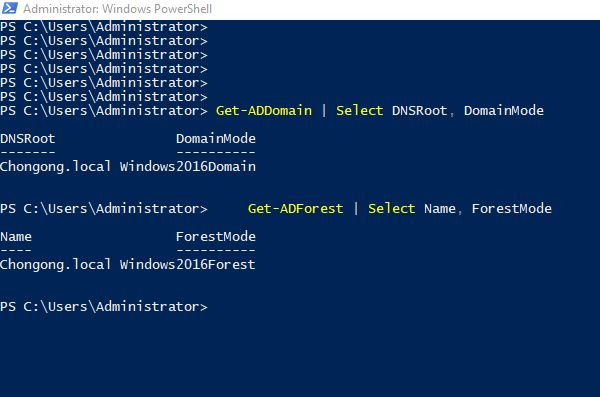
*Domain and forest functional level confirmed as `Windows2016Domain`/`Windows2016Forest`.*

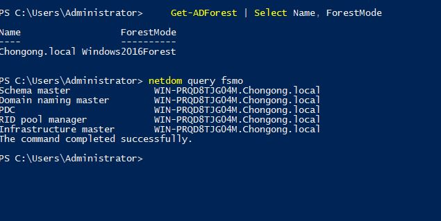
*All five FSMO roles confirmed still on `WIN-PRQD8TJG04M`.*

### Phase 9 - Document And Verify

I added repeatable scripts and updated the documentation so the live state can be
checked again later.

What I did:

- Added `scripts/p02-apply-ad-architecture.ps1`.
- Added `scripts/p02-verify-ad-architecture.ps1`.
- Ran the verification script against the live domain.
- Updated the project README, shared identity docs, skills, and project indexes.

Why it matters: future Claude/Codex sessions can verify Project 02 without
guessing or rebuilding the same work.

PowerShell used/proof:

```powershell
.\scripts\p02-verify-ad-architecture.ps1
```

Screenshots not yet captured for this phase (`phase9-01-p02-verification-output.png`, `phase9-02-project-02-github-files.png`).

## Why The OU Names Are ManagedUsers And ManagedComputers

The domain already has built-in root containers named `CN=Users` and
`CN=Computers`. Active Directory does not allow a root OU with the same leaf
name, so I used:

```text
OU=ManagedUsers,DC=Chongong,DC=local
OU=ManagedComputers,DC=Chongong,DC=local
```

That keeps the built-in containers intact and gives new GPO-ready OUs for the
real lab objects.

## Current OU Layout

```text
Chongong.local
  _Admin
    Tier0-DomainAdmins
    Tier1-ServerAdmins
    Tier2-WorkstationAdmins
    ServiceAccounts
  ManagedComputers
    Servers
    Workstations
  ManagedUsers
    Finance
    HR
    IT
    Management
    Sales
  Groups
    GlobalGroups
    DomainLocalGroups
  Quarantine
  Domain Controllers
```

## How I Applied It

Manual equivalent:

1. Open **Active Directory Users and Computers**.
2. Create `ManagedComputers`, `ManagedUsers`, `GlobalGroups`, and
   `DomainLocalGroups`.
3. Move existing department OUs under `ManagedUsers`.
4. Move domain-joined servers and workstations under `ManagedComputers`.
5. Create `GG-*` and `DL-*` groups.
6. Nest global groups into the matching domain local groups.
7. Stage disabled admin/service accounts.
8. Enable AD Recycle Bin.
9. Delegate helpdesk reset/unlock rights on `ManagedUsers`.

Scripted path:

```powershell
# Plan only
.\scripts\p02-apply-ad-architecture.ps1 -Mode Plan

# Apply after approval
.\scripts\p02-apply-ad-architecture.ps1 -Mode Apply
```

The script is idempotent. A later `Plan` run should show existing OUs, groups,
memberships, delegation, and computer placement instead of trying to recreate
or move the same objects again.

## Department Groups

| Department | Global group | Domain local group |
|------------|--------------|--------------------|
| Finance | `GG-Finance-Users` | `DL-Finance-Share-RW` |
| HR | `GG-HR-Users` | `DL-HR-Share-RW` |
| IT | `GG-IT-Users` | `DL-IT-Share-RW` |
| IT admins | `GG-IT-Admins` | `DL-IT-Share-Full` |
| Management | `GG-Management-Users` | `DL-Management-Share-RW` |
| Sales | `GG-Sales-Users` | `DL-Sales-Share-RW` |

These groups are staged for Project 06 file shares. Project 02 created the AD
groups and nesting only; it did not create shares or NTFS permissions.

## Cross-Family Groups

| Group | Used later by |
|-------|---------------|
| `GG-NetAdmins` | Project 13 NPS/RADIUS for Cisco, CML, OPNsense, and firewall admin auth |
| `GG-Net-ReadOnly` | Project 13 read-only network device access |
| `GG-SOC-Analysts` | Project 10 SOC/Wazuh access model |
| `GG-ServerAdmins` | Server administration model from Project 01 |
| `GG-Helpdesk` | Password reset/unlock delegation |
| `GG-WorkstationAdmins` | Tier 2 workstation administration |

## Verification

Run the read-only verification script from this project folder:

```powershell
.\scripts\p02-verify-ad-architecture.ps1
```

Useful individual checks:

```powershell
Get-ADOrganizationalUnit -Filter * |
  Select-Object Name, DistinguishedName |
  Sort-Object DistinguishedName

Get-ADGroup -Filter 'Name -like "GG-*" -or Name -like "DL-*"' |
  Select-Object Name, GroupScope, DistinguishedName |
  Sort-Object Name

Get-ADComputer -Filter * -Properties OperatingSystem |
  Select-Object Name, OperatingSystem, DistinguishedName |
  Sort-Object Name

Get-ADOptionalFeature "Recycle Bin Feature" |
  Select-Object Name, EnabledScopes

netdom query fsmo
```

Verified results on `2026-06-23`:

| Check | Result |
|-------|--------|
| Department OUs | Finance, HR, IT, Management, and Sales are under `ManagedUsers` |
| Computers | `DESKTOP-*` systems are under `Workstations`; `GITEA` and `RADIUS01` are under `Servers` |
| Staged accounts | `ws-leonel`, `svc-backup`, and `svc-sync` exist and are disabled |
| Recycle Bin | Enabled |
| FSMO roles | All five roles remain on `WIN-PRQD8TJG04M` |
| `__vmware__` group | Empty Domain Local group, description `VMware User Group`; left untouched |
| `WIN-DC02` | No VM found in Hyper-V; replica DC build remains pending |

## Remaining Work - WIN-DC02

The replica DC part is not complete because Hyper-V does not currently have a
`WIN-DC02` VM. I verified the Hyper-V VM list and did not find it.

What I need before Phase 7:

- Windows Server 2022 ISO or a prepared source VM.
- Hyper-V switch/VLAN decision for the replica DC.
- Static IP address for `WIN-DC02`.
- DNS on `WIN-DC02` pointed to `192.168.20.11` before domain join.
- DSRM password typed by Leonel only, never saved in chat or the repo.
- Explicit approval before promoting `WIN-DC02` as a domain controller.
- A system state backup plan before changing DC replication.

Next safe build:

1. Create a Windows Server 2022 VM named `WIN-DC02`.
2. Give it a static IP and point DNS to `192.168.20.11`.
3. Join it to `Chongong.local`.
4. Promote it as an additional domain controller with DNS installed.
5. Verify `repadmin /replsummary`, `repadmin /showrepl`, DNS health, and FSMO
   role placement.
6. Keep FSMO roles on `WIN-PRQD8TJG04M` unless a later DR project explicitly
   approves a transfer.

Do not practice FSMO seizure or forced failover against the live domain in this
project. That belongs in Project 11 backup and disaster recovery.

## Rollback / Recovery

There is no delete-based rollback for this project. The safe recovery approach
is:

- Move objects back only if a specific GPO/application dependency requires it.
- Disable newly staged accounts if they are not needed.
- Remove group memberships only after confirming the dependent project does not
  use them.
- Use AD Recycle Bin for accidental deletions after this point.
- Restore from system state backup for domain-wide failure.

## STAR Summary

**Situation:** The domain had users, computers, and groups spread across default
containers and root-level department OUs, which made future GPOs, file shares,
RADIUS policies, and SOC logging harder to manage.

**Task:** Build a predictable AD structure without deleting objects or breaking
the live primary domain controller.

**Action:** I created managed user/computer OUs, moved existing objects into the
right places, created AGDLP groups, staged disabled service/admin accounts,
enabled AD Recycle Bin, and delegated helpdesk reset/unlock rights.

**Result:** The domain now has a clean identity structure ready for DNS, DHCP,
GPO, file server, SOC, and NPS/RADIUS projects. The only remaining Project 02
infrastructure item is building and promoting `WIN-DC02`.
