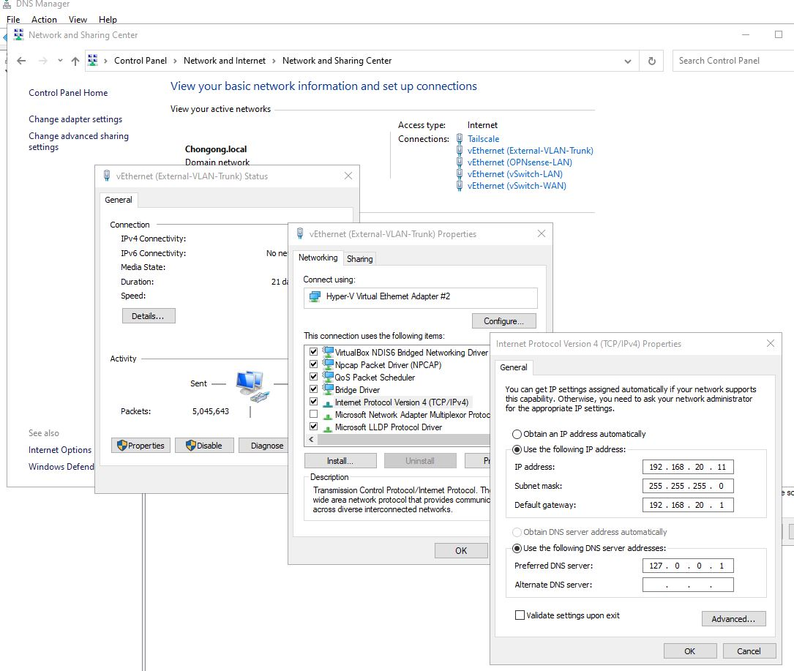
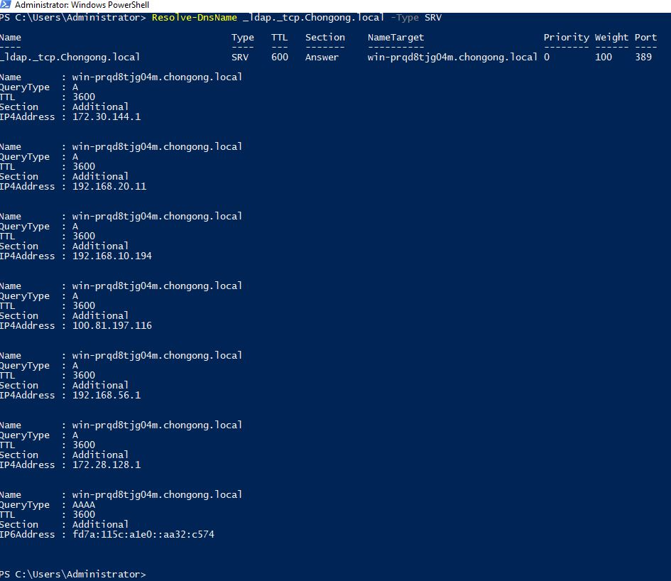
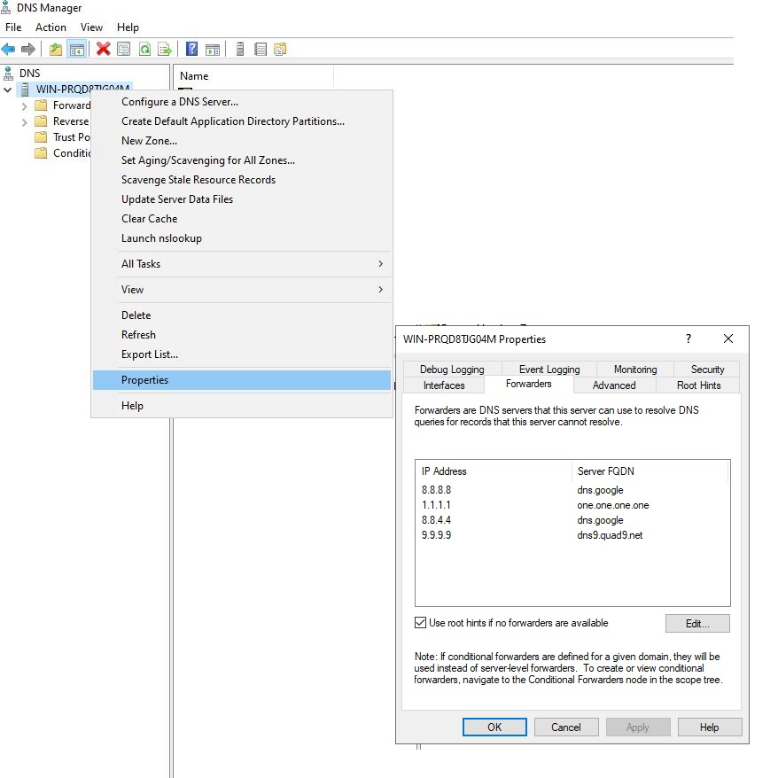
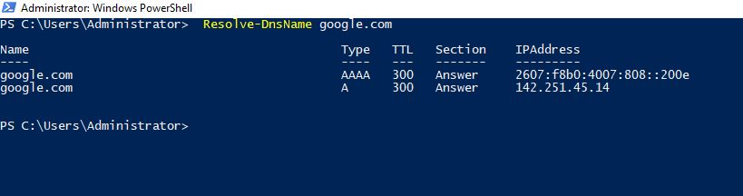
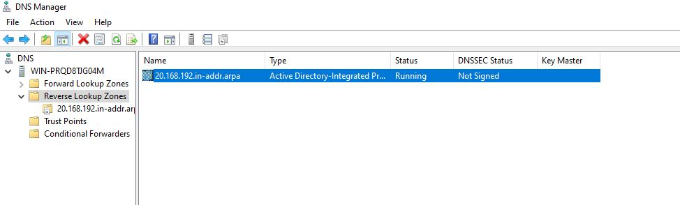
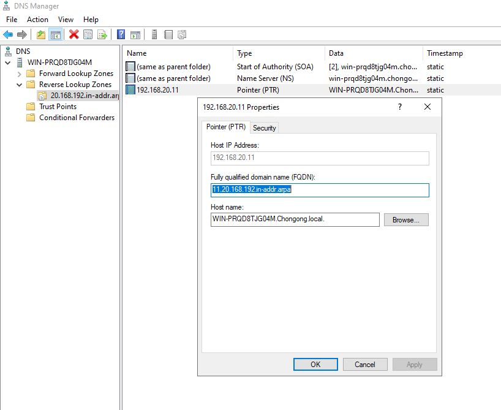
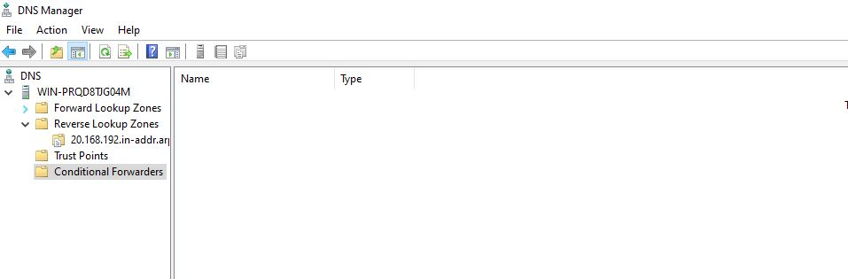
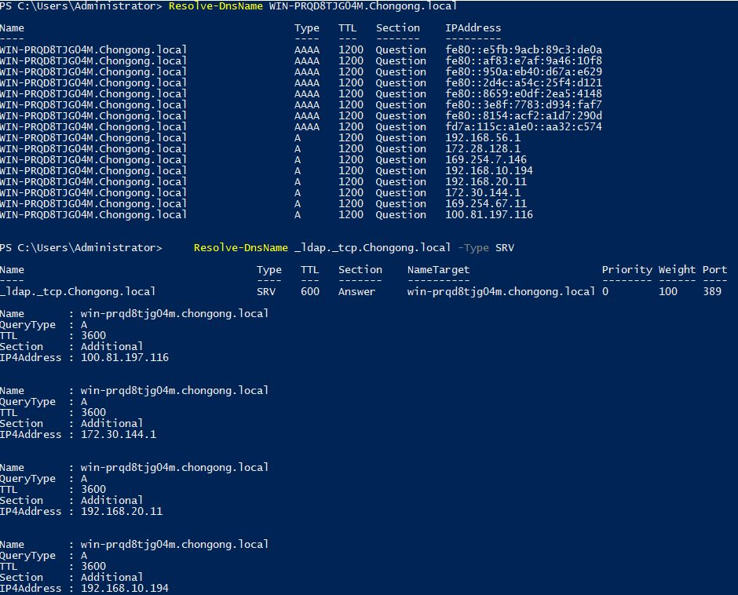
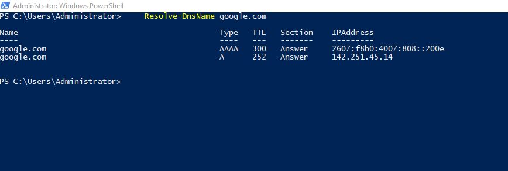
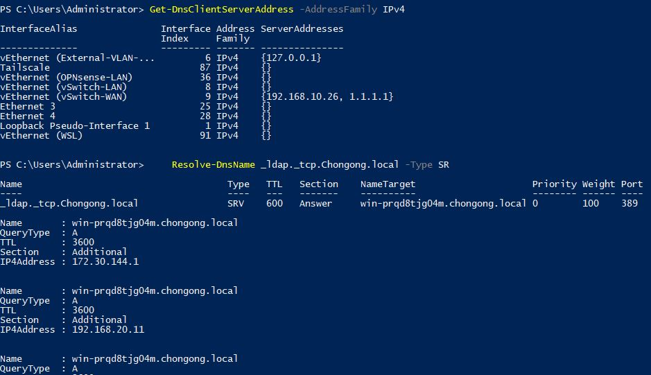

# Project 03 - AD DNS and Name Resolution Engineering

**Status:** Mostly complete on `2026-06-23`; Phase 5 deferred as not needed, Phase 9 blocked by `WIN-DC02`

**System:** `WIN-PRQD8TJG04M` (`192.168.20.11`) - live DNS server and Primary Domain Controller

**Skill:** `/winserver-p03`

## Summary

I audited and hardened the AD-integrated DNS configuration for `Chongong.local`.
During the audit I found a real DNS problem: the Domain Controller was using
public DNS servers on its own LAN NIC instead of querying itself first. I fixed
that, created the missing reverse lookup zone, enabled scavenging, verified
internal/external resolution, and documented break/fix runbooks.

## What Changed

| Area | Result |
|------|--------|
| DC DNS client settings | LAN NIC now points to `127.0.0.1` instead of public DNS |
| Forwarders | Confirmed already configured: `8.8.8.8`, `1.1.1.1`, `8.8.4.4`, `9.9.9.9` |
| Reverse DNS | Created `20.168.192.in-addr.arpa` and PTR for `192.168.20.11` |
| Scavenging | Enabled server scavenging and zone aging for `Chongong.local` |
| Split-brain behavior | Internal AD records and external public names both resolve correctly |
| Break/fix evidence | One real DNS incident plus two documented runbooks |

## Project Phases

Project 03 has 10 phases. Phases 1-4, 6-8, and 10 are complete. Phase 5 is
deferred because there is no cross-lab DNS zone that needs conditional forwarding
yet. Phase 9 is blocked until `WIN-DC02` exists.

| Phase | Name | Status |
|-------|------|--------|
| Phase 1 | Audit Current DNS State | Complete |
| Phase 2 | Fix DNS Server Addressing | Complete |
| Phase 3 | Configure Forwarders | Complete - already satisfied |
| Phase 4 | Reverse Lookup Zones | Complete |
| Phase 5 | Conditional Forwarders | Deferred - not needed yet |
| Phase 6 | DNS Scavenging | Complete |
| Phase 7 | Split-Brain DNS | Complete |
| Phase 8 | Break/Fix Exercise | Complete |
| Phase 9 | `WIN-DC02` DNS Verification | Pending - blocked by `WIN-DC02` |
| Phase 10 | Document + Push | Complete |

Screenshot checklist: [docs/p03-screenshot-plan.md](docs/p03-screenshot-plan.md)

## Phase Details

### Phase 1 - Audit Current DNS State

I audited the current DNS configuration before making changes.

What I did:

- Reviewed DNS server role configuration.
- Listed all DNS zones.
- Checked forwarders.
- Checked scavenging state.
- Checked DNS client settings on the DC NICs.
- Found that the LAN NIC was pointing to public DNS instead of itself.

Why it matters: AD depends on DNS. If a Domain Controller sends internal AD
queries to public DNS first, authentication and service discovery can fail even
when the DNS zone itself is correct.

PowerShell used/proof:

```powershell
Get-DnsServer
Get-DnsServerZone
Get-DnsServerForwarder
Get-DnsServerScavenging
Get-DnsClientServerAddress -AddressFamily IPv4
Resolve-DnsName _ldap._tcp.Chongong.local -Type SRV
```

Images to insert later:

- `screenshots/phase1-01-dns-zones-and-forwarders.png`
- `screenshots/phase1-02-dns-client-before-fix.png`

### Phase 2 - Fix DNS Server Addressing

I fixed the real DNS misconfiguration found in Phase 1.

What I did:

- Changed `vEthernet (External-VLAN-Trunk)` from public DNS servers to
  `127.0.0.1`.
- Verified internal AD SRV records resolved.
- Verified external internet names still resolved through forwarders.

Why it matters: a DC should use AD DNS for its own DNS client settings. Public
DNS belongs in the DNS server forwarder list, not on the DC NIC.

PowerShell used/proof:

```powershell
Set-DnsClientServerAddress -InterfaceAlias "vEthernet (External-VLAN-Trunk)" -ServerAddresses 127.0.0.1

Get-DnsClientServerAddress -AddressFamily IPv4
Resolve-DnsName _ldap._tcp.Chongong.local -Type SRV
Resolve-DnsName google.com
```


*LAN NIC DNS client now pointing at `127.0.0.1` instead of public resolvers.*


*`_ldap._tcp.Chongong.local` resolving correctly after the fix.*

Break/fix evidence: [troubleshooting/break-fix-log.md](troubleshooting/break-fix-log.md)

### Phase 3 - Configure Forwarders

I confirmed the forwarders were already configured correctly, so no change was
needed.

What I did:

- Verified forwarders were already set to `8.8.8.8`, `1.1.1.1`, `8.8.4.4`,
  and `9.9.9.9`.
- Verified external DNS still resolved.
- Did not overwrite the forwarder list.

Why it matters: `Set-DnsServerForwarder` replaces the forwarder list. Since the
list was already correct, leaving it alone was safer than rewriting it.

PowerShell used/proof:

```powershell
Get-DnsServerForwarder
Resolve-DnsName google.com
```


*Configured forwarders: `8.8.8.8`, `1.1.1.1`, `8.8.4.4`, `9.9.9.9`.*


*External name resolution confirmed working through the forwarders.*

### Phase 4 - Reverse Lookup Zones

I created reverse DNS for the Windows subnet.

What I did:

- Created reverse zone `20.168.192.in-addr.arpa` for `192.168.20.0/24`.
- Created PTR record for `192.168.20.11`.
- Verified the PTR record by querying the DNS server directly.
- Identified Docker Desktop `hns` as a local client-side artifact when
  `Resolve-DnsName` returned `host.docker.internal`.

Why it matters: reverse DNS helps troubleshooting, logging, monitoring, and some
enterprise tools that expect PTR records for infrastructure hosts.

PowerShell used/proof:

```powershell
Add-DnsServerPrimaryZone -NetworkID "192.168.20.0/24" -ReplicationScope Domain -DynamicUpdate Secure
Add-DnsServerResourceRecordPtr -ZoneName "20.168.192.in-addr.arpa" -Name "11" -PtrDomainName "WIN-PRQD8TJG04M.Chongong.local"

Get-DnsServerZone -Name "20.168.192.in-addr.arpa"
Get-DnsServerResourceRecord -ZoneName "20.168.192.in-addr.arpa" -RRType Ptr
nslookup -type=PTR 192.168.20.11 127.0.0.1
nslookup -type=PTR 192.168.20.11 192.168.20.11
```


*`20.168.192.in-addr.arpa` reverse lookup zone created.*


*PTR record for `192.168.20.11` confirmed pointing to `WIN-PRQD8TJG04M.Chongong.local`.*

### Phase 5 - Conditional Forwarders

This phase is deferred because there is no confirmed cross-lab DNS zone that
`Chongong.local` needs to forward to yet.

What I did:

- Checked whether a conditional forwarder was currently needed.
- Deferred the phase instead of creating an unused forwarder.

Why it matters: DNS forwarding should solve a real name-resolution need. Adding
unused conditional forwarders creates confusion and future troubleshooting noise.

PowerShell proof to use when this becomes needed:

```powershell
Get-DnsServerConditionalForwarderZone
```


*Conditional Forwarders list, empty — confirms the phase was intentionally deferred, not forgotten.*

### Phase 6 - DNS Scavenging

I enabled stale-record cleanup.

What I did:

- Enabled DNS server scavenging.
- Enabled aging on the `Chongong.local` zone.
- Set refresh and no-refresh intervals.
- Verified the next available scavenging time.

Why it matters: stale DNS records create bad troubleshooting data. Scavenging
keeps DNS cleaner as clients and VMs change over time.

PowerShell used/proof:

```powershell
Set-DnsServerScavenging -ScavengingState $true -ScavengingInterval 7.00:00:00 -ComputerName WIN-PRQD8TJG04M
Set-DnsServerZoneAging -Name "Chongong.local" -Aging $true -RefreshInterval 4.00:00:00 -NoRefreshInterval 4.00:00:00

Get-DnsServerScavenging
Get-DnsServerZoneAging -Name "Chongong.local"
```

Images to insert later:

- `screenshots/phase6-01-scavenging-enabled.png`
- `screenshots/phase6-02-zone-aging-enabled.png`

### Phase 7 - Split-Brain DNS

I verified internal and external name resolution behaved correctly.

What I did:

- Verified internal host records resolve from AD DNS.
- Verified internal SRV records resolve from AD DNS.
- Verified external names resolve through forwarders.

Why it matters: internal AD names must stay private, while normal internet names
still need to resolve for updates, Microsoft 365, and general network use.

PowerShell used/proof:

```powershell
Resolve-DnsName WIN-PRQD8TJG04M.Chongong.local
Resolve-DnsName _ldap._tcp.Chongong.local -Type SRV
Resolve-DnsName google.com
```


*Internal AD names (host + SRV) resolving correctly and privately.*


*External public names still resolving correctly via forwarders.*

### Phase 8 - Break/Fix Exercise

I documented DNS troubleshooting using one real incident and two safe runbooks.

What I did:

- Used the real DC NIC DNS issue as Scenario A.
- Documented the missing `_msdcs` SRV records runbook.
- Documented the broken/missing forwarder runbook.
- Avoided intentionally breaking the live household DNS service just to create
  screenshots.

Why it matters: this turns a real DNS outage pattern into portfolio evidence and
future troubleshooting procedure without creating unnecessary downtime.

PowerShell used/proof:

```powershell
Get-DnsClientServerAddress -AddressFamily IPv4
Resolve-DnsName _ldap._tcp.Chongong.local -Type SRV
Get-DnsServerForwarder
Resolve-DnsName google.com
```


*NIC DNS fix and SRV resolution confirming the real Phase 2 incident is resolved.*

Image not yet captured for this phase: `screenshots/phase8-02-break-fix-log.png`

Break/fix log: [troubleshooting/break-fix-log.md](troubleshooting/break-fix-log.md)

### Phase 9 - `WIN-DC02` DNS Verification

This phase is pending because `WIN-DC02` has not been built or promoted yet.

What is needed before I can do it:

- `WIN-DC02` VM created.
- `WIN-DC02` joined to `Chongong.local`.
- `WIN-DC02` promoted as an additional DC with DNS.
- Replication healthy between `WIN-PRQD8TJG04M` and `WIN-DC02`.

Why it matters: secondary DNS verification cannot be real until the second DC
exists.

Future PowerShell proof:

```powershell
Get-ADDomainController -Filter * |
  Select-Object HostName, IPv4Address, IsGlobalCatalog

Get-DnsServerZone -ComputerName WIN-DC02
repadmin /replsummary
```

Image to insert later: `screenshots/phase9-01-win-dc02-dns-verification.png`

### Phase 10 - Document + Push

I saved the Project 03 evidence and updated the repo.

What I did:

- Updated this Project 03 README.
- Added the break/fix log.
- Updated project status references.
- Added screenshot planning for later image insertion.

Why it matters: the DNS work is repeatable and reviewable, not just a one-time
live change.

Proof commands:

```bash
git status --short
git log --oneline -5
```

Images to insert later:

- `screenshots/phase10-01-project-03-github-status.png`
- `screenshots/phase10-02-project-03-files.png`

## Verified State

| Check | Result |
|-------|--------|
| Internal AD SRV lookup | `_ldap._tcp.Chongong.local` resolves to `win-prqd8tjg04m.chongong.local:389` |
| DC DNS client | LAN NIC uses `127.0.0.1` |
| Forwarders | Public forwarders still resolve external names |
| Reverse DNS | `192.168.20.11` resolves to `WIN-PRQD8TJG04M.Chongong.local` through direct DNS queries |
| Scavenging | Enabled |
| Zone aging | Enabled for `Chongong.local` |
| Secondary DNS | Pending `WIN-DC02` |

## Technical Links

| Detail | Link |
|--------|------|
| Break/fix log | [troubleshooting/break-fix-log.md](troubleshooting/break-fix-log.md) |
| Screenshot plan | [docs/p03-screenshot-plan.md](docs/p03-screenshot-plan.md) |

## Portfolio Summary

**Situation:** DNS had not been fully documented, reverse DNS was missing for the
Windows subnet, scavenging was disabled, and the DC itself was pointing at
public DNS instead of AD DNS.

**Task:** Audit and harden DNS without breaking the live household domain.

**Action:** I audited zones, forwarders, scavenging, and NIC settings; fixed the
DC DNS client path; created the reverse zone and PTR record; enabled scavenging;
verified internal and external resolution; and documented DNS break/fix runbooks.

**Result:** The domain now resolves internal AD records correctly, external
forwarding still works, reverse DNS exists for the DC, stale record cleanup is
enabled, and Phase 9 is clearly blocked only by the missing `WIN-DC02` replica
DC.
