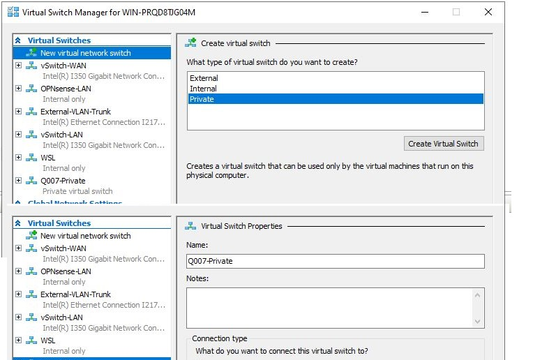
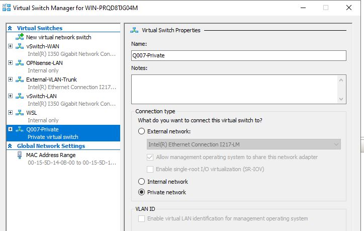
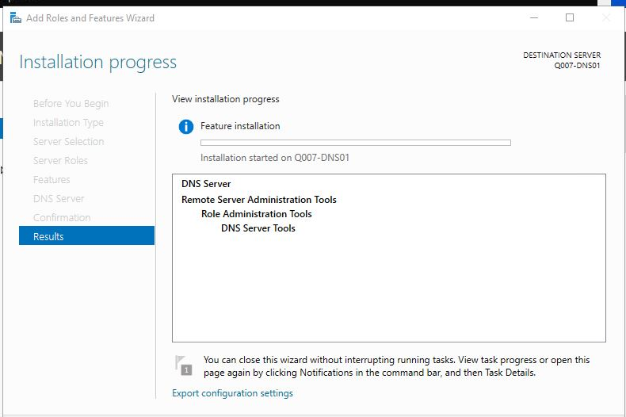
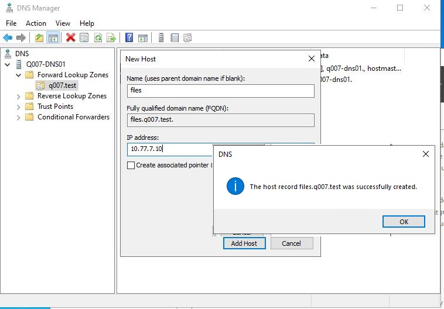

# Q007 — Windows Evidence Details

**Related project:** [Q007 DNS Failure-Triage Simulation](../README.md)
**Last updated:** 2026-07-17

This page holds reviewed screenshot 3+ evidence that would exceed the
two-images-per-phase limit in the project README. Each image remains beside
the note that states what it proves.

## Phase 2 — Private Switch And Isolated VM

### Private Switch Manager

<strong>Proof:</strong> Hyper-V Virtual Switch Manager shows `Q007-Private` as a Private virtual switch. <a href="screenshots/phase2-03-q007-private-switch-manager.txt">Paired evidence note</a>.

### Private Switch Properties

<strong>Proof:</strong> The `Q007-Private` properties dialog has Private network selected. <a href="screenshots/phase2-04-q007-private-switch-properties.txt">Paired evidence note</a>.

These GUI images supplement the stronger host PowerShell evidence in the
project README. They do not independently prove the guest installation or
inside-guest network state.

## Phase 4 — DNS Role And Baseline Zone

### DNS Role Installation Wizard

<strong>Proof:</strong> Add Roles and Features shows DNS Server and its management tools selected for `Q007-DNS01`. <a href="screenshots/phase4-03-q007-dns-role-installation.txt">Paired evidence note</a>.

### Files Record Creation

<strong>Proof:</strong> DNS Manager confirms creation of `files.q007.test` for `10.77.7.10` with no PTR option selected. <a href="screenshots/phase4-04-q007-files-record-creation.txt">Paired evidence note</a>.

These GUI captures supplement the accepted PowerShell role/service check and
the DNS Manager baseline-state evidence. The paired transcript establishes
that the primary zone was file-backed, non-AD-integrated, and had dynamic
updates disabled.
