# Q007 Windows DNS Operator Practicum

| Practicum fact | Value |
|---|---|
| Status | Phases 0–9 complete; repaired, validated, and powered off |
| Relationship to Q007 | Optional hands-on extension to the completed automated proof |
| Operator | Leonel |
| Guide, evidence intake, and documentation | Codex |
| Independent review | Claude Fable, read-only |
| Host scope | Existing Hyper-V host, only after a dated change approval |
| Guest scope | One disposable, standalone Windows Server VM |
| Production DNS, AD, DHCP, and domain controllers | Out of scope; do not contact or change |
| Plan review | [Claude Fable GO after five documented clarifications](q007-claude-fable-practicum-review-2026-07-15.md) |

## Objective

Build practical Windows Server DNS experience without changing the completed
Q007 result or practicing on household infrastructure. The lab repeats the
same record-set lifecycle already proven by Q007:

1. establish one correct A record;
2. add one extra wrong A record;
3. inspect the complete answer set and demonstrate possible client impact;
4. remove only the wrong record;
5. run three positive retests and one NXDOMAIN test; and
6. preserve evidence, remove the test zone, and retain the powered-off VM until
   the evidence is accepted.

This practicum proves Windows DNS administration. It does not replace or
invalidate the completed loopback simulation, and it does not authorize a
Hyper-V or Windows change by itself.

## What Leonel Will Learn

- create an isolated Hyper-V lab without attaching it to a physical network;
- install the DNS Server role with Server Manager;
- create and inspect a standalone, file-backed primary zone in DNS Manager;
- use `Resolve-DnsName`, `nslookup`, and DNS Server PowerShell cmdlets;
- distinguish a successful DNS response from a correct answer set;
- preview and perform an exact-record repair;
- apply positive, negative, repeated, and cleanup tests; and
- capture useful evidence without exposing credentials or unrelated systems.

## Roles And Decision Gates

| Participant | Responsibility |
|---|---|
| Leonel | Operate Hyper-V and Windows, type the commands, make the repair decision, and capture the screenshots and transcript |
| Codex | Supply the gated procedure, validate each returned result, intake and redact evidence, and update Q007 documentation |
| Claude Fable | Perform one bounded, read-only review of the prepared guide; no live access or changes |

Leonel stops at every **Codex validation gate** and returns the requested
output or screenshot. Codex does not run commands on the Windows or Hyper-V
systems. Creating, changing, or deleting Hyper-V objects requires the approval
defined in the [change-window plan](q007-windows-lab-change-window.md).

## Safe Topology

```text
Existing Hyper-V host
  |
  +-- Q007-Private (Private virtual switch; no host or physical-NIC path)
        |
        +-- Q007-DNS01 (standalone Windows Server; not domain joined)
              +-- 10.77.7.2/24  management/query address
              +-- 10.77.7.10/24 correct lab service address
              +-- no default gateway
              +-- DNS zone q007.test
                    +-- files.q007.test -> 10.77.7.10  baseline
                    +-- files.q007.test -> 10.77.7.99  injected fault
```

A Hyper-V Private switch permits communication only among attached guest VMs;
it does not create a management-OS adapter or bind to a physical NIC. This lab
uses one guest, so DNS queries and reachability checks remain inside that
guest. Never attach `Q007-DNS01` to an External, Internal, Default, or existing
production switch.

## Fixed Lab Values

| Item | Fixed value |
|---|---|
| Virtual switch | `Q007-Private` / Private |
| VM | `Q007-DNS01`, Generation 2 |
| VM resources | 2 vCPU, 4 GB startup memory, 40 GB VHDX |
| Domain membership | Standalone workgroup only |
| Guest primary IPv4 | `10.77.7.2/24` |
| Guest secondary IPv4 | `10.77.7.10/24`, skip as source |
| Default gateway | None |
| Guest DNS client | `10.77.7.2` only |
| Zone | `q007.test`, file-backed primary, dynamic updates disabled |
| Record | `files.q007.test` |
| Correct answer | `10.77.7.10` |
| Wrong answer | `10.77.7.99`, never assigned to an interface |
| Unknown name | `old-files.q007.test` |
| Guest transcript | `C:\Q007-Evidence\q007-windows-hands-on-transcript.txt` |

The Windows Server ISO path, VM storage root, and license are current-state
inputs. Do not guess or publish them. The verified guest edition is Windows
Server 2022 Standard Evaluation.

## Global Stop Conditions

Stop immediately and send the current screen or output to Codex when:

- either Q007 Hyper-V object already exists before creation;
- the selected switch type is not **Private**;
- the VM has more than one network adapter or is connected to another switch;
- the guest is domain joined, has a default route, or can reach a production
  address;
- `10.77.7.99` is already assigned or responds before fault injection;
- any command names a production zone, server, adapter, VM, or switch;
- the baseline contains anything other than `10.77.7.10`;
- the exact repair preview does not name only `10.77.7.99`;
- any retest fails, the wrong address remains, or the unknown name resolves;
- credentials, license keys, unrelated VM names, or private notifications are
  visible in a screenshot; or
- the next step would delete a VM, VHDX, ISO, switch, or evidence file.

## Phase 0 — Read-Only Host Precheck

**Goal:** prove the fixed names are unused and identify the real ISO and
storage paths without changing the Hyper-V host.

On the Hyper-V host, open Windows PowerShell as Administrator. Run only this
read-only block:

```powershell
$LabVm = 'Q007-DNS01'
$LabSwitch = 'Q007-Private'

[pscustomobject]@{
    VMName       = $LabVm
    VMExists     = [bool](Get-VM -Name $LabVm -ErrorAction SilentlyContinue)
    SwitchName   = $LabSwitch
    SwitchExists = [bool](Get-VMSwitch -Name $LabSwitch -ErrorAction SilentlyContinue)
}

Get-VMHost | Select-Object VirtualMachinePath, VirtualHardDiskPath
Get-ComputerInfo |
  Select-Object WindowsProductName,WindowsVersion,OsBuildNumber
```

Privately identify the intended Windows Server ISO and VM storage root, then
validate those exact paths. Replace the placeholders locally; do not send a
license key or password.

```powershell
$IsoPath = '<EXISTING-WINDOWS-SERVER-ISO-PATH>'
$VmRoot  = '<APPROVED-Q007-VM-STORAGE-ROOT>'

Get-Item -LiteralPath $IsoPath |
  Select-Object FullName,Length,LastWriteTime
$VmRootItem = Get-Item -LiteralPath $VmRoot
$VmRootItem | Select-Object FullName,LastWriteTime
Get-Volume -DriveLetter $VmRootItem.PSDrive.Name |
  Select-Object DriveLetter,FileSystemLabel,@{
    Name='SizeGB';Expression={[math]::Round($_.Size / 1GB, 1)}
  },@{
    Name='FreeGB';Expression={[math]::Round($_.SizeRemaining / 1GB, 1)}
  }
```

Required result: `VMExists` and `SwitchExists` are both `False`; the ISO and
storage root exist; there is enough free space for a 40 GB dynamically
expanding VHDX plus working headroom.

**Evidence accepted:** Leonel captured the clean-state precheck and Codex
inspected it under the evidence-intake standard. No crop or redaction was
required. The repository copy and source capture have the same SHA-256.

<p><strong>Proof:</strong> Before Phase 2, both fixed Q007 object names were unused, 904.7 GB was free, the accepted ISO and signed-boot checks passed, the ISO was dismounted, and the combined Phase 0 assertion returned true.</p>

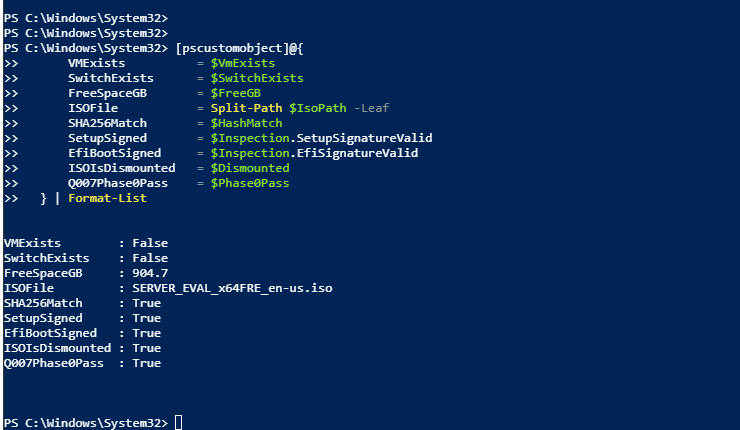

Searchable values are in the [paired text
extraction](../evidence/screenshots/phase0-01-q007-hyperv-precheck.txt) and the
[hands-on evidence log](../evidence/q007-windows-hands-on-evidence-log.md).

**Codex validation gate:** passed on 2026-07-15 for the technical precheck.
Confirm no active Hyper-V/storage incident and record the exact Phase 2
approval before creating or copying anything.

## Phase 1 — State The Failure Before Building

Read this scenario aloud or place it in the transcript notes:

> A user resolves `files.q007.test`. DNS succeeds but returns both the intended
> `10.77.7.10` and stale `10.77.7.99` addresses. A client that selects the stale
> address cannot reach the intended endpoint. The operator must inspect every
> A record, remove only the proven-wrong value, and pass repeated positive and
> negative tests before closing.

No screenshot is required. The scenario fixes the expected state before the
operator sees the fault.

## Phase 2 — Create The Isolated Hyper-V Objects

**Approval gate:** passed on 2026-07-15 for the exact ISO copy, Private switch,
fixed VM, and standalone Windows installation scope recorded in the
change-window plan. Guest IP/DNS configuration, deletion, and publication are
not included. Stop at each Codex validation gate.

### Approved Media Staging — Complete 2026-07-16

Leonel copied the hash-validated `SERVER_EVAL_x64FRE_en-us.iso` to
`D:\Hyper-V\ISOs` without deleting the source. The destination SHA-256 was
`3E4FA6D8507B554856FC9CA6079CC402DF11A8B79344871669F0251535255325`,
which exactly matched the accepted source.

### 2A. Create The Private Switch In Hyper-V Manager

1. Open **Hyper-V Manager** and select the local host.
2. Open **Virtual Switch Manager**.
3. Choose **New virtual network switch** and **Private**.
4. Select **Create Virtual Switch**.
5. Name it `Q007-Private`; do not select or bind a physical adapter.
6. Apply the change.

Verify in PowerShell:

```powershell
Get-VMSwitch -Name 'Q007-Private' |
  Select-Object Name,SwitchType,NetAdapterInterfaceDescription
```

Required result: `SwitchType` is `Private` and no physical adapter description
is present.

**Phase 2A evidence accepted:** the original capture required no crop or
redaction and was preserved byte-for-byte.

<p><strong>Proof:</strong> The new `Q007-Private` switch reports type `Private` and has no physical-adapter interface description.</p>

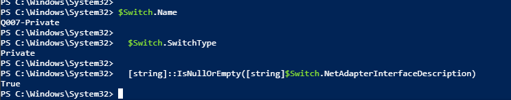

The [paired text](../evidence/screenshots/phase2-01-q007-private-switch.txt)
retains the three displayed property checks. This evidence does not prove VM
creation or attachment.

The two additional GUI views are displayed with their paired notes in the
[Windows evidence details](../evidence/q007-windows-evidence-details.md#phase-2--private-switch-and-isolated-vm).

### 2B. Create The Standalone VM In Hyper-V Manager

1. Select **New > Virtual Machine** and name it `Q007-DNS01`.
2. Store it only under the approved Q007 VM storage root.
3. Choose **Generation 2**.
4. Assign 4096 MB startup memory.
5. Connect the one adapter to `Q007-Private`.
6. Create a 40 GB dynamically expanding VHDX.
7. Attach the validated Windows Server ISO.
8. Finish the wizard and set the processor count to 2. Keep the default
   Generation 2 Secure Boot setting and Microsoft Windows template.
9. Connect to the VM console before starting it, start the VM, and press a key
   when prompted to boot from the ISO. If the prompt is missed, turn off only
   `Q007-DNS01`, reconnect to its console, and start it again.
10. Install the intended Windows Server edition with Desktop Experience and a
   local Administrator account. Do not join a domain.

Never capture the product-key, password, or account-creation screens.

After installation, verify on the host:

```powershell
Get-VM -Name 'Q007-DNS01' |
  Select-Object Name,State,Generation,ProcessorCount,MemoryStartup
Get-VMNetworkAdapter -VMName 'Q007-DNS01' |
  Select-Object VMName,Name,SwitchName,Status
```

Required result: one Generation 2 VM, one adapter, and only `Q007-Private`.

**Phase 2B host-configuration evidence accepted:** the original capture was
preserved byte-for-byte and required no crop or redaction.

<p><strong>Proof:</strong> `Q007-DNS01` was Off with Generation 2, 2 vCPU, 4 GB static startup memory, one network adapter, and attachment only to `Q007-Private`.</p>

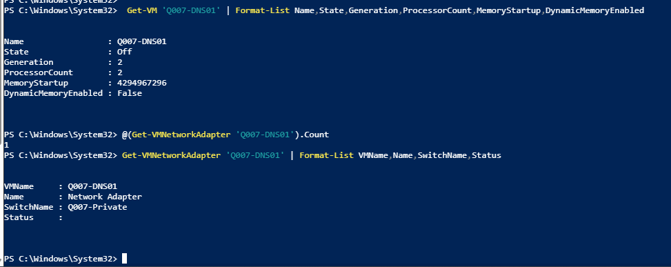

The [paired text](../evidence/screenshots/phase2-02-q007-vm-isolated-network.txt)
retains the displayed resource and adapter values. Earlier operator output also
verified a dynamic 40 GB VHDX, Secure Boot with the Microsoft Windows template,
and the staged ISO path. The accepted screenshot does not establish whether
Windows Server installation completed inside the guest.

**Codex validation gate:** passed on 2026-07-16. Host-side isolation passed,
and the [guest verification](../evidence/q007-phase2-guest-installation-verification.txt)
then proved Windows Server 2022 Standard Evaluation build 20348 was running in
`WORKGROUP` with `PartOfDomain=False`. Phase 3 guest rename, IP, and DNS-client
configuration remain separately approval-gated.

### Overnight Handoff — 2026-07-16

Leonel ended the session while Windows Setup displayed 50%. `Q007-DNS01` was
left running on `Q007-Private` so Setup could finish and reboot. Do not press a
key during an automatic reboot, because that would restart installation from
the DVD. At the next session, connect to the VM, complete the local
Administrator setup if prompted, sign in, and run the Phase 2 guest OS and
workgroup verification. Do not rename the guest or configure IP/DNS until
Codex validates that output and the separate Phase 3 approval is recorded.

### Guest Installation Verification — 2026-07-16

Leonel resumed the VM, signed in, and ran the two planned read-only CIM checks.
The [preserved output](../evidence/q007-phase2-guest-installation-verification.txt)
identified Windows Server 2022 Standard Evaluation version 10.0.20348, build
20348. It also showed the initial computer name, `WORKGROUP`, and
`PartOfDomain=False`. This closes Phase 2 without renaming the guest or
configuring its IP, DNS client, DNS role, zone, or records.

## Phase 3 — Configure And Prove Guest Isolation

**Approval gate:** passed on 2026-07-16 for only the guest rename/restart,
evidence transcript, two fixed lab addresses on the one Private-switch adapter,
no default gateway, and DNS client `10.77.7.2`. DNS role installation and all
later phases remain unapproved.

In Server Manager, rename the standalone server to `Q007-DNS01` and restart.
Then open Windows PowerShell as Administrator in the guest.

Create the evidence directory and start the transcript:

```powershell
New-Item -Path 'C:\Q007-Evidence' -ItemType Directory -Force
Start-Transcript -Path 'C:\Q007-Evidence\q007-windows-hands-on-transcript.txt' -Force
```

Require exactly one connected adapter, then configure the two lab addresses.
There is deliberately no default gateway.

```powershell
$UpNics = @(Get-NetAdapter | Where-Object Status -eq 'Up')
if ($UpNics.Count -ne 1) {
    throw "Expected exactly one connected adapter; found $($UpNics.Count)."
}

$IfIndex = $UpNics[0].ifIndex
New-NetIPAddress -InterfaceIndex $IfIndex -IPAddress '10.77.7.2' `
  -PrefixLength 24
New-NetIPAddress -InterfaceIndex $IfIndex -IPAddress '10.77.7.10' `
  -PrefixLength 24 -SkipAsSource $true
Set-DnsClientServerAddress -InterfaceIndex $IfIndex `
  -ServerAddresses '10.77.7.2'
```

Name resolution will not work until Phase 4 installs the DNS role. That is
expected; do not add a public, production, or second DNS server address.

Run the safety proof:

```powershell
Get-CimInstance Win32_ComputerSystem |
  Select-Object Name,Domain,PartOfDomain
Get-NetAdapter | Select-Object Name,Status,MacAddress,LinkSpeed
Get-NetIPAddress -InterfaceIndex $IfIndex -AddressFamily IPv4 |
  Select-Object IPAddress,PrefixLength,SkipAsSource
Get-NetRoute -ErrorAction SilentlyContinue |
  Where-Object DestinationPrefix -in @('0.0.0.0/0','::/0')
Get-DnsClientServerAddress -InterfaceIndex $IfIndex -AddressFamily IPv4
```

Required result: `Name` is `Q007-DNS01`, `PartOfDomain` is `False`, the two
fixed IPv4 addresses are present, the default-route command returns nothing,
and the only DNS client address is `10.77.7.2`.

**Evidence:** capture `phase3-01-q007-guest-safety-precheck.png`.

**Phase 3 evidence accepted:** the original clean recapture was preserved
byte-for-byte and required no redaction. Its SHA-256 matches the source.

<p><strong>Proof:</strong> The standalone guest has exactly the two approved lab addresses, self-DNS only, no default route, and a passing combined assertion.</p>

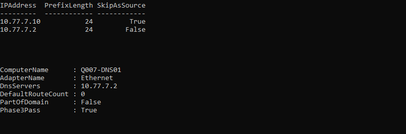

The [paired text](../evidence/screenshots/phase3-01-q007-guest-safety-precheck.txt)
retains the visible values. A first capture was rejected because it exposed the
local account path; Leonel recaptured only the technical output. The final
evidence shows `Q007-DNS01`, `PartOfDomain=False`, `10.77.7.2/24`,
`10.77.7.10/24` with `SkipAsSource=True`, DNS client `10.77.7.2`, no default
route, and `Phase3Pass=True`.

<p><strong>Proof:</strong> The Computer Name dialog shows `Q007-DNS01` remaining in `WORKGROUP`. <a href="../evidence/screenshots/phase3-02-q007-rename-workgroup.txt">Paired evidence note</a>.</p>

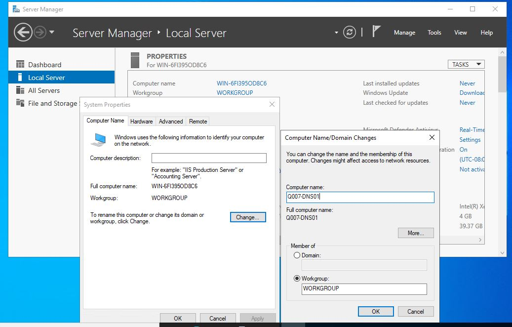

**Codex validation gate:** passed on 2026-07-16. Phase 4 DNS-role and zone
configuration remain separately approval-gated.

## Phase 4 — Install DNS And Build The Baseline

**Approval gate:** passed on 2026-07-16 for only the DNS Server role and
management tools, the file-backed `q007.test` primary zone with dynamic updates
disabled, and one `files` A record for `10.77.7.10`. AD DS, DHCP, other roles,
PTRs, forwarders, delegations, production DNS, and fault injection remain
unapproved.

### 4A. Install The Role With Server Manager

1. Open **Manage > Add Roles and Features**.
2. Choose **Role-based or feature-based installation** and the local server.
3. Select **DNS Server**, accept the management tools, and install.
4. Do not add AD DS, DHCP, or any other role.

Verify:

```powershell
Get-WindowsFeature -Name DNS |
  Select-Object Name,InstallState
Get-Service -Name DNS |
  Select-Object Name,Status,StartType
```

**Phase 4A evidence accepted:** the clean PowerShell capture was preserved
byte-for-byte and required no redaction. Its SHA-256 matches the source.

<p><strong>Proof:</strong> DNS and its management tools are installed, AD DS and DHCP remain uninstalled, and the DNS service is running automatically.</p>

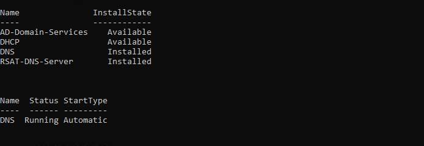

The [paired text](../evidence/screenshots/phase4-01-q007-dns-role-installed.txt)
retains the visible role and service values.

The additional role-installation GUI view is displayed with its paired note in
the [Windows evidence details](../evidence/q007-windows-evidence-details.md#phase-4--dns-role-and-baseline-zone).

### 4B. Create The Standalone Zone With DNS Manager

1. Open **Tools > DNS**.
2. Expand the local server and right-click **Forward Lookup Zones**.
3. Choose **New Zone**, then **Primary zone**.
4. Do not store the zone in Active Directory.
5. Name the zone `q007.test` and accept `q007.test.dns` as the zone file.
6. Select **Do not allow dynamic updates**.
7. In `q007.test`, create a new Host (A) named `files` with
   `10.77.7.10`. Do not create a PTR record.

Verify the exact baseline:

```powershell
Get-DnsServerZone -Name 'q007.test' |
  Select-Object ZoneName,ZoneType,IsDsIntegrated,DynamicUpdate
Get-DnsServerResourceRecord -ZoneName 'q007.test' -Name 'files' -RRType A |
  Select-Object HostName,RecordType,@{
    Name='IPv4Address';Expression={$_.RecordData.IPv4Address}
  }
```

Required result: a non-AD-integrated primary zone with dynamic updates off and
exactly one `files` A record containing `10.77.7.10`.

**Evidence:** capture `phase4-01-q007-dns-role-installed.png` and
`phase4-02-q007-zone-baseline-record.png`.

**Phase 4B evidence accepted:** the DNS Manager capture was preserved
byte-for-byte and required no redaction. Its SHA-256 matches the source.

<p><strong>Proof:</strong> DNS Manager shows the standalone `q007.test` zone and the `files` Host (A) properties for `10.77.7.10`, with PTR creation unchecked.</p>

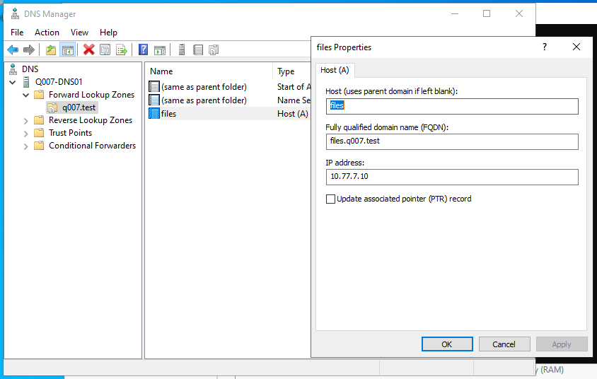

The [paired text](../evidence/screenshots/phase4-02-q007-zone-baseline-record.txt)
retains the visible DNS Manager values. Transcript output separately proved
the primary zone is file-backed and non-AD-integrated, dynamic updates are
disabled, the zone file is `q007.test.dns`, exactly one A record exists, and
`Phase4Pass=True`.

The additional record-creation GUI view is displayed with its paired note in
the [Windows evidence details](../evidence/q007-windows-evidence-details.md#phase-4--dns-role-and-baseline-zone).

**Codex validation gate:** passed on 2026-07-16. Phase 5 baseline query and
fault injection remain separately approval-gated.

### Overnight Handoff — 2026-07-16

Leonel stopped after the accepted Phase 4 baseline and before any Phase 5
query or fault. The safe retained state is `Q007-DNS01` powered Off on
`Q007-Private`, with the DNS role running when last checked and the standalone
`q007.test` zone containing only `files -> 10.77.7.10`. Stop the current
PowerShell transcript before the graceful shutdown. On resume, start the VM,
sign in, reopen elevated PowerShell, append to the same transcript, and rerun
the Phase 4 validation before requesting Phase 5 approval. Do not create
`10.77.7.99` or query/inject the fault during the pause.

### Resume Validation — 2026-07-17

Leonel started the retained VM, appended to the existing transcript, and
reran the complete isolation, service, zone, and record precheck. The
[preserved output](../evidence/q007-phase4-resume-verification-2026-07-17.txt)
showed the two fixed addresses, self-DNS only, no default route, DNS running,
the file-backed non-AD zone, exactly one `files -> 10.77.7.10` A record, and
`ResumePass=True`. Phase 5 remains separately approval-gated.

## Phase 5 — Query The Baseline And Inject One Fault

**Approval gate:** passed on 2026-07-17 for only the direct exact-baseline
query, wrong-address liveness check, one extra `files` A record for
`10.77.7.99` with a five-minute TTL, guest DNS-client cache clear, six direct
full-answer queries, and good/wrong reachability tests. PTR creation, other
zones or DNS settings, production contact, repair/removal, and cleanup remain
unapproved.

Query the authoritative server directly and preserve the full baseline:

```powershell
$DnsServer = '10.77.7.2'
$Name = 'files.q007.test'
$Good = '10.77.7.10'
$Bad = '10.77.7.99'

$Baseline = @(
  Resolve-DnsName $Name -Server $DnsServer -Type A -DnsOnly -NoHostsFile |
    Where-Object Type -eq 'A' |
    Select-Object -ExpandProperty IPAddress
)
$Baseline
if ($Baseline.Count -ne 1 -or $Baseline[0] -ne $Good) {
    throw "Baseline does not contain exactly $Good."
}

$BadAlreadyResponds = Test-Connection -ComputerName $Bad -Count 1 -Quiet
if ($BadAlreadyResponds) {
    throw "$Bad already responds; do not use it as the fault address."
}
```

Capture the baseline screenshot before continuing. Then add only the wrong
record in this disposable zone:

**Baseline evidence accepted:** the clean recapture was preserved
byte-for-byte and required no redaction. Its SHA-256 matches the source.

<p><strong>Proof:</strong> Before injection, the direct query returned exactly `10.77.7.10`, the wrong address did not respond, and the baseline assertion passed.</p>

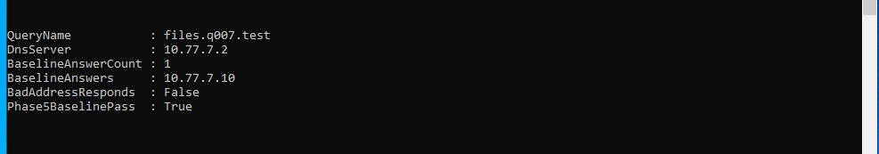

The [paired text](../evidence/screenshots/phase5-01-q007-baseline-resolution.txt)
retains the six displayed values. For later captures, Leonel chose DNS Manager
or Server Manager for the Windows configuration state and PowerShell only for
proof the GUI cannot show, such as full answer sets, repeated queries, route
isolation, and NXDOMAIN.

Then add only the wrong record in this disposable zone:

```powershell
Add-DnsServerResourceRecord -ZoneName 'q007.test' -A -Name 'files' `
  -IPv4Address '10.77.7.99' -TimeToLive 00:05:00
Clear-DnsClientCache

Get-DnsServerResourceRecord -ZoneName 'q007.test' -Name 'files' -RRType A |
  Select-Object HostName,RecordType,@{
    Name='IPv4Address';Expression={$_.RecordData.IPv4Address}
  }
```

The GUI-created baseline and injected record can display different TTLs. TTL
does not affect this pass criterion because every test names the authoritative
server directly and checks the complete current answer set.

Inspect the complete answer set repeatedly. Record order may change because a
DNS server can rotate same-name records; order is not a pass/fail condition.

```powershell
1..6 | ForEach-Object {
    $Answers = @(
      Resolve-DnsName $Name -Server $DnsServer -Type A -DnsOnly -NoHostsFile |
        Where-Object Type -eq 'A' |
        Select-Object -ExpandProperty IPAddress
    )
    [pscustomobject]@{
        Query = $_
        CompleteAnswerSet = ($Answers -join ', ')
        ContainsGood = $Good -in $Answers
        ContainsBad = $Bad -in $Answers
    }
}

Test-Connection -ComputerName $Good -Count 2
Test-Connection -ComputerName $Bad -Count 2 -ErrorAction Continue
```

The `$Bad` ping is expected to fail with red error or timeout output. That
failure is the passing reachability result; preserve and capture it as-is.

Required result: every complete answer set contains both values; the locally
assigned correct address responds; the unassigned wrong address does not.
This is a reachability demonstration, not a claim that an SMB service ran.

**Evidence:** capture `phase5-01-q007-baseline-resolution.png` before injection
and `phase5-02-q007-fault-two-a-records.png` after injection.

**Fault evidence accepted:** the cropped DNS Manager capture was preserved
byte-for-byte and required no redaction. Its SHA-256 matches the source.

<p><strong>Proof:</strong> DNS Manager shows the real fault state with both `files` A records, `10.77.7.10` and `10.77.7.99`.</p>

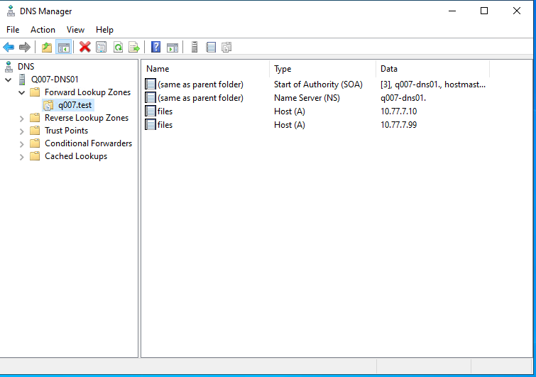

The [paired text](../evidence/screenshots/phase5-02-q007-fault-two-a-records.txt)
retains the two visible record values. The [full Phase 5 validation](../evidence/q007-phase5-fault-validation-2026-07-17.txt)
proves the five-minute TTL, six passing full-answer queries, good-address
reachability, and wrong-address non-reachability. It also preserves a failed
supplemental `ping.exe` exit-code assertion: an ICMP unreachable response made
the process exit zero, so Codex replaced that invalid assumption with
`Test-NetConnection`, which returned good `True`, bad `False`, and
`ReachabilityPass=True`.

**Codex validation gate:** passed on 2026-07-17. Do not repair until the
separate Phase 6 approval is recorded.

## Phase 6 — Preview, Repair, And Retest

List the current records immediately before repair:

```powershell
Get-DnsServerResourceRecord -ZoneName 'q007.test' -Name 'files' -RRType A |
  Select-Object HostName,RecordType,@{
    Name='IPv4Address';Expression={$_.RecordData.IPv4Address}
  }
```

Preview the exact removal. Read the preview and confirm it names only the A
record `files.q007.test` with data `10.77.7.99`:

```powershell
Remove-DnsServerResourceRecord -ComputerName 'localhost' `
  -ZoneName 'q007.test' -Name 'files' -RRType A `
  -RecordData '10.77.7.99' -WhatIf
```

If the preview is exact, remove only that value and clear only the guest's DNS
client cache:

```powershell
Remove-DnsServerResourceRecord -ComputerName 'localhost' `
  -ZoneName 'q007.test' -Name 'files' -RRType A `
  -RecordData '10.77.7.99' -Force
Clear-DnsClientCache
```

Run three positive retests and fail closed on any unexpected answer:

```powershell
$Retests = @(
  1..3 | ForEach-Object {
      $Answers = @(
        Resolve-DnsName $Name -Server $DnsServer -Type A -DnsOnly -NoHostsFile |
          Where-Object Type -eq 'A' |
          Select-Object -ExpandProperty IPAddress |
          Sort-Object -Unique
      )
      [pscustomobject]@{
          Retest = $_
          CompleteAnswerSet = ($Answers -join ', ')
          Passed = ($Answers.Count -eq 1 -and $Answers[0] -eq $Good)
      }
  }
)
$Retests | Format-Table -AutoSize
if ($Retests.Passed -contains $false) {
    throw 'At least one repaired-state retest failed.'
}

Get-DnsServerResourceRecord -ZoneName 'q007.test' -Name 'files' -RRType A |
  Select-Object HostName,RecordType,@{
    Name='IPv4Address';Expression={$_.RecordData.IPv4Address}
  }

nslookup -type=A 'old-files.q007.test' '10.77.7.2'
```

If the resource-record command errors or the good record is missing, stop and
follow [rollback Level 1](q007-windows-lab-rollback-plan.md#level-1--wrong-record-exists-or-repair-validation-fails).

Required result: all three `Passed` values are `True`; the server contains
only `10.77.7.10`; and `nslookup` reports the unknown name does not exist.

### Repair And Retest Output

<p><strong>Proof:</strong> PowerShell shows one good record, three exact-good retests, the wrong record absent, NXDOMAIN, and `Phase6Pass=True`. <a href="../evidence/screenshots/phase6-01-q007-repair-powershell.txt">Paired evidence note</a>.</p>

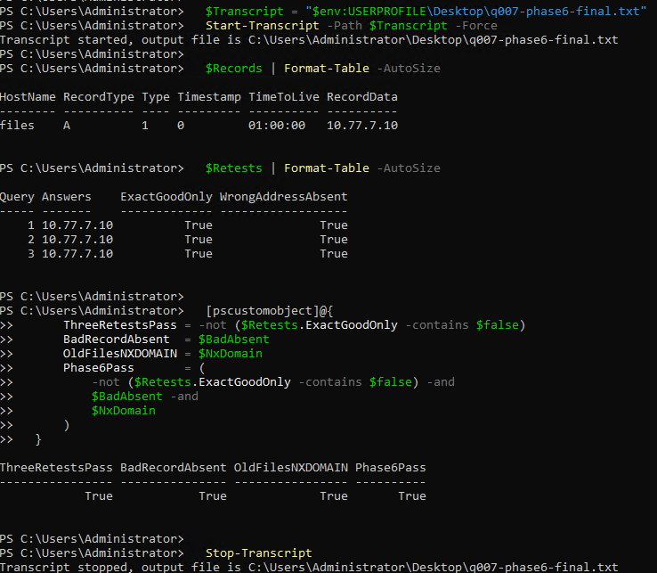

### Repaired DNS Manager State

<p><strong>Proof:</strong> DNS Manager shows exactly one `files` A record for `10.77.7.10`. <a href="../evidence/screenshots/phase6-02-q007-repaired-dns-manager.txt">Paired evidence note</a>.</p>

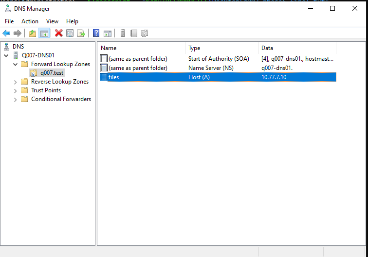

**Codex validation gate:** passed on 2026-07-17. Phase 6 is complete; zone
cleanup and VM shutdown require separate approval.

## Phase 7 — Perform The Operator Closeout Check

Use the completed [Q007 Windows runbook](../runbooks/q007-windows-dns-failure-triage.md)
as the checklist. This lab exercised its extra-record branch; NIC-order and
forwarder changes remain out of scope.

```powershell
Get-Service DNS | Select-Object Name,Status,StartType
Get-DnsServerZone -Name 'q007.test' |
  Select-Object ZoneName,ZoneType,IsDsIntegrated,DynamicUpdate
Get-DnsServerResourceRecord -ZoneName 'q007.test' -Name 'files' -RRType A |
  Select-Object HostName,RecordType,@{
    Name='IPv4Address';Expression={$_.RecordData.IPv4Address}
  }
Get-NetRoute -ErrorAction SilentlyContinue |
  Where-Object DestinationPrefix -in @('0.0.0.0/0','::/0')
```

Required result: DNS is running; the disposable zone is authoritative and
non-AD-integrated; only the good record remains; and there is still no default
route.

### Windows Operator Closeout

<p><strong>Proof:</strong> DNS runs automatically, the zone is non-AD-integrated with updates disabled, only the good A record remains, and no default route is present. <a href="../evidence/screenshots/phase7-01-q007-windows-operator-validation.txt">Paired evidence note</a>.</p>

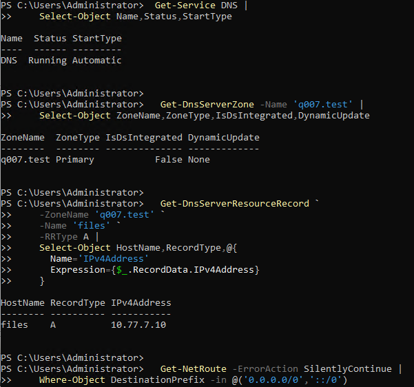

The Codex validation gate passed on 2026-07-17.

## Phase 8 — Package And Validate Evidence

Do not edit screenshots to change technical output. Crop unrelated desktop
content and redact only secrets or unrelated identifiers, recording each
redaction. Provide Codex with:

- the transcript from `C:\Q007-Evidence`;
- the screenshot files listed in the screenshot plan;
- the Windows Server version and edition, with no product key;
- the Phase 6 retest output; and
- any deviation, error, or rollback that occurred.

Codex will inspect every image, normalize filenames, check links and hashes,
and update Q007 only after the evidence passes. No screenshot is required for
this packaging phase.

## Phase 9 — Remove The Zone And Retain The Powered-Off Lab

Proceed only after Codex confirms the Phase 8 evidence is sufficient. Remove
the disposable zone, verify it is absent, and stop the transcript:

```powershell
Remove-DnsServerZone -Name 'q007.test' -Force
Get-DnsServerZone -Name 'q007.test' -ErrorAction SilentlyContinue
Stop-Transcript
```

Required result: the verification command returns no zone. No separate cleanup
screenshot was captured before shutdown, so the evidence record does not claim
independent visual proof of the empty-zone check.

### Powered-Off VM Retention

<p><strong>Proof:</strong> Hyper-V host PowerShell reports `Q007-DNS01` in the `Off` state. <a href="../evidence/screenshots/phase9-02-q007-vm-powered-off-retained.txt">Paired evidence note and limitation</a>.</p>

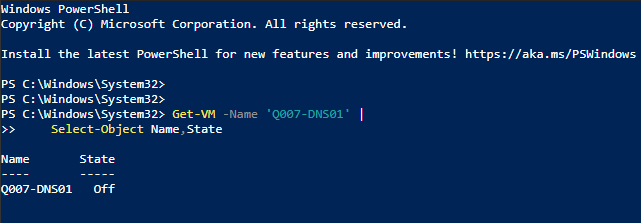

Keep the VM, VHDX, and `Q007-Private` switch until Codex accepts the cleanup
evidence. Their deletion is destructive and requires a separate exact
approval. Never delete or alter any other VM, disk, ISO, or switch.

## Completion Criteria

The hands-on extension is complete only when:

- Phase 0 current state and the Hyper-V change approval are recorded;
- the guest remained standalone, private, and without a default route;
- the role, zone, correct record, and injected wrong record are visible;
- the full two-record fault was diagnosed without relying on answer order;
- only the wrong record was removed after an exact preview;
- three positive retests passed and the unknown name returned NXDOMAIN;
- the evidence set was inspected, sanitized, linked, and hashed;
- the test zone was removed and the VM was powered off; and
- documentation distinguishes the completed automated Q007 core from this
  later Windows operator practicum.

## Microsoft References

- [Plan Hyper-V networking](https://learn.microsoft.com/windows-server/virtualization/hyper-v/plan/plan-hyper-v-networking-in-windows-server)
- [Add or remove Windows Server roles and features](https://learn.microsoft.com/windows-server/administration/server-manager/add-remove-roles-features)
- [`Add-DnsServerPrimaryZone`](https://learn.microsoft.com/powershell/module/dnsserver/add-dnsserverprimaryzone)
- [`Add-DnsServerResourceRecord`](https://learn.microsoft.com/powershell/module/dnsserver/add-dnsserverresourcerecord)
- [`Get-DnsServerResourceRecord`](https://learn.microsoft.com/powershell/module/dnsserver/get-dnsserverresourcerecord)
- [`Remove-DnsServerResourceRecord`](https://learn.microsoft.com/powershell/module/dnsserver/remove-dnsserverresourcerecord)
