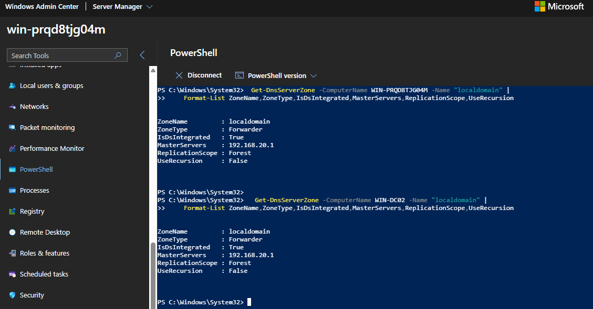
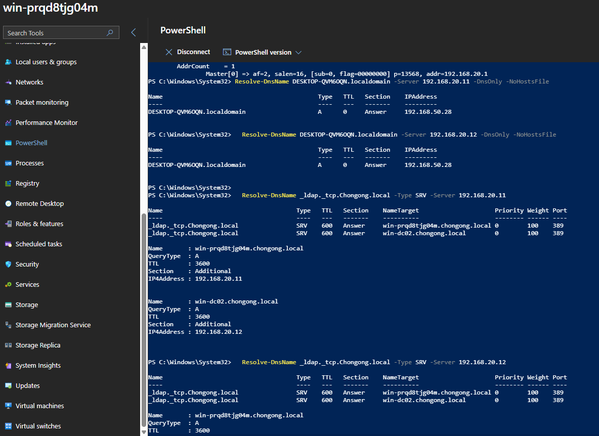
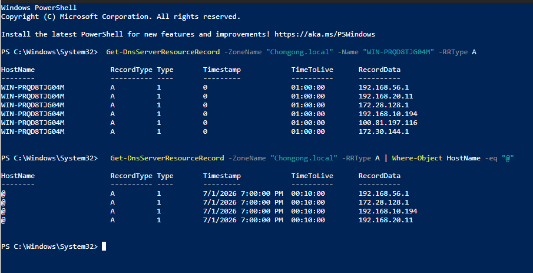
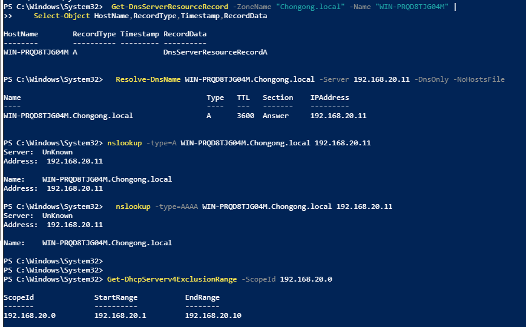
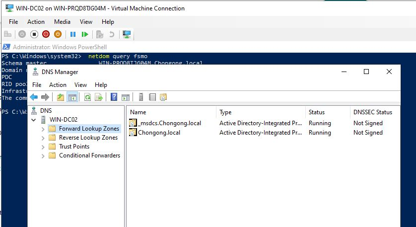
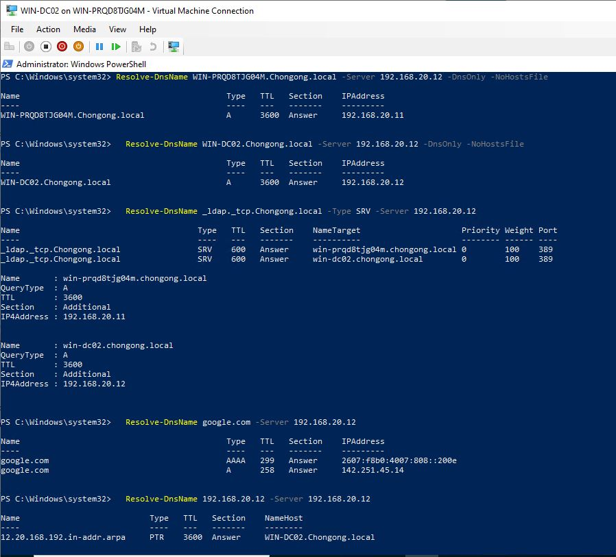
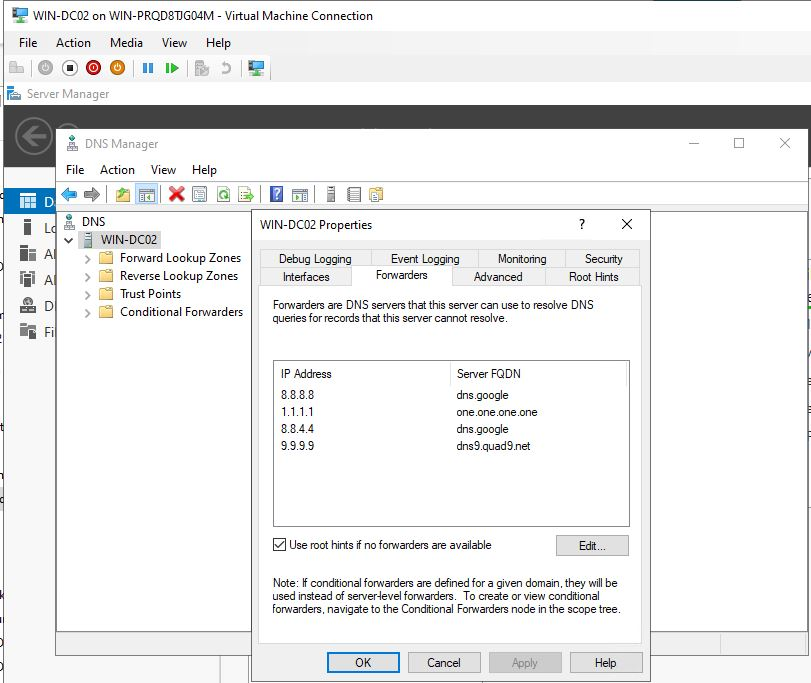
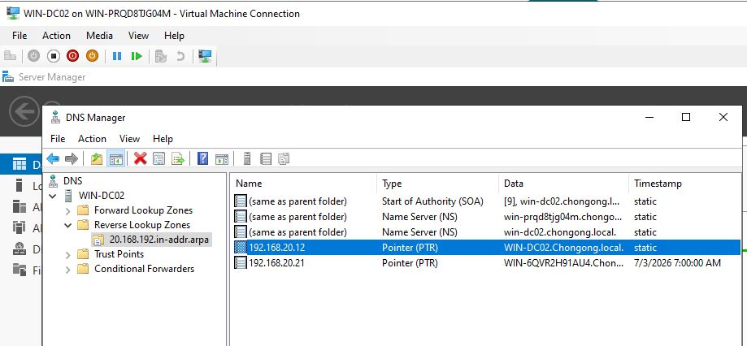
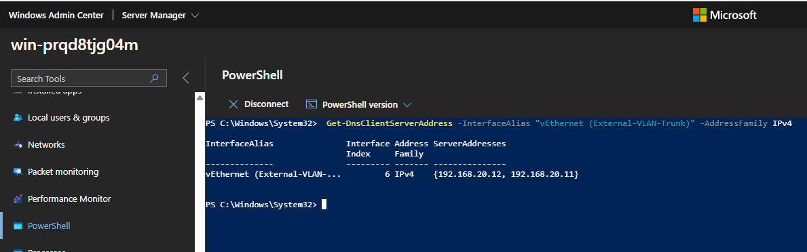

# Project 03 — AD DNS And Name Resolution Engineering Technical Details

**Status:** Complete on `2026-07-03`

**System:** `WIN-PRQD8TJG04M` (`192.168.20.11`) and `WIN-DC02` (`192.168.20.12`) - AD-integrated DNS

**Skill:** `/winserver-p03`

## Summary

I audited and hardened the AD-integrated DNS configuration for `Chongong.local`.
During the audit I found a real DNS problem: the Domain Controller was using
public DNS servers on its own LAN NIC instead of querying itself first. I fixed
that, created the missing reverse lookup zone, enabled scavenging, verified
internal/external resolution, documented break/fix runbooks, completed
secondary DNS verification after `WIN-DC02` was promoted, and added a real
conditional forwarder for Route10's `localdomain` zone.

## Portfolio Summary

**Situation:** DNS had not been fully documented, reverse DNS was missing for the
Windows subnet, scavenging was disabled, and the DC itself was pointing at
public DNS instead of AD DNS.

**Task:** Audit and harden DNS without breaking the live household domain.

**Action:** I audited zones, forwarders, scavenging, and NIC settings; fixed the
DC DNS client path; created the reverse zone and PTR record; enabled scavenging;
verified internal and external resolution; added a conditional forwarder for
Route10's `localdomain` zone; and documented DNS break/fix runbooks.

**Result:** The domain now resolves internal AD records correctly, external
forwarding still works, reverse DNS exists for both DCs, stale record cleanup is
enabled, `WIN-DC02` is verified as a working secondary DNS server, and AD DNS can
now resolve Route10-registered household names without leaking `localdomain`
queries to public DNS.

## What Changed

| Area | Result |
|------|--------|
| DC DNS client settings | PDC now uses `192.168.20.12, 192.168.20.11`; `WIN-DC02` uses `192.168.20.11, 192.168.20.12` |
| Forwarders | Confirmed already configured: `8.8.8.8`, `1.1.1.1`, `8.8.4.4`, `9.9.9.9` |
| Reverse DNS | Created `20.168.192.in-addr.arpa` and PTR records for both DCs |
| Scavenging | Enabled server scavenging and zone aging on the PDC; enabled server scavenging on `WIN-DC02` |
| Split-brain behavior | Internal AD records and external public names both resolve correctly |
| Conditional forwarder | Added AD-integrated `localdomain` forwarder to Route10 at `192.168.20.1`, replicated to both DCs |
| Break/fix evidence | One real DNS incident plus two documented runbooks |
| Secondary DNS | `WIN-DC02` resolves AD names, SRV records, reverse DNS, and external names |

## Project Phases

Project 03 has 10 phases. All phases are complete. Phase 5 was completed after
live discovery found a real forwarding target: Route10's `localdomain` DNS zone.

| Phase | Name | Status |
|-------|------|--------|
| Phase 1 | Audit Current DNS State | Complete |
| Phase 2 | Fix DNS Server Addressing | Complete |
| Phase 3 | Configure Forwarders | Complete |
| Phase 4 | Reverse Lookup Zones | Complete |
| Phase 5 | Conditional Forwarders | Complete - Route10 `localdomain` |
| Phase 6 | DNS Scavenging | Complete |
| Phase 7 | Split-Brain DNS | Complete |
| Phase 8 | Break/Fix Exercise | Complete |
| Phase 9 | `WIN-DC02` DNS Verification | Complete |
| Phase 10 | Document + Push | Complete |

Screenshot checklist: [docs/p03-screenshot-plan.md](docs/p03-screenshot-plan.md)

## Phase Details

### Phase 1 - Audit Current DNS State

I audited the current DNS configuration before making changes.

What I did:

- Reviewed DNS server role configuration.
- Listed all DNS zones.
- Checked forwarders.
- Checked scavenging state.
- Checked DNS client settings on the DC NICs.
- Found that the LAN NIC was pointing to public DNS instead of itself.

Why it matters: AD depends on DNS. If a Domain Controller sends internal AD
queries to public DNS first, authentication and service discovery can fail even
when the DNS zone itself is correct.

PowerShell used/proof:

```powershell
Get-DnsServer
Get-DnsServerZone
Get-DnsServerForwarder
Get-DnsServerScavenging
Get-DnsClientServerAddress -AddressFamily IPv4
Resolve-DnsName _ldap._tcp.Chongong.local -Type SRV
```

Images to insert later:

- `screenshots/phase1-01-dns-zones-and-forwarders.png`
- `screenshots/phase1-02-dns-client-before-fix.png`

### Phase 2 - Fix DNS Server Addressing

I fixed the real DNS misconfiguration found in Phase 1.

What I did:

- Changed `vEthernet (External-VLAN-Trunk)` from public DNS servers to AD DNS.
- Verified internal AD SRV records resolved.
- Verified external internet names still resolved through forwarders.
- After `WIN-DC02` was promoted, changed the PDC to use `WIN-DC02` first and
  itself second.

Why it matters: a DC should use AD DNS for its own DNS client settings. Public
DNS belongs in the DNS server forwarder list, not on the DC NIC.

PowerShell used/proof:

```powershell
Set-DnsClientServerAddress -InterfaceAlias "vEthernet (External-VLAN-Trunk)" -ServerAddresses 127.0.0.1

Set-DnsClientServerAddress -InterfaceAlias "vEthernet (External-VLAN-Trunk)" -ServerAddresses 192.168.20.12,192.168.20.11

Get-DnsClientServerAddress -AddressFamily IPv4
Resolve-DnsName _ldap._tcp.Chongong.local -Type SRV
Resolve-DnsName google.com
```


*Initial Phase 2 fix showing the DC moved off public DNS. After `WIN-DC02` was promoted, the final two-DC DNS client order is documented in Phase 9.*


*`_ldap._tcp.Chongong.local` resolving correctly after the fix.*

Break/fix evidence: [troubleshooting/break-fix-log.md](troubleshooting/break-fix-log.md)

### Phase 3 - Configure Forwarders

I confirmed the forwarders were already configured correctly, so no change was
needed.

What I did:

- Verified forwarders were already set to `8.8.8.8`, `1.1.1.1`, `8.8.4.4`,
  and `9.9.9.9`.
- Verified external DNS still resolved.
- Did not overwrite the forwarder list.

Why it matters: `Set-DnsServerForwarder` replaces the forwarder list. Since the
list was already correct, leaving it alone was safer than rewriting it.

PowerShell used/proof:

```powershell
Get-DnsServerForwarder
Resolve-DnsName google.com
```


*Configured forwarders: `8.8.8.8`, `1.1.1.1`, `8.8.4.4`, `9.9.9.9`.*


*External name resolution confirmed working through the forwarders.*

### Phase 4 - Reverse Lookup Zones

I created reverse DNS for the Windows subnet.

What I did:

- Created reverse zone `20.168.192.in-addr.arpa` for `192.168.20.0/24`.
- Created PTR record for `192.168.20.11`.
- Verified the PTR record by querying the DNS server directly.
- Identified Docker Desktop `hns` as a local client-side artifact when
  `Resolve-DnsName` returned `host.docker.internal`.

Why it matters: reverse DNS helps troubleshooting, logging, monitoring, and some
enterprise tools that expect PTR records for infrastructure hosts.

PowerShell used/proof:

```powershell
Add-DnsServerPrimaryZone -NetworkID "192.168.20.0/24" -ReplicationScope Domain -DynamicUpdate Secure
Add-DnsServerResourceRecordPtr -ZoneName "20.168.192.in-addr.arpa" -Name "11" -PtrDomainName "WIN-PRQD8TJG04M.Chongong.local"

Get-DnsServerZone -Name "20.168.192.in-addr.arpa"
Get-DnsServerResourceRecord -ZoneName "20.168.192.in-addr.arpa" -RRType Ptr
nslookup -type=PTR 192.168.20.11 127.0.0.1
nslookup -type=PTR 192.168.20.11 192.168.20.11
```


*`20.168.192.in-addr.arpa` reverse lookup zone created.*


*PTR record for `192.168.20.11` confirmed pointing to `WIN-PRQD8TJG04M.Chongong.local`.*

### Phase 5 - Conditional Forwarders

This phase is complete. I first deferred conditional forwarding because there
was no proven target zone. After live discovery, I found a real one:
Route10 registers household DHCP names under `localdomain`, and both DCs can
query Route10 at `192.168.20.1`.

What I did:

- Ruled out OPNsense `internal` because it was not an authoritative zone for
  lab clients and the DCs could not query OPNsense DNS on VLAN 20.
- Ruled out Pi-hole at `192.168.10.26` because it did not host a useful local
  zone for this project.
- Verified Route10 answered `DESKTOP-QVM6OQN.localdomain` as `192.168.50.28`.
- Added an AD-integrated conditional forwarder for `localdomain` to Route10 at
  `192.168.20.1`.
- Verified the forwarder replicated to both DNS servers and works from both
  `192.168.20.11` and `192.168.20.12`.
- Disabled recursion for this forwarded zone so `localdomain` queries stay with
  Route10 instead of falling through to public DNS.

Why it matters: domain clients use AD DNS. Before this change, a lookup for a
household device like `DESKTOP-QVM6OQN.localdomain` could fail or be sent to
public forwarders. Now AD DNS sends only `localdomain` queries to Route10, which
keeps local names local without changing Route10, routing, DHCP, NAT, or firewall
behavior.

PowerShell used/proof:

```powershell
Resolve-DnsName DESKTOP-QVM6OQN.localdomain -Server 192.168.20.1

Add-DnsServerConditionalForwarderZone `
  -Name "localdomain" `
  -MasterServers 192.168.20.1 `
  -ReplicationScope "Forest"

Set-DnsServerConditionalForwarderZone -ComputerName WIN-PRQD8TJG04M -Name "localdomain" -UseRecursion $false
Set-DnsServerConditionalForwarderZone -ComputerName WIN-DC02 -Name "localdomain" -UseRecursion $false

Get-DnsServerZone -ComputerName WIN-PRQD8TJG04M -Name "localdomain" |
  Format-List ZoneName,ZoneType,IsDsIntegrated,MasterServers,ReplicationScope,UseRecursion

Get-DnsServerZone -ComputerName WIN-DC02 -Name "localdomain" |
  Format-List ZoneName,ZoneType,IsDsIntegrated,MasterServers,ReplicationScope,UseRecursion

Resolve-DnsName DESKTOP-QVM6OQN.localdomain -Server 192.168.20.11 -DnsOnly -NoHostsFile
Resolve-DnsName DESKTOP-QVM6OQN.localdomain -Server 192.168.20.12 -DnsOnly -NoHostsFile
```

Final verified state:

| Check | Result |
|-------|--------|
| Forwarded zone | `localdomain` |
| Forwarder target | Route10 at `192.168.20.1` |
| Replication | Forest-wide, AD-integrated, present on both DCs |
| Recursion for forwarded zone | Disabled |
| Test record | `DESKTOP-QVM6OQN.localdomain -> 192.168.50.28` from both DCs |

Rollback if this ever causes a problem:

```powershell
Remove-DnsServerConditionalForwarderZone -Name "localdomain" -Force
```

#### Conditional forwarder replicated to both DCs



*Both DNS servers have the AD-integrated `localdomain` conditional forwarder.
The forwarder points to Route10 at `192.168.20.1`, replicates forest-wide, and
has recursion disabled for that forwarded zone.*

#### Route10 localdomain resolution through both DCs



*Both DCs resolve `DESKTOP-QVM6OQN.localdomain` to `192.168.50.28`, and AD SRV
lookups still return both domain controllers. This proves the Route10 forwarder
works without breaking AD DNS service discovery.*

### Phase 6 - DNS Scavenging

I enabled stale-record cleanup.

What I did:

- Enabled DNS server scavenging.
- Enabled aging on the `Chongong.local` zone.
- Set refresh and no-refresh intervals.
- Verified the next available scavenging time.

Why it matters: stale DNS records create bad troubleshooting data. Scavenging
keeps DNS cleaner as clients and VMs change over time.

PowerShell used/proof:

```powershell
Set-DnsServerScavenging -ScavengingState $true -ScavengingInterval 7.00:00:00 -ComputerName WIN-PRQD8TJG04M
Set-DnsServerZoneAging -Name "Chongong.local" -Aging $true -RefreshInterval 4.00:00:00 -NoRefreshInterval 4.00:00:00

Get-DnsServerScavenging
Get-DnsServerZoneAging -Name "Chongong.local"
```

Images to insert later:

- `screenshots/phase6-01-scavenging-enabled.png`
- `screenshots/phase6-02-zone-aging-enabled.png`

### Phase 7 - Split-Brain DNS

I verified internal and external name resolution behaved correctly.

What I did:

- Verified internal host records resolve from AD DNS.
- Verified internal SRV records resolve from AD DNS.
- Verified external names resolve through forwarders.

Why it matters: internal AD names must stay private, while normal internet names
still need to resolve for updates, Microsoft 365, and general network use.

PowerShell used/proof:

```powershell
Resolve-DnsName WIN-PRQD8TJG04M.Chongong.local
Resolve-DnsName _ldap._tcp.Chongong.local -Type SRV
Resolve-DnsName google.com
```


*Internal AD names (host + SRV) resolving correctly and privately.*


*External public names still resolving correctly via forwarders.*

### Phase 8 - Break/Fix Exercise

I documented DNS troubleshooting using one real incident and two safe runbooks.

What I did:

- Used the real DC NIC DNS issue as Scenario A.
- Documented the missing `_msdcs` SRV records runbook.
- Documented the broken/missing forwarder runbook.
- Avoided intentionally breaking the live household DNS service just to create
  screenshots.

Why it matters: this turns a real DNS outage pattern into portfolio evidence and
future troubleshooting procedure without creating unnecessary downtime.

PowerShell used/proof:

```powershell
Get-DnsClientServerAddress -AddressFamily IPv4
Resolve-DnsName _ldap._tcp.Chongong.local -Type SRV
Get-DnsServerForwarder
Resolve-DnsName google.com
```


*NIC DNS fix and SRV resolution confirming the real Phase 2 incident is resolved.*

Image not yet captured for this phase: `screenshots/phase8-02-break-fix-log.png`

Break/fix log: [troubleshooting/break-fix-log.md](troubleshooting/break-fix-log.md)

### Phase 9 - `WIN-DC02` DNS Verification

I completed secondary DNS verification after `WIN-DC02` was built and promoted
as a DNS-enabled Global Catalog. Before doing that, I cleaned the multihomed
records on `WIN-PRQD8TJG04M` so `WIN-DC02` would not try to use the wrong
interface for AD DS and DNS replication.

What I did:

- Verified the DNS zones replicated to `WIN-DC02`.
- Copied the same DNS forwarders to `WIN-DC02`.
- Enabled server-level scavenging on `WIN-DC02`.
- Added the PTR record for `192.168.20.12`.
- Verified `WIN-DC02` answers internal host lookups, AD SRV records, reverse
  DNS, and external names.
- Updated the PDC DNS client so it uses `WIN-DC02` first and itself second.

Why it matters: a second DC only helps if clients can actually use it for DNS.
This phase proves the domain can resolve names through `WIN-DC02`, not just
through the original PDC.

PowerShell used/proof:

```powershell
Get-DnsServerZone -ComputerName WIN-DC02

$forwarders = (Get-DnsServerForwarder -ComputerName WIN-PRQD8TJG04M).IPAddress
Set-DnsServerForwarder -ComputerName WIN-DC02 -IPAddress $forwarders

Set-DnsServerScavenging `
  -ComputerName WIN-DC02 `
  -ScavengingState $true `
  -ScavengingInterval 7.00:00:00

Add-DnsServerResourceRecordPtr `
  -ZoneName "20.168.192.in-addr.arpa" `
  -Name "12" `
  -PtrDomainName "WIN-DC02.Chongong.local"

Resolve-DnsName WIN-PRQD8TJG04M.Chongong.local -Server 192.168.20.12 -DnsOnly -NoHostsFile
Resolve-DnsName WIN-DC02.Chongong.local -Server 192.168.20.12 -DnsOnly -NoHostsFile
Resolve-DnsName _ldap._tcp.Chongong.local -Type SRV -Server 192.168.20.12
Resolve-DnsName google.com -Server 192.168.20.12
Resolve-DnsName 192.168.20.12 -Server 192.168.20.12
Get-DnsClientServerAddress -InterfaceAlias "vEthernet (External-VLAN-Trunk)" -AddressFamily IPv4
```

Detailed DNS evidence: [docs/p03-win-dc02-secondary-dns-evidence.md](docs/p03-win-dc02-secondary-dns-evidence.md)


*Before cleanup, `WIN-PRQD8TJG04M` had multiple A records from non-AD interfaces. I fixed this before promoting `WIN-DC02` so replication would use the AD VLAN address.*


*After cleanup, direct DNS lookup for the PDC returned only `192.168.20.11`.*


*DNS Manager on `WIN-DC02` showing the AD-integrated zones replicated to the new DNS server.*


*PowerShell proof that `WIN-DC02` resolves both DC names, AD SRV records, external names, and its own PTR record.*


*`WIN-DC02` has the same public forwarders as the original DNS server.*


*Reverse lookup zone showing the `192.168.20.12` PTR for `WIN-DC02`. The command evidence above is the final authority for the clean PTR result.*


*The PDC now uses `WIN-DC02` first and itself second for DNS client resolution.*

### Phase 10 - Document + Push

I saved the Project 03 evidence and updated the repo.

What I did:

- Updated this Project 03 README.
- Added the break/fix log.
- Updated project status references.
- Added screenshot planning and embedded the completed Phase 5 and Phase 9
  evidence.

Why it matters: the DNS work is repeatable and reviewable, not just a one-time
live change.

Proof commands:

```bash
git status --short
git log --oneline -5
```

Final evidence links:

- WIN-DC02 secondary DNS evidence: [docs/p03-win-dc02-secondary-dns-evidence.md](docs/p03-win-dc02-secondary-dns-evidence.md)
- Break/fix log: [troubleshooting/break-fix-log.md](troubleshooting/break-fix-log.md)
- Screenshot plan: [docs/p03-screenshot-plan.md](docs/p03-screenshot-plan.md)

## Verified State

| Check | Result |
|-------|--------|
| Internal AD SRV lookup | `_ldap._tcp.Chongong.local` resolves to both `win-prqd8tjg04m.chongong.local:389` and `win-dc02.chongong.local:389` |
| PDC DNS client | `vEthernet (External-VLAN-Trunk)` uses `192.168.20.12, 192.168.20.11` |
| WIN-DC02 DNS client | `Ethernet` uses `192.168.20.11, 192.168.20.12` |
| Forwarders | Public forwarders still resolve external names |
| Conditional forwarder | `localdomain` forwards to Route10 `192.168.20.1` from both DCs |
| Reverse DNS | `192.168.20.11` and `192.168.20.12` have PTR records |
| Scavenging | Enabled |
| Zone aging | Enabled for `Chongong.local` |
| Secondary DNS | `WIN-DC02` answers internal, SRV, PTR, and external lookups |

## Technical Links

| Detail | Link |
|--------|------|
| WIN-DC02 DNS evidence | [docs/p03-win-dc02-secondary-dns-evidence.md](docs/p03-win-dc02-secondary-dns-evidence.md) |
| Break/fix log | [troubleshooting/break-fix-log.md](troubleshooting/break-fix-log.md) |
| Screenshot plan | [docs/p03-screenshot-plan.md](docs/p03-screenshot-plan.md) |
