# Q011 — Isolated RHEL 10.2 Baseline On Hyper-V

> **Frozen public mirror — 2026-07-22:** The canonical maintained record moved
> to [`enterprise-linux-administration-labs`](https://github.com/vushueh/enterprise-linux-administration-labs/tree/main/projects/q011-isolated-rhel-baseline).
> That repository is private until publication review passes. This copy remains
> temporarily so the completed public portfolio evidence does
> not disappear while the new repository completes its publication gate. Do
> not add new Linux project evidence here.

**Status:** ✅ Complete — Phase 9 retained the verified RHEL baseline Off,
disconnected, Untagged at VLAN 0, DVD-empty, and checkpoint-free with
`Phase9RetentionPass=True`  
**Date started:** 2026-07-19  
**Date completed:** 2026-07-21  
**Latest verified state:** 2026-07-21  
**Execution owner:** `windows-server-business-admin-labs`  
**Platform:** Hyper-V host `WIN-PRQD8TJG04M`  
**Queue ID:** `SIM-L1-RHEL`  
**Risk:** isolated VM lifecycle with separately approved live gates

## Why This Matters

I need a reproducible RHEL baseline that I can patch, test, and rebuild without
changing an existing Linux system. The first Proxmox candidate could not meet
RHEL 10's CPU requirement, so I stopped before VM creation and moved the lab to
compatible Hyper-V hardware. Keeping the new guest disconnected during
installation gave me an attributable starting point before registration,
networking, SSH, firewall, and update testing.

## Portfolio Summary

| | Summary |
|---|---|
| Situation | The selected Proxmox node did not meet RHEL 10's x86-64-v3 CPU requirement, and the available VLAN policy did not yet prove the isolation boundary. |
| Task | Build a fresh RHEL 10.2 VM on supported hardware without touching an existing RHEL guest or exposing the new system to a network. |
| Action | I selected Hyper-V, verified and staged the exact DVD, created a Generation 2 VM, installed Minimal RHEL with automatic LVM, captured the disconnected service baseline, rejected a conflicting DHCP authority, reserved the corrected OPNsense lease, repaired automatic profile activation, tested SSH, registered interactively, repaired the exact RPM trust gap, and ran one supervised patch/reboot window. |
| Result | RHEL 10.2 exists as `q011-rhel01` with SELinux Enforcing, locked root, a persistent `192.168.70.140` DHCP identity, automatic network activation, Windows 11 SSH, registration, and enabled BaseOS/AppStream repositories. Phase 7P completed DNF history transaction `2` and booted kernel `6.12.0-211.37.1.el10_2.x86_64`; Phase 8 proved stable controls and intended changes; Phase 9 retained the verified VM Off and isolated with `Phase9RetentionPass=True`. |

## How To Read This Project

- For the short story, follow the phase sections below.
- For exact commands and safety gates, use the linked design and run sheets.
- For objective output, open the Phase 4B and Phase 4C evidence records.
- For every retained hands-on image, use the linked visual walkthroughs and
  SHA-256 manifests.

## My Test Boundary

I used only `Q011-RHEL102-BASELINE` on `WIN-PRQD8TJG04M`. Phases 5 and 6
temporarily attached only that VM to `vSwitch-LAN` as Access VLAN 70 under
exact approvals. The first fresh lease identified an unexpected legacy ASA
authority at `172.16.70.1`, so every failed attempt returned to disconnected
VLAN 0. After Leonel powered the ASA off, OPNsense supplied and later reserved
`192.168.70.140/24` with DHCP server and gateway `192.168.70.1`. Phase 6
changed only that Dnsmasq host mapping and the existing profile's autoconnect
field, registered interactively, and contacted only the approved Red Hat
repositories. Phase 7 temporarily reused that bounded path, stopped before
package modification at an unapproved GPG-key gate, and again returned to one
empty DVD drive and one adapter **Not Connected**, Untagged, VLAN 0.
Phase 7G reused only that approved temporary path for read-only trust checks,
then returned the same final state with `Phase7GEndStatePass=True`. Phase 7K
used it once more to import only the exact verified three-certificate trust
set, authenticated both retained cached samples, invoked no DNF command, and
returned `Phase7KEndStatePass=True`. Phase 7P used the same bounded path for
one approved `dnf upgrade --refresh`, one reboot, and read-only controls. It
then returned `Phase7PEndStatePass=True` with the VM Off, disconnected,
Untagged VLAN 0, DVD-empty, and checkpoint-free. Phase 8 used the path once
more for comparison-only checks, changed no guest state, and returned
`Phase8EndStatePass=True`. Phase 9 then used host-side read-only checks and
two safe Hyper-V views to confirm the same retained state without starting or
changing the VM.

The project-scoped names `Q011-RHEL102-BASELINE` and `q011-rhel01` do not amend
the Windows server naming standard. The imported former Proxmox discovery is
predecessor evidence, not a competing execution owner.

## Phase Status

| Phase | Mode | Purpose | State |
|---|---|---|---|
| 0 | DOC | Select Q011 and bound the lab | Complete |
| 1 | LIVE-RO | Discover Proxmox, media, network-policy, and Hyper-V constraints | Complete |
| 2C | DOC | Transfer ownership and freeze the disconnected Hyper-V design | Complete |
| 4A | HANDS-ON | Stage and checksum the exact ISO locally | Complete — size/hash pass |
| 4B | HANDS-ON | Create and prove the frozen disconnected VM | Complete — `Phase4BPass=True` |
| 4C | HANDS-ON | Install and verify RHEL 10.2 without networking | Complete — `Phase4CEndStatePass=True` |
| 5 | HANDS-ON | Capture service/security before-state and bounded DHCP/SSH proof | Complete — `Phase5EndStatePass=True` |
| 5N | HANDS-ON | Diagnose conflicting VLAN 70 DHCP authority and prove corrected OPNsense lease | Complete — Windows 11 SSH passed |
| 6 | HANDS-ON | Preserve DHCP identity, register RHEL, and prove repositories without patching | Complete — `Phase6DPass=True`; `Phase6EndStatePass=True` |
| 7 | HANDS-ON | Apply one controlled RHEL patch transaction and validate reboot | Stopped safely — all key imports declined; `upgrade_exit=1`; no package transaction; `Phase7RecoveryPass=True` |
| 7G | LIVE-RO | Diagnose local GPG trust state without importing or retrying | Complete — missing RPM trust certificates confirmed; `Phase7GEndStatePass=True` |
| 7K | HANDS-ON | Import only the verified packaged Red Hat trust set and recheck cached signatures | Complete — `Phase7KTrustPass=true`; `Phase7KEndStatePass=True` |
| 7P | HANDS-ON | Retry one controlled DNF transaction and validate one reboot | Complete — transaction `2` success; newest kernel booted; `Phase7PEndStatePass=True` |
| 8 | HANDS-ON | Compare post-patch controls and preserve rebuild evidence | Complete — `Phase8GuestBaselinePass=true`; `Phase8EndStatePass=True` |
| 9 | LIVE-RO / HANDS-ON | Retain the verified baseline and prove final safe state | Complete — `RETAIN-Q011`; `Phase9RetentionPass=True` |

## Phase 0 — Select And Bound Q011

I selected `SIM-L1-RHEL` only after its predecessor was ready and kept the
project disposable and isolated. The queue requires a patched baseline plus
SSH, firewalld, SELinux, evidence, and rebuild notes, so this early phase did
not treat VM creation as project completion. The boundary carried into the
[execution-owner decision](docs/q011-hyperv-owner-decision.md).

No screenshot is appropriate for this documentation-only selection because no
live interface or system state changed.

## Phase 1 — Discover The Viable Platform

Read-only Proxmox discovery found Intel Xeon L5520 processors that do not meet
RHEL 10's x86-64-v3 requirement. I stopped before creating a guest. Filtered
Hyper-V discovery then found compatible Xeon E5-2687W v3 processors, sufficient
point-in-time capacity, no Q011 name collision, and no proven safe VLAN path.
The [imported discovery summary](evidence/q011-imported-discovery-summary.md)
therefore supported Hyper-V with the adapter disconnected.

The host inventory itself remains sanitized text because a terminal picture
would not add independent proof. I retained the two safe GUI views from the
network-policy check because they show why the disconnected design was
necessary.

### VLAN 70 first-match policy

<strong>Proof:</strong> The VLAN 70 rules view shows the broad first-match allow path that could not prove an isolated installation boundary.

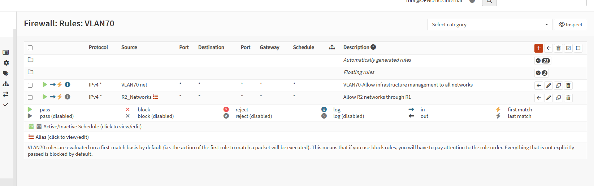

### Outbound NAT context

<strong>Proof:</strong> The outbound NAT view records the existing policy context without changing it.

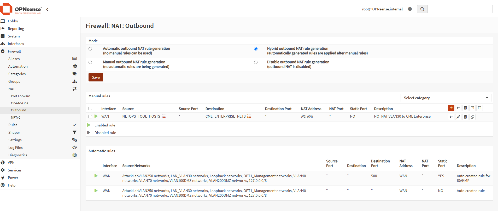

The exact image hashes are in the
[Phase 1 screenshot manifest](evidence/q011-phase1-screenshots.sha256).

## Phase 2C — Freeze The Hyper-V Design

I moved execution ownership into this Windows repository and froze one
Generation 2 VM with 2 vCPU, 6 GiB static memory, a 60-GiB dynamic VHDX, Linux
Secure Boot, automatic checkpoints disabled, Automatic Start Action Nothing,
and one Not Connected adapter. The
[disconnected design](docs/q011-phase2c-disconnected-vm-design.md) also kept the
verified ISO copy and VM creation behind separate approvals.

This phase changed documentation only, so it records an explicit screenshot
exception. The actual GUI evidence begins with the approved media and VM work.

## Phase 4A — Stage And Verify The Local RHEL DVD

I copied the verified RHEL 10.2 DVD to the Hyper-V host after a guarded copy
attempt left no destination artifact. I corrected the manually created plural
`ISOs` path under a separate exact approval, then proved 11,059,986,432 bytes
and SHA-256
`e15cb333529c332e76e4b1b946efe3515c99f996546675aec18e8effdf2540a5`
at `D:\Hyper-V\ISO`. The
[Phase 4A evidence](evidence/q011-phase4a-iso-staging-evidence.md) preserves the
full deviation and rollback boundary.

### Exact local RHEL DVD

<strong>Proof:</strong> The File Properties capture shows the exact RHEL 10.2 filename, singular local ISO directory, and 11,059,986,432-byte size. The paired searchable result proves SHA-256.

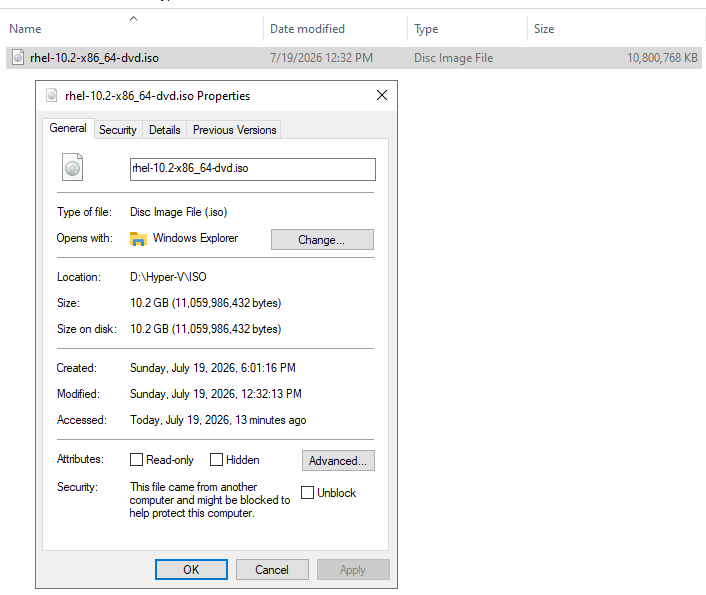

## Phase 4B — Create And Prove The Disconnected VM

The fresh preflight caught `Zone.Identifier` and stopped before VM/VHDX
creation. After I separately approved exact metadata removal with unchanged
bytes and hash, another retry caught a missing operator confirmation. I then
passed every collision, media, capacity, load, and transition gate and created
the VM through Hyper-V Manager. Review caught Generation 1 before the wizard
advanced, so I corrected it to Generation 2 and completed the frozen design.

The [execution evidence](evidence/q011-phase4b-evidence.md) and
[13-image visual walkthrough](evidence/q011-phase4b-visual-walkthrough.md)
retain the complete process while the README displays only the two strongest
final-state images.

### Final disconnected adapter

<strong>Proof:</strong> The Q011 Settings dialog shows its single Network Adapter with Virtual switch set to Not connected and VLAN identification disabled.

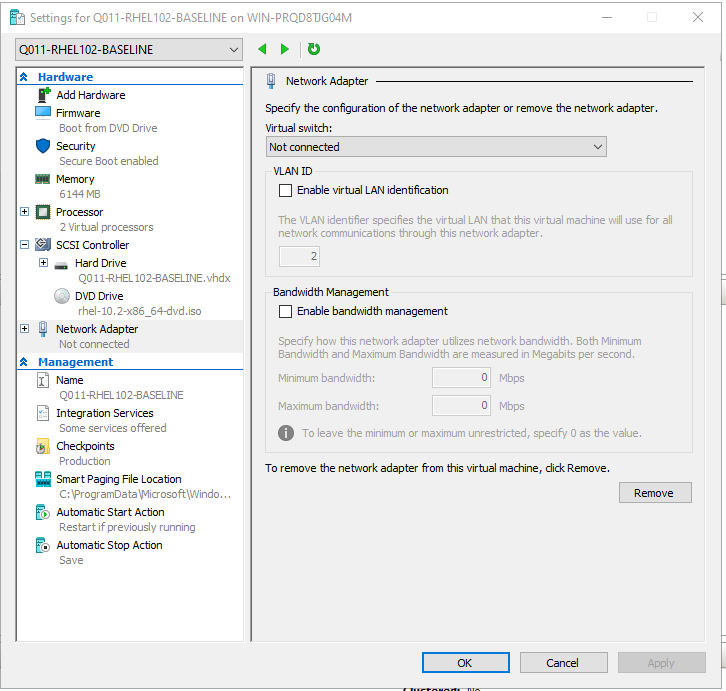

### Firmware And Installation Media Order

<strong>Proof:</strong> The Q011 firmware page shows the verified RHEL DVD first, the exact Q011 VHDX second, and the Not connected adapter last.

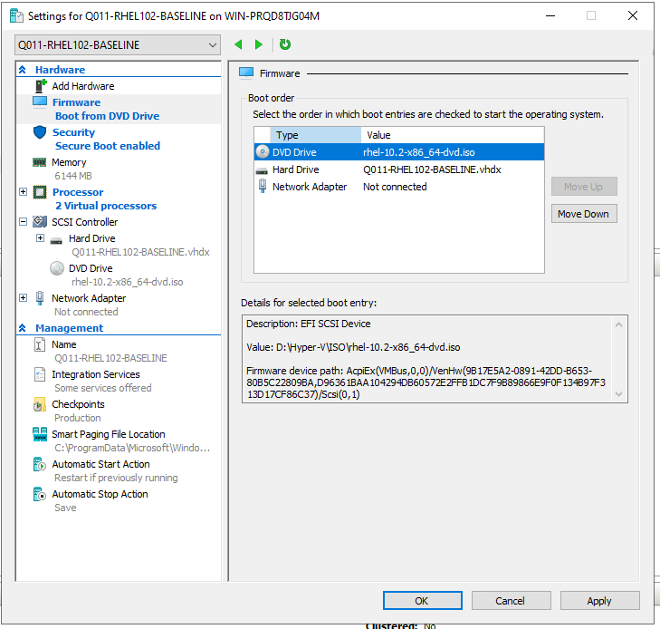

## Phase 4C — Install RHEL Without Network

I passed the fresh preflight and installed Minimal RHEL 10.2 with automatic
LVM, hostname `q011-rhel01`, root disabled, one password-protected `leonel`
administrator, no registration, and no network. The installer summary kept its
disconnected network tile at `Unknown`; reopening the direct page proved the
hostname and unplugged interface before disk writes. The exact
[Phase 4C evidence](evidence/q011-phase4c-evidence.md) records that gate and the
full local-console result.

At the completed installer, the immediate post-eject query briefly retained
the ISO path and stopped the reboot. The next approved inspection found the
DVD already empty before a retry could run, and a full checksum proved the ISO
unchanged. VMConnect later rejected the long clipboard payload, so I used
short manual commands to prove RHEL 10.2, SELinux Enforcing, root status `L`
(locked), `leonel` in `wheel`, zero failed units, automatic LVM, no
registration, and no non-loopback connectivity. I shut down normally and the
host returned `Phase4CEndStatePass=True`.

### Installation Summary Before Disk Writes

<strong>Proof:</strong> The summary shows the local source, Minimal Install, automatic partitioning, Denver time, root disabled, a local administrator configured, and no Red Hat registration. The linked evidence supplies the direct hostname and offline-network proof.

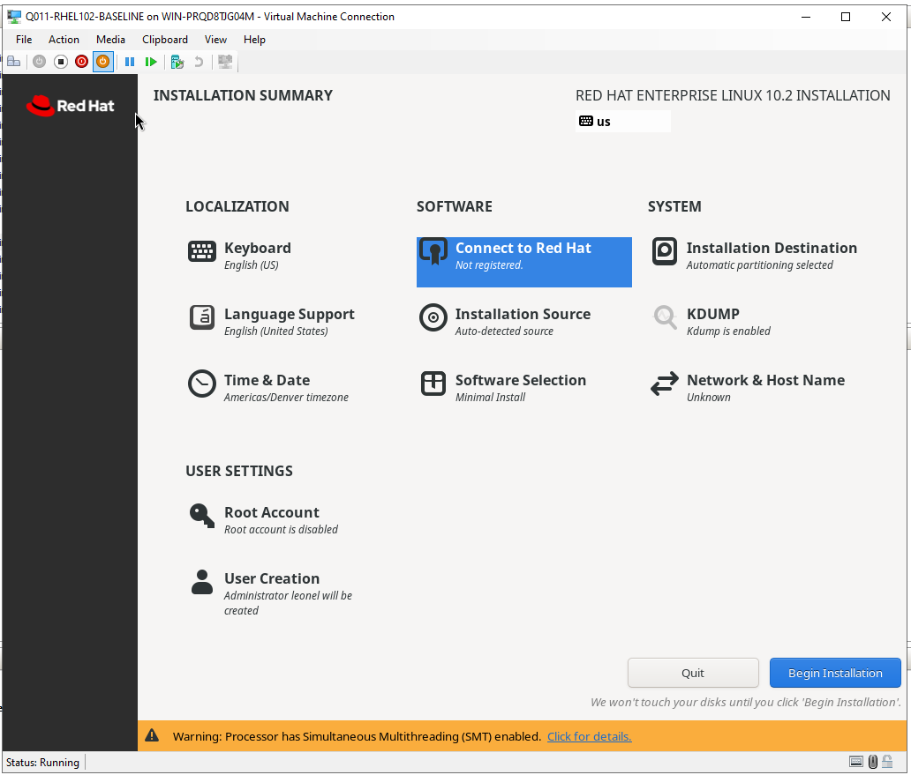

### Installed Offline Baseline

<strong>Proof:</strong> The final console capture shows RHEL 10.2, q011-rhel01, SELinux Enforcing, locked root state L, leonel in wheel, system running, and the combined reviewed manual verification marker. A mistyped systemctl command is immediately corrected by the successful invocation below it.

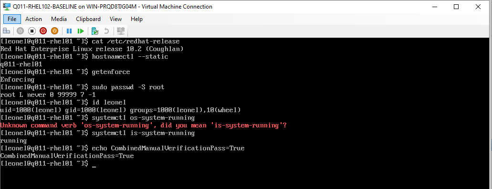

The [seven-image Phase 4C walkthrough](evidence/q011-phase4c-visual-walkthrough.md)
also preserves the Welcome screen, installation completion, empty DVD,
contained clipboard-input failure, and offline network proof.

## Phase 5 — Baseline Services And Prove Bounded SSH

The [Phase 5 run sheet](docs/q011-phase5-disconnected-service-baseline.md)
first captured the unpatched local before-state: RHEL 10.2, SELinux Enforcing,
locked root, `leonel` in `wheel`, running OpenSSH and firewalld, effective
SSH settings, listeners, configuration hashes, LVM, and unregistered state.

The approved Phase 5N extensions then diagnosed the unexpected
`172.16.70.52` lease as a fresh response from legacy DHCP authority
`172.16.70.1`. After the user-confirmed ASA shutdown, the existing
NetworkManager profile received `192.168.70.140` from OPNsense
`192.168.70.1`. Hyper-V host-to-guest TCP 22 remained blocked by path policy,
but the Windows 11 workstation completed an interactive `leonel` SSH login and
proved hostname `q011-rhel01`. The dynamic lease is not treated as persistent.

### Clean Service Baseline

<strong>Proof:</strong> The clean SSH capture shows the exact RHEL release, hostname, Enforcing SELinux, locked-root status, wheel membership, healthy system state, and baseline package versions. It contains no credential value.

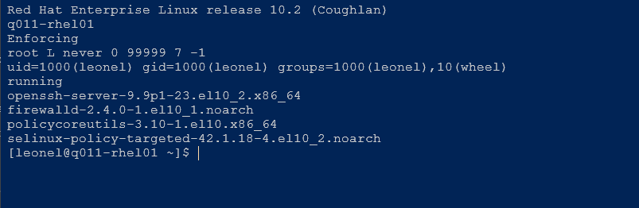

### Final Safe End State

<strong>Proof:</strong> The final host result shows the VM Off with one disconnected adapter on VLAN 0, an empty DVD drive, zero checkpoints, automatic checkpoints disabled, Automatic Start Action Nothing, and Phase5EndStatePass True.

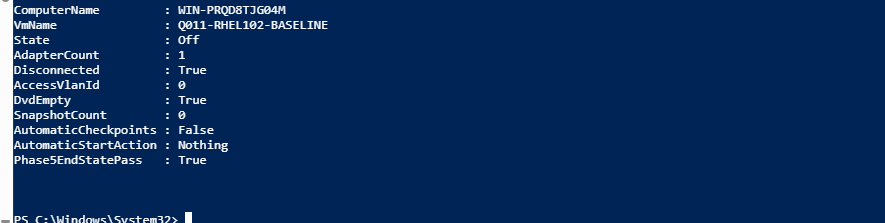

The [Phase 5 evidence](evidence/q011-phase5-evidence.md),
[searchable results](evidence/q011-phase5-sanitized-results.txt), and
[14-image visual walkthrough](evidence/q011-phase5-visual-walkthrough.md)
preserve the stopped gates, DHCP-source diagnosis, corrected lease, SSH proof,
service details, and final state.

## Phase 6 — Preserve Network Identity And Register Without Patching

The [Phase 6 change window](docs/q011-phase6-network-registration-change-window.md)
re-established only the proved OPNsense VLAN 70 path while the conflicting ASA
remained Off. A separate exact window reserved `192.168.70.140` for Q011. The
first reboot honestly failed automatic IPv4 activation; read-only inspection
found `connection.autoconnect=no`, and the approved correction changed only
that field to `yes`. The next reboot returned the reservation and SSH without
manual `nmcli` activation.

I then registered RHEL interactively, retained no credential or Red Hat
identity value, and proved registration plus the required BaseOS/AppStream
repositories through Boolean-only output. No package transaction ran. The
[Phase 6 evidence](evidence/q011-phase6-evidence.md),
[searchable results](evidence/q011-phase6-sanitized-results.txt), and
[twelve-image walkthrough](evidence/q011-phase6-visual-walkthrough.md) preserve
the complete path. Normal shutdown and Hyper-V restoration returned
`Phase6EndStatePass=True` while intentionally retaining the reservation,
autoconnect setting, registration, and repositories.

### Registration And Repository Gate

<strong>Proof:</strong> The sanitized result contains only Boolean pass
values for registration, BaseOS, AppStream, and the combined Phase 6D gate;
no consumer identity or credential is visible.

### Final Safe State

<strong>Proof:</strong> The host result proves Q011 is Off with one
disconnected Untagged VLAN-zero adapter, empty DVD, zero checkpoints, and
<code>Phase6EndStatePass=True</code>.

## Phase 7 — Apply One Controlled Patch Transaction

The reviewed
[Phase 7 window](docs/q011-phase7-controlled-patching-change-window.md)
passed its safe-state, DHCP/SSH, registration, repository, disk, SELinux,
service, and failed-unit gates. `dnf check-update` returned the expected `100`,
and the supervised transaction summary showed five installs, 88 upgrades,
zero removals or downgrades, and 560 MiB from BaseOS/AppStream.

After download, DNF requested Red Hat release key 2, auxiliary key 3, and
release key 4 from the configured local key file. Those imports were not part
of the approved change, so I answered `N` to all three. DNF reported that it
installed no keys, returned `upgrade_exit=1`, and kept the downloaded packages
in cache. History still ended at transaction `1`, the original installation;
no package modification was observed and no reboot ran. I shut the guest down
normally and restored the exact isolated host state with
`Phase7RecoveryPass=True`.

### Pre-Update Readiness

<strong>Proof:</strong> The compact guest result proves RHEL 10.2, the sole
running kernel, Enforcing SELinux, healthy system/services, zero failed units,
root-space readiness, registration, required repositories, and accepted
update-availability exit 100. It does not prove an update ran.

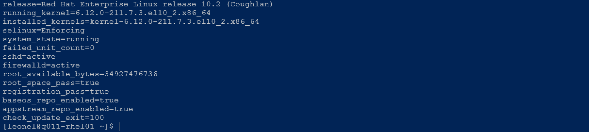

### GPG Stop And Unchanged DNF History

<strong>Proof:</strong> The console result shows
<code>upgrade_exit=1</code> and DNF history still ending at the original
transaction 1. The searchable evidence records the three declined prompts;
the image itself does not display their fingerprints or prove cached RPM
trust.

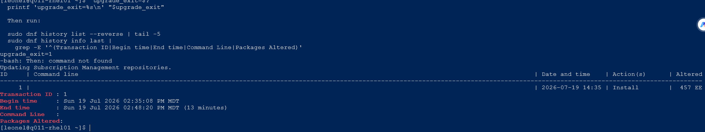

The [Phase 7 stop evidence](evidence/q011-phase7-evidence.md),
[searchable results](evidence/q011-phase7-sanitized-results.txt),
[five-image walkthrough](evidence/q011-phase7-visual-walkthrough.md), and
[screenshot manifest](evidence/q011-phase7-screenshots.sha256) preserve the
complete bounded result. The planned post-update screenshot does not exist
because there was no completed transaction or reboot.

## Phase 7G — Diagnose The GPG Trust State

I ran only the reviewed read-only checks from the
[Phase 7G run sheet](docs/q011-phase7g-gpg-trust-read-only-investigation.md).
The installed `redhat-release` package and its exact key file verified, and
both required repositories used that file with GPG checking enabled. RPM's
trust list was empty. Two repository-scoped cached RPM samples then returned
`NOKEY` for release keys `05707a62` and `fd431d51`, while every retained
header and payload digest returned `OK`.

This isolates the failure to missing RPM trust certificates rather than
observed corruption in the two sampled payloads. The
[Phase 7G evidence](evidence/q011-phase7g-evidence.md),
[searchable results](evidence/q011-phase7g-sanitized-results.txt), and
[three-image walkthrough](evidence/q011-phase7g-visual-walkthrough.md) preserve
the exact claim boundary. Normal shutdown and host restoration returned Q011
to Off, disconnected, Untagged VLAN 0 with `Phase7GEndStatePass=True`.

### Package-Owned Key And Repository State

<strong>Proof:</strong> The SSH result shows the verified package-owned key
file, both filtered repository trust sections, and an empty RPM trust list. It
does not prove a certificate is imported.

### Valid Cached Digests With Missing Trust

<strong>Proof:</strong> Both repository-scoped cached RPM samples show all
digests OK while their RPMv6 and RPMv4 signing key IDs return NOKEY. The image
does not authenticate every cached package.

## Phase 7K — Repair And Verify RPM Trust

I executed the separately gated
[Phase 7K change window](docs/q011-phase7k-rpm-trust-repair-change-window.md)
with native `rpmkeys` and the exact verified package-owned input. The guest
reconfirmed a zero-key before-state, then imported only Red Hat release key 2,
auxiliary key 3, and release key 4. The post-import query returned exactly
three machine-readable handles and `exact_key_set=true`.

The same BaseOS `kernel-core` and AppStream `amd-gpu-firmware` samples that
returned `NOKEY` in Phase 7G now returned `OK` for both observed signature
schemes and every digest. Both commands exited `0`,
`Phase7KTrustPass=true`, and no DNF command or package transaction ran. Normal
shutdown and host restoration returned `Phase7KEndStatePass=True`.

Claude's bounded review returned `CONDITIONAL` and found rollback continuity,
display-parser, identity-wording, count, shell-variable, `pipefail`, and
PowerShell error-handling gaps. Codex independently verified and corrected
them. The [Phase 7K review record](evidence/q011-phase7k-claude-review.md)
preserves every disposition and the remaining transport-loss/sample-coverage
risks. The [Phase 7K evidence](evidence/q011-phase7k-evidence.md),
[searchable results](evidence/q011-phase7k-sanitized-results.txt),
[three-image walkthrough](evidence/q011-phase7k-visual-walkthrough.md), and
[screenshot manifest](evidence/q011-phase7k-screenshots.sha256) preserve the
completed repair without overstating patch status.

### Exact Three-Certificate Trust Set

<strong>Proof:</strong> The queried RPM trust result shows only the three
allowlisted Red Hat public-key entries, their machine-readable handles,
<code>post_key_handle_count=3</code>, and
<code>exact_key_set=true</code>. It contains no private key or credential.

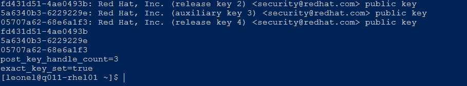

### Cached Signatures Authenticate

<strong>Proof:</strong> The retained BaseOS and AppStream samples show both
recorded signatures and all digests as OK, both command exits as zero, and
<code>Phase7KTrustPass=true</code>. This authenticates only the two sampled
RPMs and does not prove that patching ran.

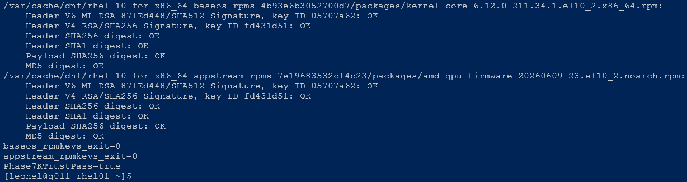

## Phase 7P — Complete The Controlled Patch And Reboot

The independently reviewed
[Phase 7P change window](docs/q011-phase7p-controlled-patch-retry-change-window.md)
passed its fresh host, guest, trust, history, repository, disk, process,
service, and SELinux gates. The current proposal contained five installs and
89 upgrades from the expected BaseOS/AppStream sources, with no removals or
downgrades. I accepted the no-checkpoint/no-export boundary and ran one
interactive `dnf upgrade --refresh`; DNF displayed `Complete!`.

I mistyped the immediate `$?` assignment and Bash attempted to execute `0`,
so I stopped before reboot and did not invent an exit value. Read-only DNF
history instead proved transaction `2`, `Return-Code: Success`, command
`upgrade --refresh`, 94 altered packages, and the new kernel installed. The
one approved reboot then loaded `6.12.0-211.37.1.el10_2.x86_64`; system,
services, SELinux, exact trust, registration, repositories, and final update
check passed. Normal shutdown and host restoration returned
`Phase7PEndStatePass=True`.

### Successful Transaction And Evidence Recovery

<strong>Proof:</strong> The retained result records DNF completion and the
read-only transaction-history recovery: history ID 2, Return-Code Success,
the newly installed kernel, and <code>Phase7PTransactionPass=true</code>. It
does not claim the lost immediate shell exit value.

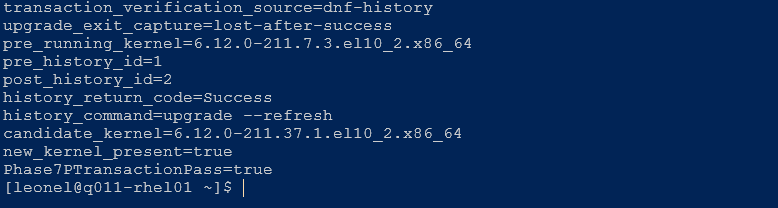

### Newest Kernel And Post-Reboot Controls

<strong>Proof:</strong> The compact post-reboot result shows the running
kernel equals the newest installed kernel, required controls and repositories
pass, the final update check returns zero, and
<code>Phase7PPostRebootPass=true</code>.

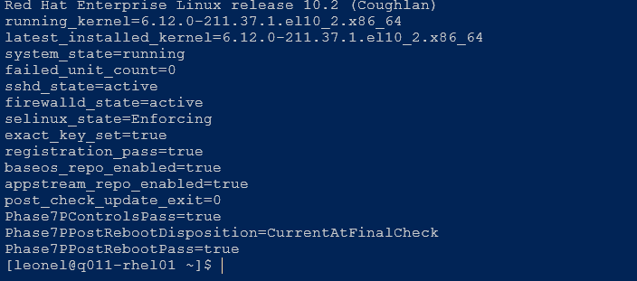

The [Phase 7P evidence](evidence/q011-phase7p-evidence.md),
[searchable results](evidence/q011-phase7p-sanitized-results.txt),
[four-image walkthrough](evidence/q011-phase7p-visual-walkthrough.md), and
[screenshot manifest](evidence/q011-phase7p-screenshots.sha256) also retain
the reviewed proposal and final isolated state.

## Phase 8 — Validate Controls And Preserve Rebuild Evidence

The reviewed
[Phase 8 run sheet](docs/q011-phase8-postpatch-validation-and-rebuild-evidence.md)
temporarily re-established only the reserved VLAN 70 path. Without manual
NetworkManager activation, Q011 returned `192.168.70.140/24` from and through
`192.168.70.1`. The comparison proved RHEL identity, locked root, wheel
membership, system health, OpenSSH/firewalld policy, SELinux, LVM, and
configuration hashes remained stable while the intended registration,
repository, exact trust, DNF-history, package-version, and kernel changes were
present.

The first SSH hash attempt omitted `sudo` and returned empty, so the gate
stopped. The approved read-only retry matched the original Phase 5 screenshot
and exposed a two-character transcription error in the text record. I
corrected only that local text and recomputed the already collected values;
no guest state changed. The final results returned
`stable_controls_pass=true`, `expected_changes_pass=true`, and
`Phase8GuestBaselinePass=true`. Normal shutdown and host restoration returned
`Phase8EndStatePass=True`.

### Post-Patch Stable Controls

<strong>Proof:</strong> The compact SSH result shows RHEL identity,
running/latest kernel alignment, locked root, wheel membership, healthy
system/services, zero failed units, SELinux Enforcing, the corrected SSH hash
comparison, and all three guest gates passing.

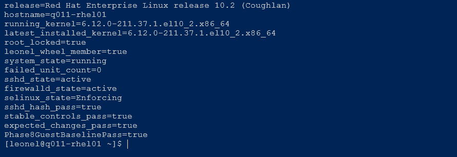

### Final Safe State

<strong>Proof:</strong> The elevated host result proves Q011 is Off with
one disconnected Untagged VLAN-zero adapter, empty DVD, zero checkpoints,
automatic checkpoints disabled, Automatic Start Action Nothing, and
<code>Phase8EndStatePass=True</code>.

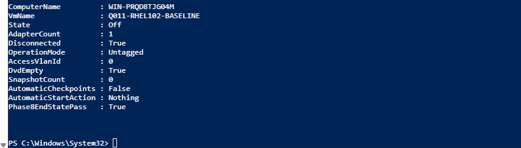

The [Phase 8 evidence](evidence/q011-phase8-evidence.md),
[searchable results](evidence/q011-phase8-sanitized-results.txt),
[three-image walkthrough](evidence/q011-phase8-visual-walkthrough.md), and
[screenshot manifest](evidence/q011-phase8-screenshots.sha256) preserve the
full comparison. The [manual rebuild record](docs/q011-manual-rebuild-record.md)
cites actual Phase 1–8 evidence and explicitly does not claim a replayed
rebuild.

## Phase 9 — Retain The Verified Baseline

I selected `RETAIN-Q011` from the independently reviewed
[Phase 9 decision run sheet](docs/q011-phase9-retention-disposal-decision.md).
The read-only host gate confirmed the exact VM remained Off with one
disconnected adapter, one Untagged VLAN-zero record, an empty DVD drive, the
exact retained VHDX, zero checkpoints, automatic checkpoints disabled, and
Automatic Start Action Nothing. The verified shared RHEL ISO also remained
present at its expected byte size. The final result was
`Phase9RetentionPass=True`; the VM was not started or changed.

### Retained VM Off

<strong>Proof:</strong> Hyper-V Manager shows the exact Q011 VM retained in
the Off state.

### Retained Network Isolation

<strong>Proof:</strong> The exact Q011 Network Adapter remains Not
connected, and VLAN identification is disabled. The inactive grey value in
the unchecked control is not an active VLAN assignment; the authoritative
host result recorded Untagged VLAN 0.

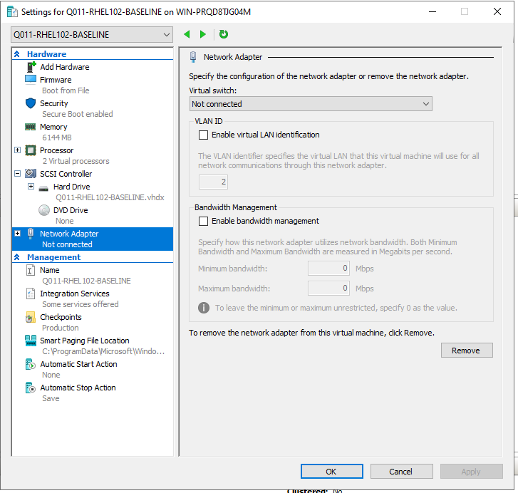

The [Phase 9 evidence](evidence/q011-phase9-evidence.md),
[searchable results](evidence/q011-phase9-sanitized-results.txt),
[two-image walkthrough](evidence/q011-phase9-visual-walkthrough.md), and
[screenshot manifest](evidence/q011-phase9-screenshots.sha256) preserve the
full retention proof. The
[Phase 9 review record](evidence/q011-phase9-claude-review.md) preserves the
earlier bounded review. The disposal branch was not selected, so no guest,
Red Hat, OPNsense, VM, VHDX, or ISO cleanup was authorized or performed.

## What I Proved

- The Proxmox CPU incompatibility gate prevented an unsupported RHEL 10 build.
- The exact DVD remained byte- and hash-identical from source verification
  through post-install ejection.
- The Hyper-V VM matches its frozen Generation 2 design and stayed
  disconnected throughout installation.
- RHEL 10.2 booted from the installed LVM-backed disk with SELinux Enforcing,
  locked root password, local administrative access, and no registration.
- The unpatched service baseline proves OpenSSH, firewalld, SELinux, listeners,
  effective SSH policy, configuration hashes, LVM, and registration absence.
- A wrong DHCP authority was rejected and rolled back; OPNsense later supplied
  the required VLAN 70 lease and Windows 11 proved remote SSH.
- OPNsense now reserves `192.168.70.140` for Q011, and the existing DHCP
  profile automatically restores that address and SSH after reboot.
- Interactive registration passed without retained identity or credential
  values, and the RHEL 10 x86_64 BaseOS/AppStream repositories are enabled.
- Normal shutdown returned the VM to Off, disconnected VLAN 0, empty DVD, zero
  checkpoints, and `Phase6EndStatePass=True`.
- Phase 7 proved the pre-update gates, a reviewed proposed BaseOS/AppStream
  transaction,
  fail-closed handling of three unapproved GPG-key imports, unchanged DNF
  history, and `Phase7RecoveryPass=True` without a package change or reboot.
- Phase 7G proved the package-owned key file and repository trust fields are
  intact, RPM's trust list is empty, and both sampled cached RPM payloads have
  valid digests but unauthenticated signatures because the required keys are
  `NOKEY`; `Phase7GEndStatePass=True` restored final isolation.
- Phase 7K imported exactly the three verified packaged Red Hat certificates,
  changed both retained samples from `NOKEY` to authenticated signatures with
  every digest still `OK`, invoked no DNF command, and restored final
  isolation with `Phase7KEndStatePass=True`.
- Phase 7P completed one supported DNF transaction, booted the newest
  installed kernel, retained the required controls, returned no additional
  updates at the final check, and restored isolation with
  `Phase7PEndStatePass=True`.
- Phase 8 proved the documented stable controls and intended changes,
  corrected one local hash transcription against its original screenshot,
  preserved an evidence-linked manual rebuild record, changed no guest state,
  and restored isolation with `Phase8EndStatePass=True`.
- Phase 9 retained the exact verified baseline and independently confirmed its
  Off, disconnected, Untagged VLAN-zero, DVD-empty, checkpoint-free state with
  `Phase9RetentionPass=True`.
- The project does not yet prove backup/restore, hardened SSH policy, an
  actually replayed rebuild, long-duration stability, or production readiness.

## Technical Evidence

- [Execution-owner decision](docs/q011-hyperv-owner-decision.md)
- [Imported discovery summary](evidence/q011-imported-discovery-summary.md)
- [Disconnected Hyper-V design](docs/q011-phase2c-disconnected-vm-design.md)
- [ISO-staging change window](docs/q011-iso-staging-change-window.md)
- [Phase 4A evidence and screenshot manifest](evidence/q011-phase4a-iso-staging-evidence.md)
- [Phase 4B change window](docs/q011-phase4b-disconnected-vm-change-window.md)
- [Phase 4B evidence](evidence/q011-phase4b-evidence.md),
  [searchable results](evidence/q011-phase4b-sanitized-results.txt), and
  [visual walkthrough](evidence/q011-phase4b-visual-walkthrough.md)
- [Phase 4C run sheet](docs/q011-phase4c-disconnected-rhel-installation.md)
  and [failure-containment plan](docs/q011-phase4c-failure-containment.md)
- [Phase 4C evidence](evidence/q011-phase4c-evidence.md),
  [searchable results](evidence/q011-phase4c-sanitized-results.txt),
  [visual walkthrough](evidence/q011-phase4c-visual-walkthrough.md), and
  [screenshot manifest](evidence/q011-phase4c-screenshots.sha256)
- [Phase 5 disconnected service-baseline run sheet](docs/q011-phase5-disconnected-service-baseline.md)
- [Phase 5 evidence](evidence/q011-phase5-evidence.md),
  [searchable results](evidence/q011-phase5-sanitized-results.txt),
  [visual walkthrough](evidence/q011-phase5-visual-walkthrough.md), and
  [screenshot manifest](evidence/q011-phase5-screenshots.sha256)
- [Phase 6 registration change window](docs/q011-phase6-network-registration-change-window.md)
  and [rollback plan](docs/q011-phase6-network-registration-rollback.md)
- [Phase 6 evidence](evidence/q011-phase6-evidence.md),
  [searchable results](evidence/q011-phase6-sanitized-results.txt),
  [visual walkthrough](evidence/q011-phase6-visual-walkthrough.md), and
  [screenshot manifest](evidence/q011-phase6-screenshots.sha256)
- [Phase 7 patch change window](docs/q011-phase7-controlled-patching-change-window.md)
  and [recovery plan](docs/q011-phase7-controlled-patching-rollback.md)
- [Phase 7 bounded Claude review](evidence/q011-phase7-claude-review.md)
- [Phase 7 stop evidence](evidence/q011-phase7-evidence.md),
  [searchable results](evidence/q011-phase7-sanitized-results.txt),
  [visual walkthrough](evidence/q011-phase7-visual-walkthrough.md), and
  [screenshot manifest](evidence/q011-phase7-screenshots.sha256)
- [Phase 7G read-only trust investigation](docs/q011-phase7g-gpg-trust-read-only-investigation.md)
  and [containment plan](docs/q011-phase7g-gpg-trust-investigation-containment.md)
- [Phase 7G bounded Claude review](evidence/q011-phase7g-claude-review.md)
- [Phase 7G execution evidence](evidence/q011-phase7g-evidence.md),
  [searchable results](evidence/q011-phase7g-sanitized-results.txt),
  [visual walkthrough](evidence/q011-phase7g-visual-walkthrough.md), and
  [screenshot manifest](evidence/q011-phase7g-screenshots.sha256)
- [Phase 7K RPM trust-repair change window](docs/q011-phase7k-rpm-trust-repair-change-window.md)
  and [rollback plan](docs/q011-phase7k-rpm-trust-repair-rollback.md)
- [Phase 7K bounded Claude review](evidence/q011-phase7k-claude-review.md)
- [Phase 7K execution evidence](evidence/q011-phase7k-evidence.md),
  [searchable results](evidence/q011-phase7k-sanitized-results.txt),
  [visual walkthrough](evidence/q011-phase7k-visual-walkthrough.md), and
  [screenshot manifest](evidence/q011-phase7k-screenshots.sha256)
- [Phase 7P controlled patch retry](docs/q011-phase7p-controlled-patch-retry-change-window.md)
  and [recovery plan](docs/q011-phase7p-controlled-patch-retry-recovery.md)
- [Phase 7P bounded Claude review](evidence/q011-phase7p-claude-review.md)
- [Phase 7P execution evidence](evidence/q011-phase7p-evidence.md),
  [searchable results](evidence/q011-phase7p-sanitized-results.txt),
  [visual walkthrough](evidence/q011-phase7p-visual-walkthrough.md), and
  [screenshot manifest](evidence/q011-phase7p-screenshots.sha256)
- [Phase 8 post-patch validation and rebuild-evidence run sheet](docs/q011-phase8-postpatch-validation-and-rebuild-evidence.md)
  and [failure-containment plan](docs/q011-phase8-failure-containment.md)
- [Phase 8 bounded Claude review](evidence/q011-phase8-claude-review.md)
- [Phase 8 execution evidence](evidence/q011-phase8-evidence.md),
  [searchable results](evidence/q011-phase8-sanitized-results.txt),
  [visual walkthrough](evidence/q011-phase8-visual-walkthrough.md), and
  [screenshot manifest](evidence/q011-phase8-screenshots.sha256)
- [Manual rebuild record](docs/q011-manual-rebuild-record.md)
- [Phase 9 retention/disposal decision run sheet](docs/q011-phase9-retention-disposal-decision.md)
  and [bounded Claude review](evidence/q011-phase9-claude-review.md)
- [Phase 9 execution evidence](evidence/q011-phase9-evidence.md),
  [searchable results](evidence/q011-phase9-sanitized-results.txt),
  [visual walkthrough](evidence/q011-phase9-visual-walkthrough.md), and
  [screenshot manifest](evidence/q011-phase9-screenshots.sha256)
- [Screenshot plan](docs/q011-screenshot-plan.md)
- [Bounded Claude reviews](evidence/q011-phase2c-claude-review.md),
  [Phase 4B](evidence/q011-phase4b-claude-review.md), and
  [Phase 4C](evidence/q011-phase4c-claude-review.md),
  [Phase 5](evidence/q011-phase5-claude-review.md), and
  [Phase 7](evidence/q011-phase7-claude-review.md), and
  [Phase 7K](evidence/q011-phase7k-claude-review.md), and
  [Phase 7P](evidence/q011-phase7p-claude-review.md)

## Reproduce Or Re-Verify

Start with the owner decision and imported discovery summary. Re-verify the
staged ISO through the Phase 4A change window, then use the Phase 4B and Phase
4C run sheets only under their exact approval and stop conditions. Keep the
adapter Not connected, enter passwords only at the console, and use the linked
evidence files rather than reproducing troubleshooting from the README.

Q011 is complete under the selected retention branch. Future re-verification
should begin with the Phase 9 read-only gate and requires a new exact approval.
Do not infer authority to start, connect, patch, clone, export, back up,
repurpose, unregister, or dispose of the retained baseline from this record.

## Current Safety Boundary

The VM is Off, disconnected, Untagged at VLAN 0, DVD-empty, and
checkpoint-free. The DHCP reservation, NetworkManager autoconnect setting,
registration, repositories, exact three-certificate Red Hat RPM trust set,
successful DNF history transaction `2`, and kernel
`6.12.0-211.37.1.el10_2.x86_64` remain retained. Phase 8 is complete. No Phase
9 change was made; the selected read-only retention gate passed with
`Phase9RetentionPass=True`. Starting or connecting the VM, disposal planning,
deletion, any package/service/configuration change, backup, commit, push,
merge, and publication require separate authority.

## How We Worked Together

### My Input And How I Helped

I made every approval and platform decision, performed the hands-on Hyper-V,
RHEL, OPNsense, PowerShell, and SSH work, entered credentials interactively,
and captured screenshots of my actual practice. I also challenged the design
when it did not make the hands-on path clear, identified the existing Proxmox
clone workflow, chose Hyper-V after the CPU gate, traced the competing DHCP
authority, and required durable screenshot coverage.

### What Codex Did And How

Codex recovered the project state, kept each live action behind an exact
least-privilege approval, prepared the discovery, creation, installation,
network, registration, trust-repair, patching, comparison, and retention run
sheets, and paired risky steps with stop or rollback gates. It checked my
returned results and images, kept the strongest two images inside each phase,
linked the remaining safe practice evidence through walkthroughs, and tied
every completion claim to a searchable result or retained screenshot.

### What Claude Did And How

Claude Fable provided bounded read-only reviews at key design and recovery
points. Those reviews challenged failure containment, object targeting,
transaction continuity, trust evidence, screenshot boundaries, and retention
versus disposal. Codex verified and documented each material finding before I
approved the related hands-on window. Claude never received credentials or
expanded live-system, Git, or publication authority.

### How We Communicated And Completed The Project

Codex gave me one machine and one next action at a time; I returned the exact
PowerShell, VMConnect, SSH, or GUI result and captured the safe practice image.
When an output failed a gate, we stopped, diagnosed under a narrower approval,
and resumed only after a corrected run sheet or explicit replacement window.
The repository evidence now carries the durable result instead of relying on
the private assistant conversation.

### Pushback And How We Resolved It

The Proxmox CPU gate prevented an unsupported RHEL 10 build and moved execution
to Hyper-V. The first VLAN 70 lease exposed a conflicting legacy DHCP
authority, so every failed attempt rolled back until the ASA was Off and
OPNsense supplied the intended reservation. The first patch transaction
stopped when RPM trust was missing; a separate diagnosis and exact trust-only
repair preceded the successful retry. Finally, a Phase 8 hash mismatch proved
to be a local transcription error, so the original screenshot—not an assumed
value—was used to correct the record without changing the guest.

## What Happens Next

Q011 is complete as a retained RHEL 10.2 baseline. Its immediate successor,
[Q012 — systemd Break/Fix Lab](https://github.com/vushueh/enterprise-linux-administration-labs/tree/main/projects/q012-systemd-breakfix-lab),
completed on 2026-07-22 with protected-source proof, a deterministic
`203/EXEC` diagnosis, reboot-tested repair, independent checkpoint restore,
clean merge, and final isolation. Any later Q011 start, network change, patch,
export, clone, repurpose, Red Hat lifecycle action, OPNsense reservation
change, or disposal is a new change window outside this completed project.
