# Q011 Phase 4B — Visual Walkthrough

This page preserves Leonel's complete hands-on Hyper-V workflow. The project
README displays only two final-state images; this linked evidence page uses
the remaining process captures without turning the main story into a gallery.

## 1. Generation Gate Caught Before Creation

<strong>Proof:</strong> The first generation screen still showed Generation 1. Review stopped the wizard here, before creation, and required Generation 2; the later wizard summary proves the correction.

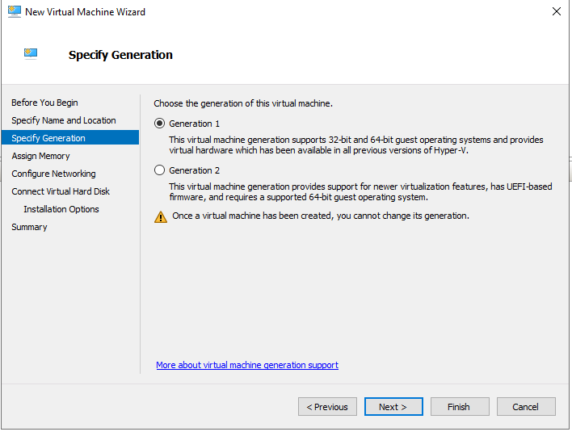

## 2. Static Installation Memory

<strong>Proof:</strong> The wizard assigned 6144 MB and left Dynamic Memory unchecked.

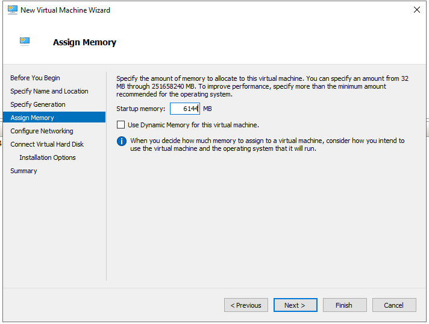

## 3. Disconnected Wizard Network

<strong>Proof:</strong> The wizard's only network selection was Not Connected.

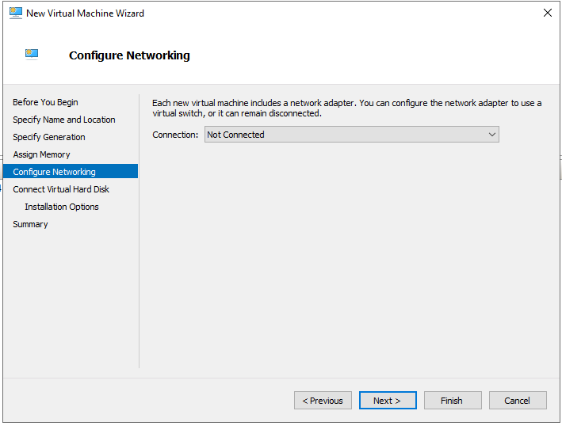

## 4. Exact Dynamic VHDX

<strong>Proof:</strong> The wizard targeted the exact Q011 VHDX under the approved D drive path with a 60 GB virtual size.

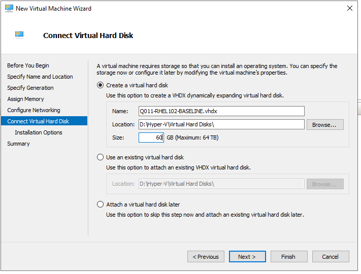

## 5. Exact Local RHEL DVD

<strong>Proof:</strong> The installation-media page selected only the local RHEL 10.2 DVD and showed the network-install option unavailable while disconnected.

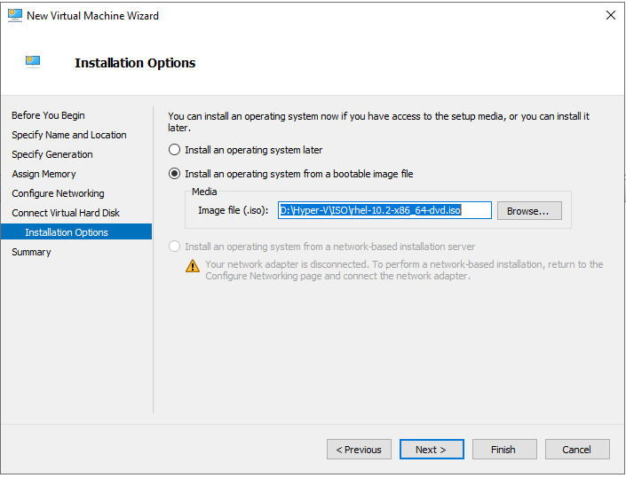

## 6. Pre-Creation Summary

<strong>Proof:</strong> Before Finish, the summary showed the corrected Generation 2 design, 6144 MB memory, Not Connected networking, exact VHDX, and exact ISO.

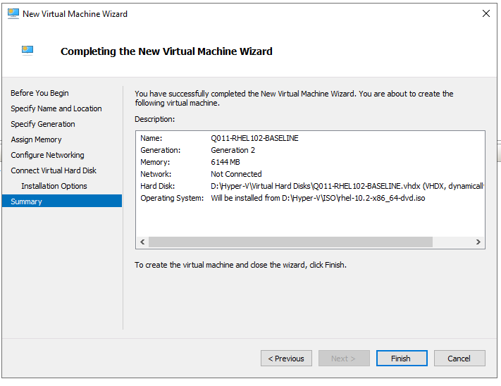

## 7. Two Virtual Processors

<strong>Proof:</strong> The Off VM's Processor page was set to two virtual processors; the settings tree also showed the frozen memory, disk, DVD, and disconnected adapter.

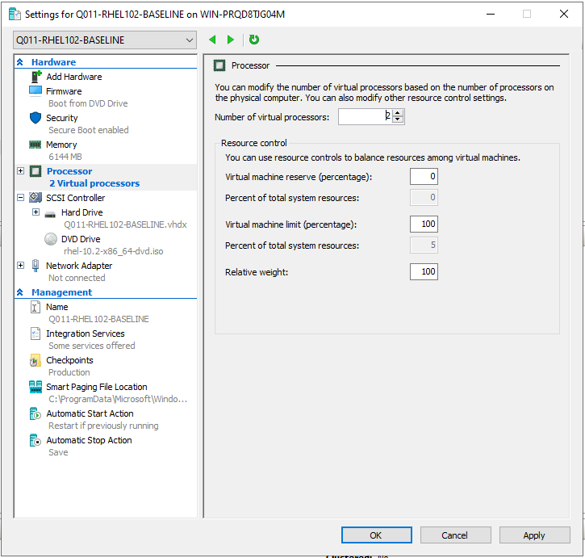

## 8. Linux-Compatible Secure Boot Template

<strong>Proof:</strong> Secure Boot was enabled with Microsoft UEFI Certificate Authority while vTPM remained disabled.

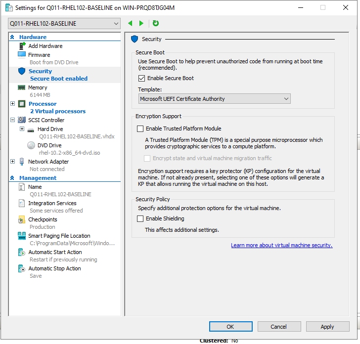

## 9. DVD-First Firmware Order

<strong>Proof:</strong> Firmware placed the RHEL DVD first, the Q011 VHDX second, and the Not connected adapter third.

## 10. Final Disconnected Adapter

<strong>Proof:</strong> The one adapter had Virtual switch set to Not connected with VLAN identification disabled.

## 11. Automatic Checkpoints Disabled

<strong>Proof:</strong> The VM retained Production checkpoint capability but cleared Use automatic checkpoints; no checkpoint was created.

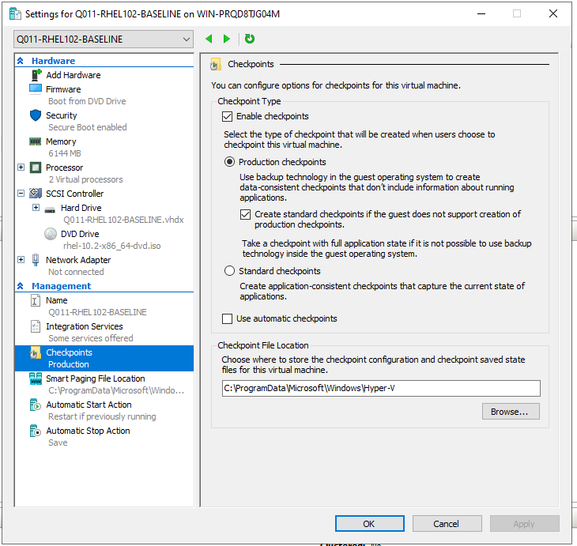

## 12. Automatic Start Set To Nothing

<strong>Proof:</strong> The host-start behavior was changed from the default restart behavior to Nothing.

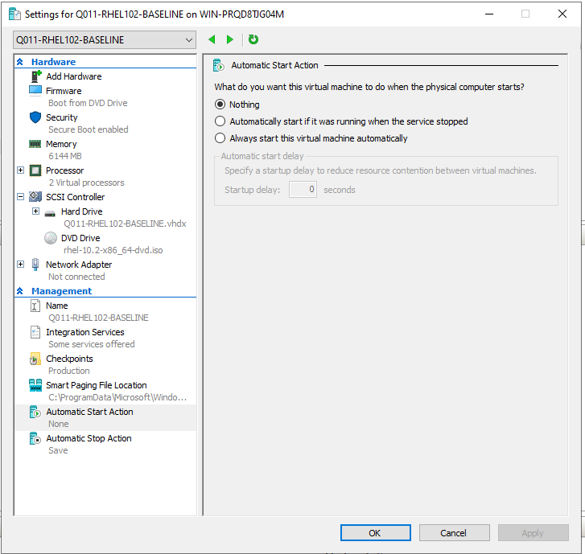

## 13. Final Searchable-State Companion

<strong>Proof:</strong> The final cropped PowerShell capture shows every frozen field and Phase4BPass=True. The paired text file remains the searchable authority.

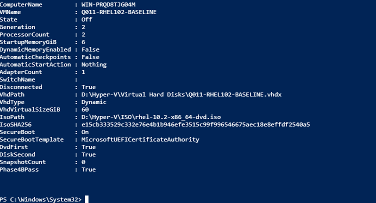

The paired [sanitized result](q011-phase4b-sanitized-results.txt) provides
searchable values and the [screenshot manifest](q011-phase4b-screenshots.sha256)
proves file integrity.
