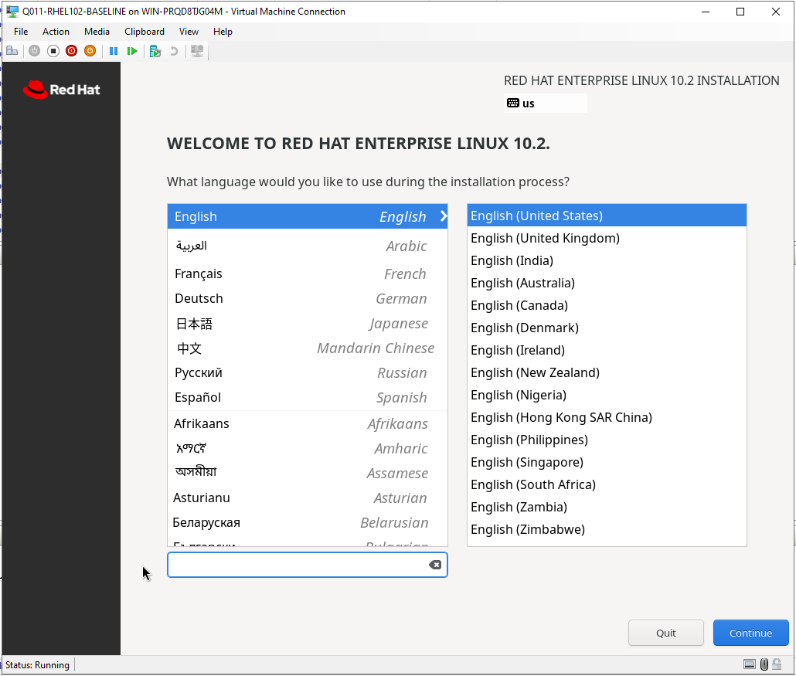
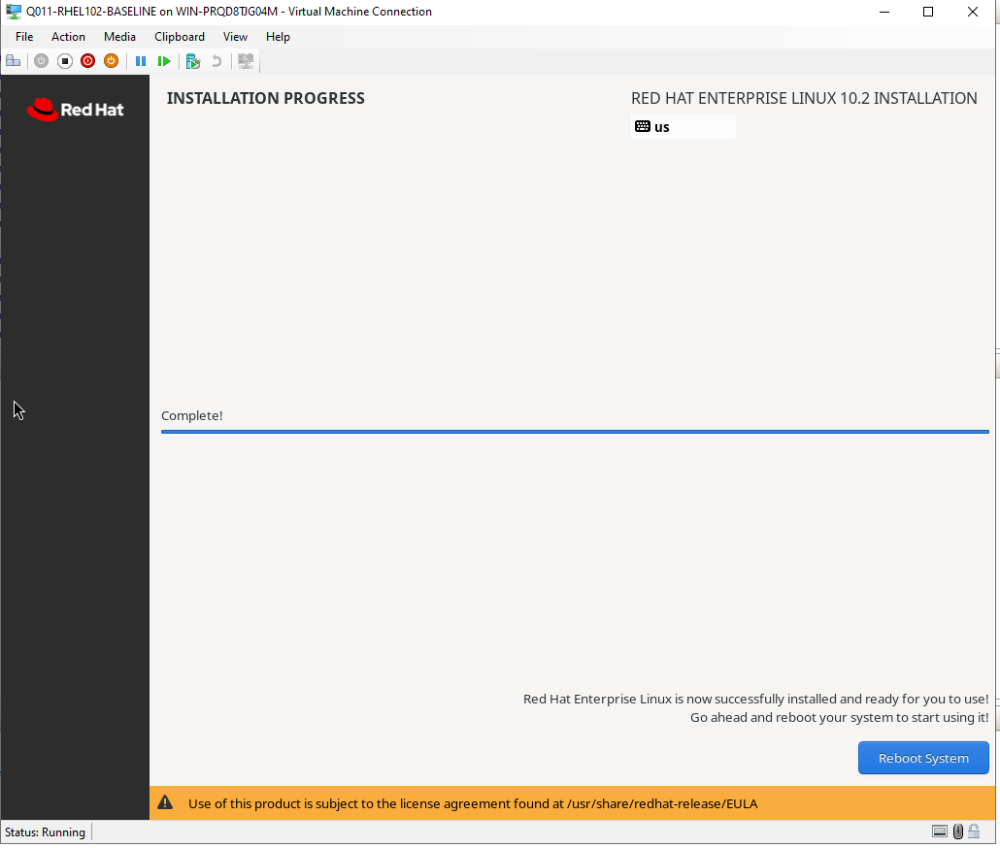
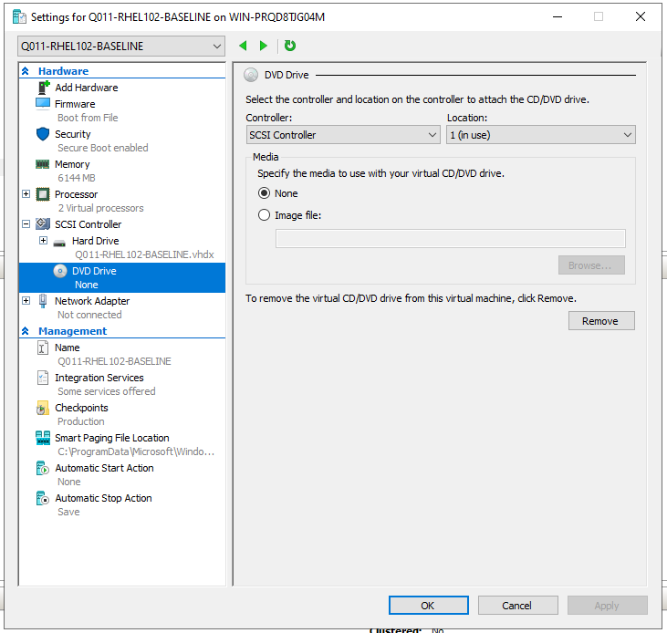
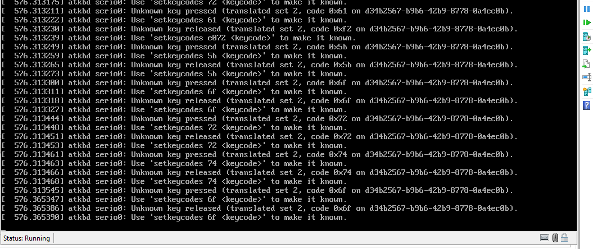
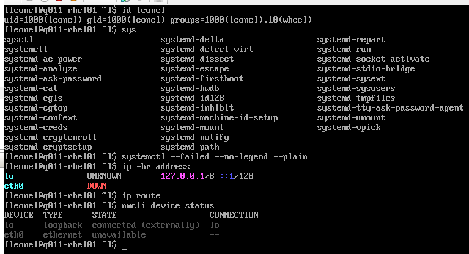

# Q011 Phase 4C — Visual Walkthrough

This page preserves the reviewed, safe images from Leonel's disconnected RHEL
installation. The project README displays only two primary captures; this
linked page retains the useful process evidence and the input failure that
changed the verification method.

## 1. RHEL 10.2 Installer Reached

<strong>Proof:</strong> The exact Q011 VM reached the RHEL 10.2 Welcome screen with English (United States) selected. The intended boot-menu image was missed, so this is retained as welcome-screen proof and is not mislabeled as the boot menu.

## 2. Final No-Write Installation Summary

<strong>Proof:</strong> Before disk writes, the installer showed the local auto-detected source, Minimal Install, automatic partitioning, Denver time, root disabled, local administrator configured, and Red Hat not registered. The disconnected summary tile remained Unknown; a separate direct page and the later guest evidence proved hostname q011-rhel01 and no connectivity.

## 3. Installation Complete Before Reboot

<strong>Proof:</strong> RHEL reported installation complete while Reboot System remained untouched, preserving the mandatory DVD-ejection checkpoint.

## 4. Exact Hyper-V DVD Empty

<strong>Proof:</strong> The Q011 Settings dialog showed Media set to None on its SCSI 0:1 DVD drive; the same tree showed the one Network Adapter still Not connected.

## 5. VMConnect Clipboard Limitation Contained

<strong>Proof:</strong> VMConnect clipboard injection produced atkbd unknown-key messages. Leonel stopped this input path without changing the guest and switched to short, manually typed read-only commands.

## 6. Offline Network And Health Proof

<strong>Proof:</strong> The local console showed leonel in wheel, no failed-unit rows, only loopback addressing, no route, and eth0 unavailable.

## 7. Installed Baseline Summary

<strong>Proof:</strong> The final console capture showed RHEL 10.2, q011-rhel01, SELinux Enforcing, locked root state L, leonel in wheel, system running, and the reviewed combined verification marker. One mistyped systemctl command is visibly followed by its correct successful invocation.

The [sanitized results](q011-phase4c-sanitized-results.txt) preserve the full
searchable values, and the
[screenshot manifest](q011-phase4c-screenshots.sha256) proves the retained PNG
integrity.
