# Q011 Phase 5 — Visual Walkthrough

**Captured:** 2026-07-20  
**Primary evidence:** clean baseline, corrected DHCP authority, and final safe
state  
**Supporting evidence:** stopped gates, initial console output, DHCP-source
diagnosis, and SSH access

All images were reviewed for passwords, tokens, keys, public WAN addresses,
and unrelated content. Several supporting captures show an empty password
prompt but no credential value; they are not primary README images.

## Initial Console Baseline

The first console capture proves the local RHEL identity, locked root, wheel
membership, running system, and initial package query. Its surprising targeted
SELinux-policy result was superseded by the clean repeated query without any
package change.

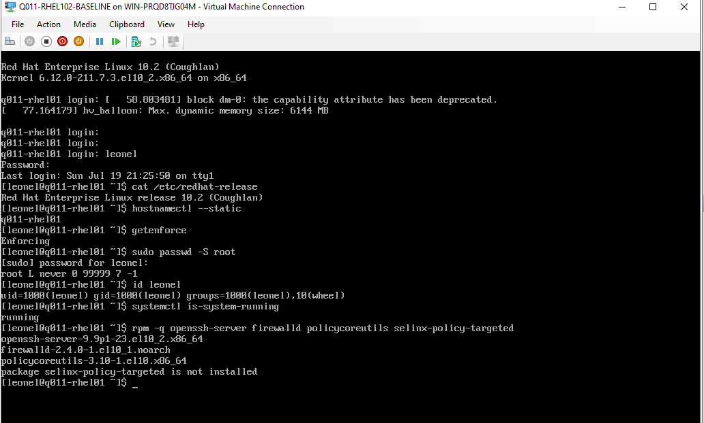

The service follow-up proves `sshd` and `firewalld` enabled and active plus a
successful firewalld configuration check. The empty sudo prompt contains no
credential value.

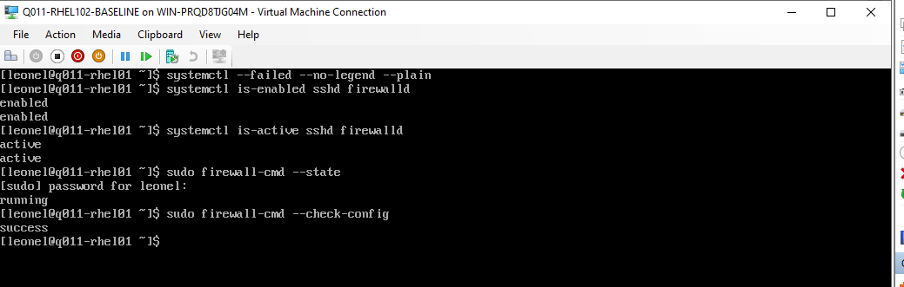

## Guarded Network Investigation

The preflight capture proves the first attachment stopped because the operator
confirmation gate was false.

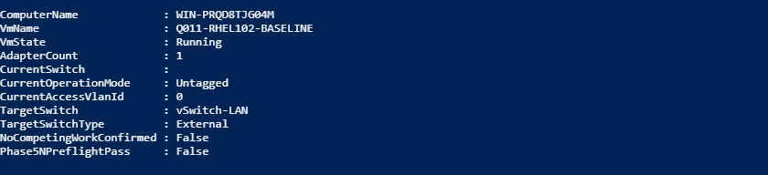

The disconnected guest discovery proves one existing `eth0` NetworkManager
profile and an unavailable device before attachment.

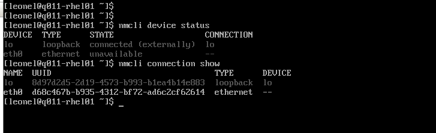

The journal capture proves a fresh DHCP transaction produced
`172.16.70.52`, followed by cancellation and no lease after disconnection.

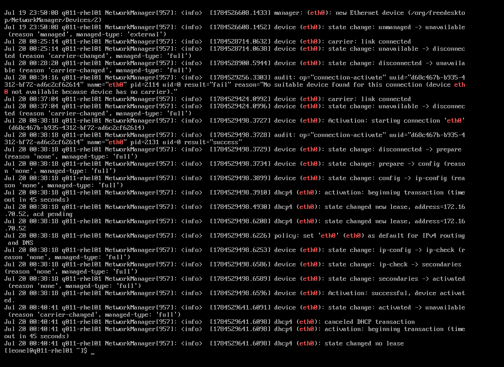

The DHCP option capture names `172.16.70.1` as the unexpected server and
router for `172.16.70.52`.

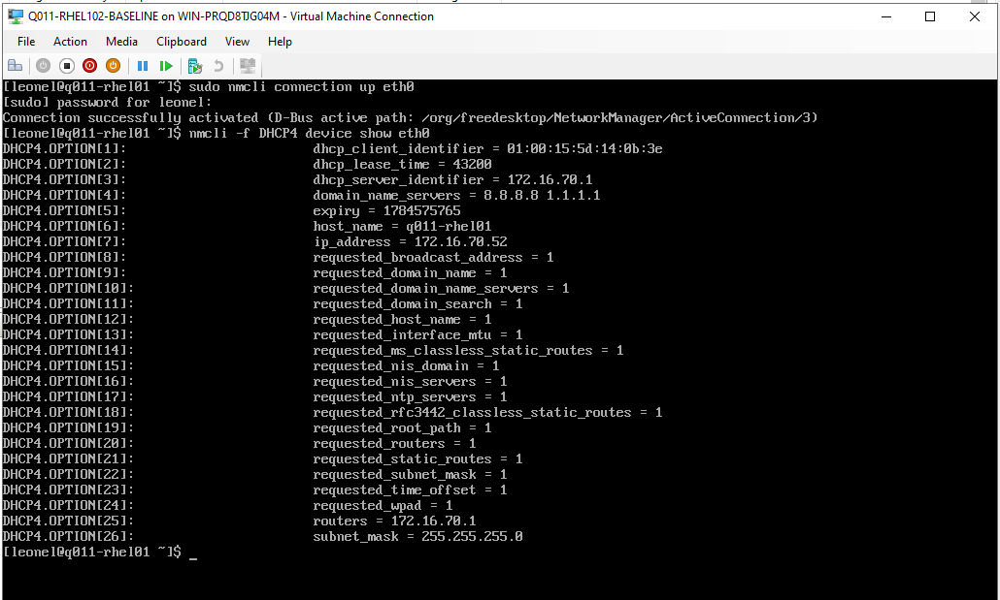

After the ASA was user-confirmed Off, the corrected capture proves OPNsense
issued `192.168.70.140/24` with server, router, and DNS `192.168.70.1`.

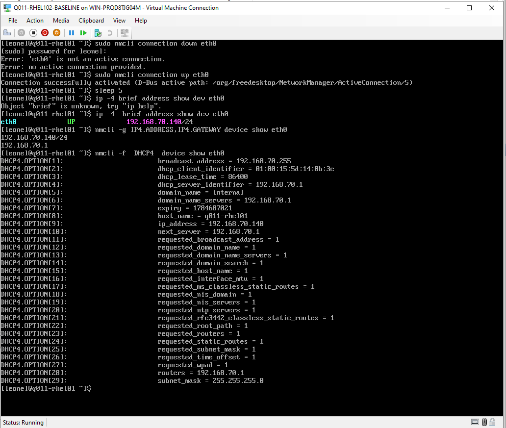

The Windows 11 terminal capture proves one interactive SSH login as `leonel`
and guest hostname `q011-rhel01`. It is supporting evidence because the empty
password prompt remains visible.

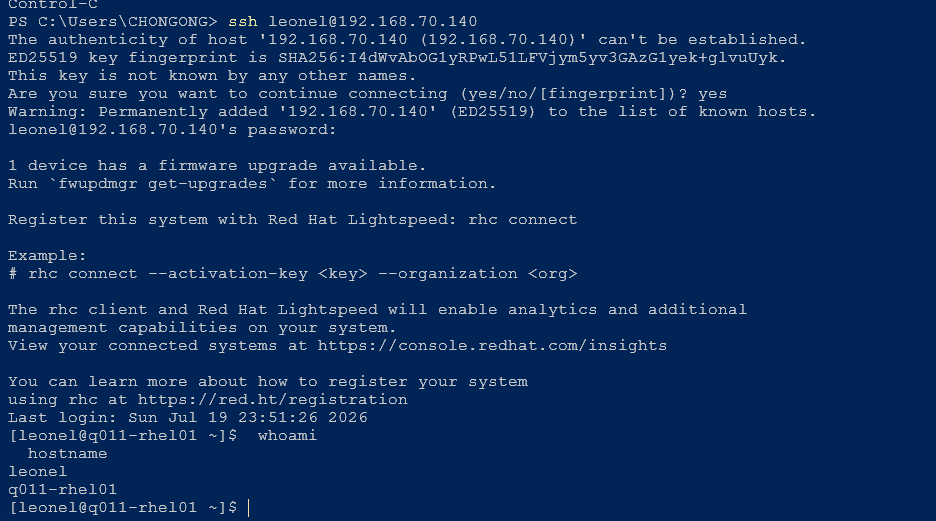

## Clean Service Baseline

The first SSH baseline capture includes an empty sudo prompt and is retained
only to preserve the operator sequence.

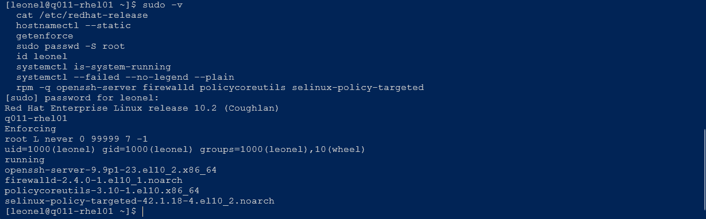

The clean repeat proves RHEL 10.2, hostname, SELinux, locked root, wheel,
running health, zero failed-unit rows, and installed package versions.

The security-service capture proves `sshd` and `firewalld` enabled and active,
the public-zone policy, and effective SSH authentication settings.

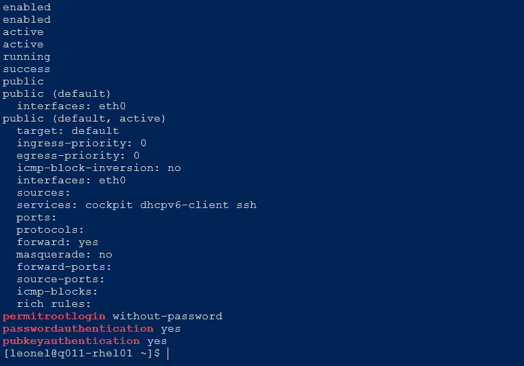

The listener and policy capture proves TCP 22 on IPv4 and IPv6, SELinux
Enforcing, and exact SSH/SELinux configuration hashes.

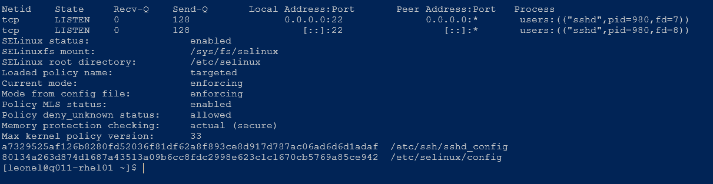

The storage and registration capture proves the active corrected lease, LVM
layout, root filesystem, absent consumer certificate, and unregistered state.

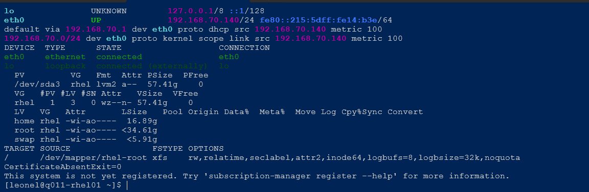

## Final Isolation

The final host capture proves normal shutdown returned Q011 to Off,
disconnected, VLAN zero, DVD-empty, checkpoint-free state with
`Phase5EndStatePass=True`.

