# Q011 Phase 6 Visual Walkthrough

All images were reviewed for credentials, tokens, consumer UUIDs,
organization identifiers, authenticated URLs, unrelated windows, and public
address leakage. No credential value is visible. Images containing an empty
password prompt are retained as supporting evidence rather than the primary
README proof.

## Phase 6A Preflight

<strong>Proof:</strong> The host result proves the correct Off,
disconnected, VLAN-zero, DVD-empty, checkpoint-free starting state, the ASA-Off
operator confirmation, and <code>Phase6PreflightPass=True</code>.

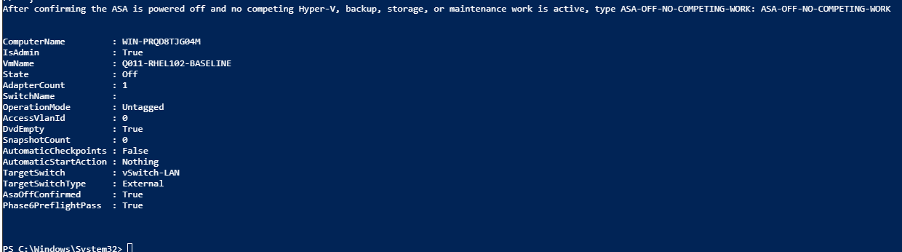

## Phase 6B VLAN 70 Attachment And DHCP

<strong>Proof:</strong> The local console shows the existing profile
activated with <code>192.168.70.140/24</code> and DHCP server, gateway, and DNS
<code>192.168.70.1</code>. The empty sudo prompt contains no password value.

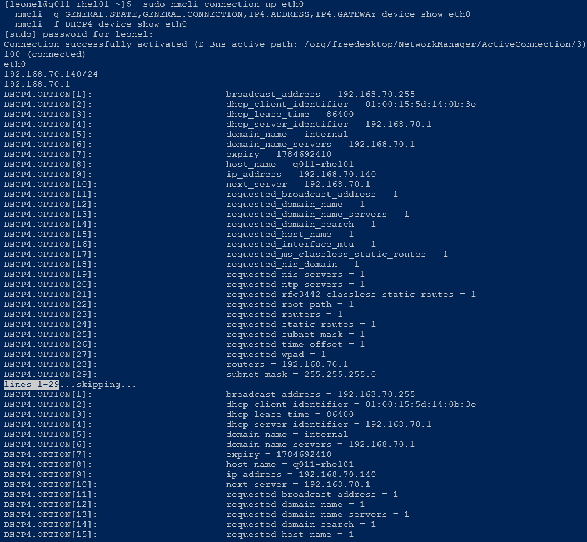

<strong>Proof:</strong> The SSH session proves <code>leonel</code> reached
<code>q011-rhel01</code> and observed the expected address.

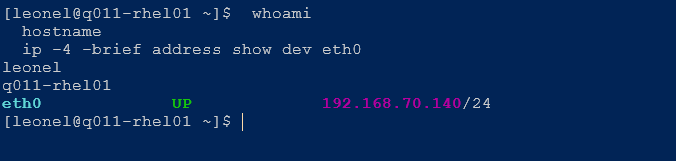

## Phase 6C-R Reservation Precheck And Creation

<strong>Proof:</strong> The Dnsmasq Hosts search returned no reservation for
Q011's MAC before the change; the table itself had zero entries.

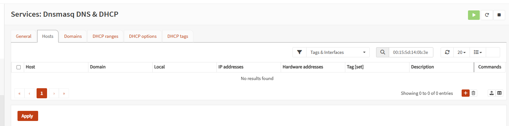

<strong>Proof:</strong> The active VLAN 70 lease maps Q011's MAC and hostname
to <code>192.168.70.140</code>.

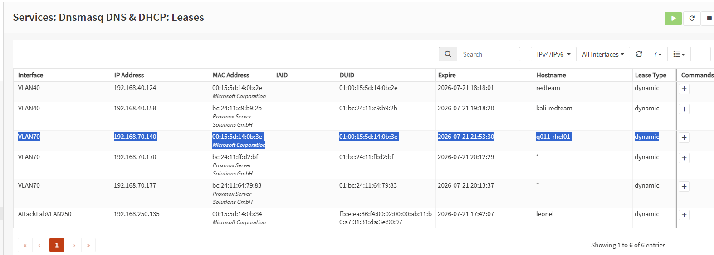

<strong>Proof:</strong> The Hosts table contains exactly one Q011 mapping
with the approved hostname, IP address, and hardware address and no tags or
domain changes.

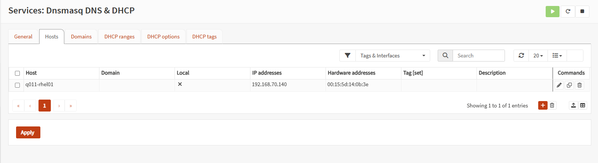

## Automatic-Activation Failure And Containment

<strong>Proof:</strong> After reboot, <code>eth0</code> had link state but no
IPv4 address until the existing profile was manually activated. This capture
prevents the earlier reboot from being mislabeled as automatic persistence.

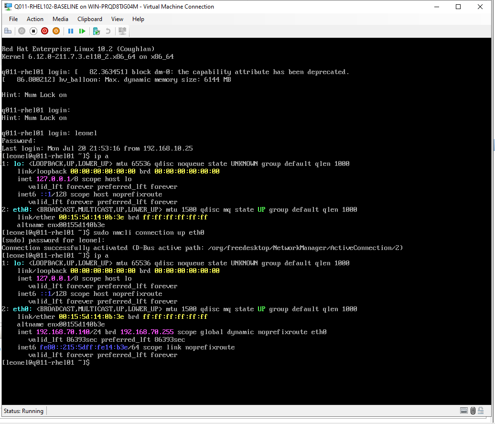

<strong>Proof:</strong> SSH and the expected DHCP values returned after the
manual recovery. This is recovery proof, not automatic-start proof.

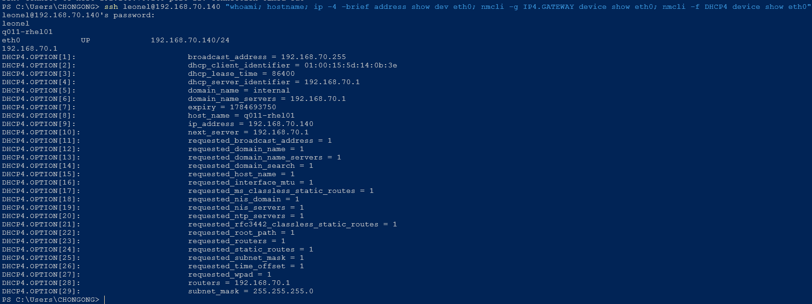

## Phase 6C-A Automatic Activation Correction

<strong>Proof:</strong> The existing profile now shows only the approved
<code>connection.autoconnect=yes</code> change while the interface remains
<code>eth0</code> and IPv4 method remains <code>auto</code>.

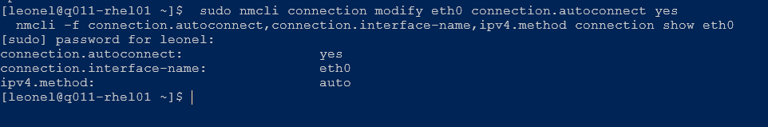

<strong>Proof:</strong> After a normal reboot, Windows 11 reached Q011 over
SSH without manual activation and observed autoconnect yes, reserved address
<code>192.168.70.140/24</code>, and OPNsense DHCP/gateway
<code>192.168.70.1</code>.

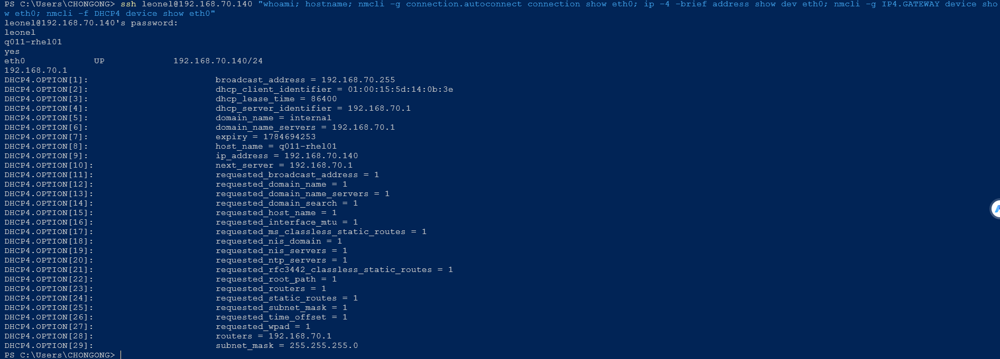

## Phase 6D Registration And Repositories

<strong>Proof:</strong> The sanitized output records only Boolean pass
results for registration and the required BaseOS/AppStream repositories. It
contains no Red Hat identity or credential value.

## Phase 6E Final Safe State

<strong>Proof:</strong> The host result proves Q011 is Off with one
disconnected Untagged VLAN-zero adapter, empty DVD, zero checkpoints, and
<code>Phase6EndStatePass=True</code>.

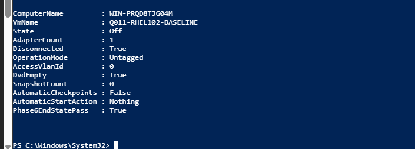
