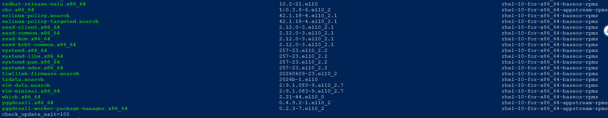
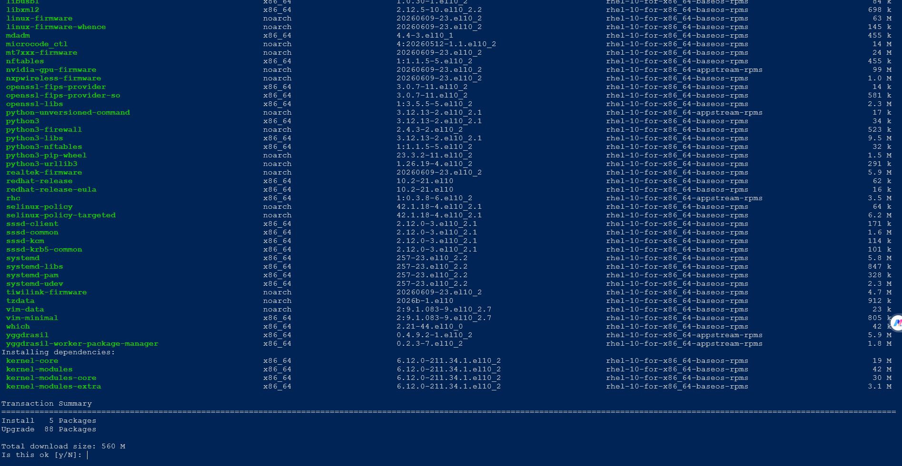
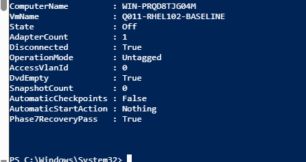

# Q011 Phase 7 — Visual Walkthrough

These five reviewed images preserve the actual stopped patching window. They
are evidence, not a backup, and they do not authorize a retry.

## Pre-Update Readiness

This compact capture proves the release, current and installed kernel,
Enforcing SELinux, healthy system/services, zero failed units, root-space gate,
registration, required repositories, and update-availability exit `100`. It
does not prove an update ran.

## Updates Available

The safe tail of `dnf check-update` proves intended BaseOS/AppStream updates
were available and the command returned `100`. It does not prove package
authenticity or installation.

## Transaction Reviewed Before Acceptance

The VMConnect capture shows only the approved repositories, five installs, 88
upgrades, 560 MiB, and the interactive `y/N` gate. No removal or downgrade is
shown. It does not prove the later GPG trust gate passed.

## GPG Stop And Unchanged History

The console result proves `upgrade_exit=1` and shows DNF history still ending
at transaction `1`, the original installation. The harmless pasted prose
error is visible. The key prompts themselves are preserved as searchable text
in the evidence record, not claimed as visible here.

## Safe Recovery End State

The host output proves Q011 is Off with one disconnected Untagged VLAN-zero
adapter, empty DVD, zero checkpoints, and `Phase7RecoveryPass=True`. It does
not prove patch success; no post-update screenshot exists.

