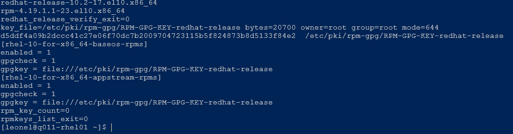
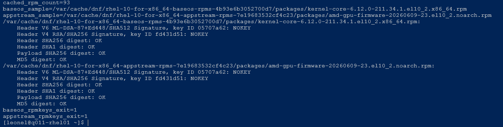
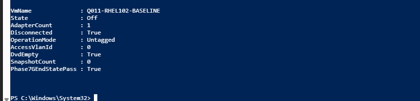

# Q011 Phase 7G — Visual Walkthrough

These three reviewed images preserve the read-only GPG trust diagnosis and
final isolation. They do not authorize a certificate import or DNF retry.

## Package-Owned Key And Repository State

This SSH capture proves the installed `redhat-release` package verifies, the
package-owned key file has the retained hash, both required repositories use
that file with GPG checking enabled, and the RPM trust database contains zero
certificates. It does not prove the file has been imported into RPM trust.

## Cached RPM Digests And Missing Signing Keys

This capture proves the repository-scoped BaseOS and AppStream samples both
have passing header and payload digests while RPM reports signing keys
`05707a62` and `fd431d51` as `NOKEY`. Exit `1` reflects missing trust, not a
failed payload digest. It does not authenticate every cached RPM.

## Safe Diagnostic End State

The final host result proves Q011 is Off with exactly one disconnected
Untagged VLAN-zero adapter, empty DVD, zero checkpoints, and
`Phase7GEndStatePass=True`. It does not prove the RPM trust issue is repaired.

