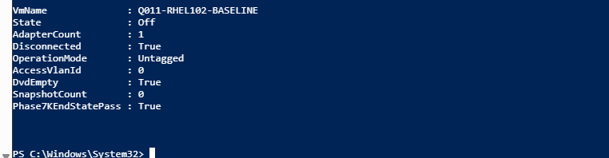

# Q011 Phase 7K — Visual Walkthrough

These three reviewed images preserve the exact RPM trust repair, sampled
signature validation, and final isolation. They do not prove that DNF ran or
that the guest is patched.

## Exact Packaged Red Hat Key Set

This SSH capture shows only the three intended Red Hat public-key entries,
their machine-readable handles, `post_key_handle_count=3`, and
`exact_key_set=true`. It contains no private key or credential value.

## Cached Signatures Authenticate

This capture shows the retained BaseOS and AppStream samples returning `OK`
for both observed signature schemes and every digest. Both `rpmkeys` commands
return exit `0`, and `Phase7KTrustPass=true`. It authenticates these two
samples only.

## Safe Trust-Repair End State

The final host result proves Q011 is Off with exactly one disconnected
Untagged VLAN-zero adapter, empty DVD, zero checkpoints, and
`Phase7KEndStatePass=True`. It does not prove a patch transaction occurred.

