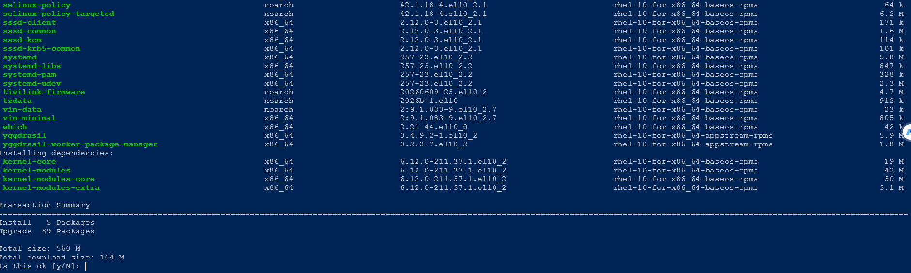
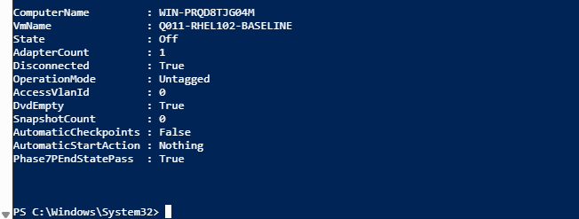

# Q011 Phase 7P — Visual Walkthrough

These four reviewed images preserve the supervised transaction, read-only
recovery from one evidence-capture typo, successful reboot validation, and
final isolation. They do not prove backup/restore or long-duration stability.

## Reviewed Package Proposal

This VMConnect capture shows the current BaseOS/AppStream proposal with five
installs, 89 upgrades, no removal or downgrade category, 560 MiB total, 104
MiB to download, and the new kernel dependencies. It proves operator review
before `y`; it does not prove the transaction completed.

## Successful Transaction Recovered From DNF History

The immediate shell exit assignment was lost after DNF displayed `Complete!`.
This clean recovered result uses read-only DNF history and RPM queries to prove
transaction `2`, `Return-Code=Success`, command `upgrade --refresh`, the new
candidate kernel, and `Phase7PTransactionPass=true`. It does not claim the
lost shell variable was captured.

## Newest Kernel And Controls Pass

This post-reboot SSH capture proves the running kernel equals the newest
installed kernel, system/services/SELinux/trust/registration/repositories all
pass, the final update check returns zero, and disposition is
`CurrentAtFinalCheck` with `Phase7PPostRebootPass=true`.

## Final Safe State

The elevated Hyper-V result proves Q011 is Off with one disconnected Untagged
VLAN-zero adapter, empty DVD, zero checkpoints, automatic checkpoints disabled,
Automatic Start Action Nothing, and `Phase7PEndStatePass=True`.

