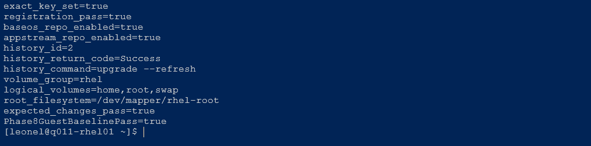

# Q011 Phase 8 — Visual Walkthrough

These three reviewed screenshots preserve the complete post-patch validation
sequence. The project README uses only the strongest control and final-state
images; this walkthrough retains the additional trust/history/storage proof.

## 1. Post-Patch Stable Controls

The compact SSH result proves RHEL 10.2, `q011-rhel01`, running/latest kernel
alignment, locked root, `leonel` wheel membership, healthy system/services,
zero failed units, SELinux Enforcing, the corrected SSH hash comparison, and
all three Phase 8 guest gates passing.

## 2. Intended Trust, History, And Storage Changes

The second SSH result proves the exact RPM trust set, registration, required
repositories, successful DNF history transaction `2`, the original LVM
layout, and both expected-change and combined guest gates passing.

## 3. Final Hyper-V Isolation

The elevated host result proves Q011 is Off with one disconnected Untagged
VLAN-zero adapter, empty DVD, zero checkpoints, automatic checkpoints
disabled, Automatic Start Action Nothing, and `Phase8EndStatePass=True`.

## Claim Boundary

The images prove the displayed Phase 8 controls and final state. They do not
prove backup/restore, hardened SSH policy, complete package inventory, an
actually replayed rebuild, long-duration stability, or production readiness.
Exact hashes are in the
[Phase 8 screenshot manifest](q011-phase8-screenshots.sha256).
