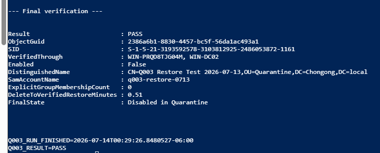

# Q003 — AD Recycle Bin Test-Object Restore

- **Status:** ✅ Complete — 2026-07-14
- **Risk:** `LIVE-LOW`
- **Owner:** Windows Server Business Admin Labs
- **Parent project:** [Project 11 — Backup, Restore, and Disaster Recovery](../)
- **Queue dependency:** Q002 complete
- **Completion rule:** I restore and verify one deliberately created test object without affecting a real identity.

## Why I Am Doing This

I am using one disposable, disabled Active Directory test identity to prove
that I can recover an accidentally deleted object safely. This is a small
recovery exercise, not permission to delete an existing user, group, computer,
or OU.

Q003 has its own page because it is an early master-queue recovery proof. It
uses part of Project 11, but it does not start or claim completion of the full
Project 11 backup and disaster-recovery project, which remains Q037.

## Queue Placement

| Position | Work | Status |
|---|---|---|
| Immediate safety preemption | U0-RUNNER-R01 local review package | Complete — 2026-07-13; local patch and parity package ready, with no push or runner change |
| Previous numbered item | Q002 backup coverage and restore plan | Complete — 2026-07-13 |
| This item | Q003 AD Recycle Bin test-object restore | Complete — same GUID restored through both DCs in 0.51 minutes |
| Next item | Q004 test-GPO backup and restore | Next — ready for scope, rollback, and approval planning |

## Where The Q003 Record Lives

This folder is the permanent Q003 home. I keep the readable project story on
this page and the detailed evidence in the linked files:

| Material | Planned location |
|---|---|
| Scope, RPO/RTO, pre-checks, recovery floor, rollback, and stop conditions | [Change window](docs/q003-change-window.md) and [rollback plan](docs/q003-rollback-plan.md) |
| Sanitized PowerShell transcript and before/after results | [Passing precheck](evidence/q003-precheck-2026-07-14.txt) and [complete execution transcript](evidence/q003-sanitized-transcript.txt) |
| Screenshot plan and reviewed screenshots | [Screenshot plan](docs/q003-screenshot-plan.md) and [final PASS screenshot](screenshots/phase5-02-q003-both-dc-verification.png) |
| Final verification, cleanup, lessons, roles, and queue handoff | [Plain-language closeout](evidence/q003-closeout.md) |

I did not create empty evidence claims or broken screenshot links. Each linked
file now exists.

## What I Did

| Phase | Work | Current state |
|---|---|---|
| 1 | Write the exact test-object scope, change window, script, and rollback ladder | Complete — 2026-07-13 |
| 2 | Run fresh read-only checks for Recycle Bin, DC health, replication, test OU, naming, and recovery-point readiness | Complete — `Q003_PRECHECK=PASS` on 2026-07-14; [sanitized evidence](evidence/q003-precheck-2026-07-14.txt) |
| 3 | Review the named disposable-object exception and obtain Leonel's dated approval | Complete — exact token `Q003-20260714-LEONEL` recorded 2026-07-14 |
| 4 | Create, baseline, delete, and restore only the approved disabled test object | Complete — exact GUID `2386a6b1-8830-4457-bc5f-56da1ac493a1` |
| 5 | Verify restored identity, attributes, location, replication, and absence of impact to real identities | Complete — both DCs agreed; `Q003_RESULT=PASS` |
| 6 | Confirm the object remains disabled in Quarantine, review evidence, and close Q003 | Complete — Claude independently reviewed the full transcript; [closeout](evidence/q003-closeout.md) |

## Final Screenshot

  

*The same restored GUID was verified through both domain controllers. The
account remained disabled in Quarantine, and the run ended
`Q003_RESULT=PASS`.*

## Claude And Codex Review

Claude independently challenged the original assumptions and found four
material gaps: Quarantine was referenced but not documented, the delete must
be pinned to a captured GUID, deleted-object lifetime must be read separately
from tombstone lifetime, and both DCs must verify the same restored object.
I verified those findings against Microsoft cmdlet documentation and built
them into the change window and script.

I did not accept Claude's suggestion to delete the object again as routine
rollback. The safer retained state is disabled in Quarantine; a second delete
would add risk without proving more recovery value.

The script passed a Windows PowerShell parser check with zero errors. Early
attempts stopped safely on the wrong workstation and an unreachable Tailscale
path. LAN SSH later worked, and Leonel ran the final precheck from the
authenticated PDC console so both-DC AD queries used his existing domain
session. The sanitized transcript ends `Q003_PRECHECK=PASS`.

The precheck also exposed two useful implementation details. A historical DNS
replication record had `FailureCount=0`, so I changed the script to distinguish
history from a current failure. Both DCs returned native status `234` for clean
`repadmin /showrepl ... /errorsonly` output, so I added a narrow, documented
exception that still requires structured headers, no failed result, clean
partner metadata, and a zero-failure replication summary. Claude approved both
corrections. No AD mutation occurred during this precheck and troubleshooting
work; the later live phase changed only the approved disposable test user.

## My Safety Boundary

- I will never use a real identity for this exercise.
- I will not restore a domain-controller checkpoint.
- I will not modify either default Group Policy object.
- I will stop if DC health, replication, Recycle Bin scope, backup readiness,
  object identity, permissions, or the test OU differs from the approved plan.
- The standing no-delete rule remains in force for all existing AD objects.
  This change window named one disposable object and received a narrow, dated
  exception before its deliberate delete/restore step.
- After verification, I kept the restored object disabled in Quarantine rather
  than deleting it again.

## What I Approved And Provided

I did not need to write the documentation or invent the commands. My job was
to:

1. review the named test object, OU, backup, rollback, stop conditions, and
   proposed recovery targets;
2. approve or reject the narrow disposable-object exception;
3. provide a dated approval for the exact live change window;
4. enter a credential manually only if the approved executor cannot proceed
   without it;
5. decide whether to stop or retry if an unexpected condition appears; and
6. review the final proof before approving completion, commit, and push.

Codex prepared the project documentation and independently verified the proof.
Claude provided the Windows-side challenge, script review, evidence transfer,
and independent transcript review. Neither assistant approved its own live
change. The [closeout](evidence/q003-closeout.md) explains each role in plain
language.

## Evidence Required Before I Mark Q003 Complete

- Dated approval and executor identity.
- Fresh pre-check and recovery-point evidence.
- Exact test-object name, distinguished name, and captured safe attributes.
- Delete and `Restore-ADObject` results for only that object.
- Positive verification on both domain controllers where applicable.
- Negative verification that no real identity, privileged membership, default
  policy, or production service was affected.
- Measured start/end time against the approved RTO.
- Cleanup/quarantine result, redaction review, lessons, and Q004 handoff.

All required evidence now exists. The readable result, role breakdown, safety
outcome, lessons, and technical links are in the
[Q003 closeout](evidence/q003-closeout.md).
