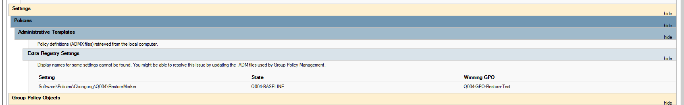
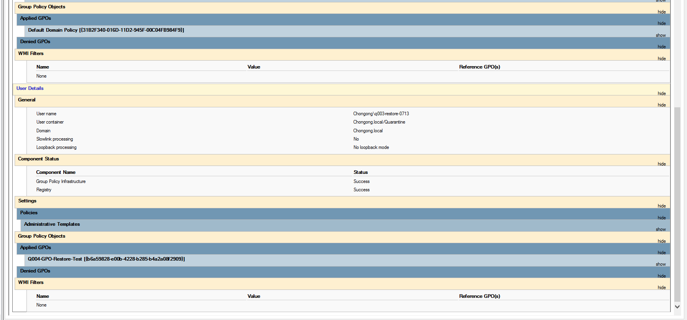

# Q004 — Test-GPO Backup And Restore

- **Status:** ✅ Complete — 2026-07-14
- **Queue ID:** `Q004 / SIM-B3-GPO-RESTORE`
- **Risk:** `LIVE-LOW` under two exact dated approvals
- **Owner:** Windows Server Business Admin Labs
- **Parent project:** [Project 11 — Backup, Restore, and Disaster Recovery](../)

## Why This Matters

A bad Group Policy change can affect many users or computers at once. Before I
begin Project 05 security-baseline work, I want proof that I can return one
test policy to a known backup without touching either default policy or a
production OU.

Q004 uses one custom GPO, the existing Quarantine OU—which currently has no
direct GPO link—and Group Policy Modeling. It does not run `gpupdate`, move a
computer, enable a user, or apply a policy to a production workstation.

## Portfolio Summary

**Situation:** The domain currently has only the two default GPOs, while later
Windows security work needs a tested rollback method.

**Task:** Back up the current GPO set, create and back up one disposable GPO,
inject a harmless test-only change, restore the exact known-good backup, and
use RSoP planning data to prove the restored setting would win.

**Action:** I backed up all three GPOs present during the test, faulted only the
disposable custom GPO, restored its exact known-good backup, proved the
restored marker with Group Policy Modeling, then removed its link and object.

**Result:** PASS. The restore completed in 0.1 minutes. Final verification
found only the two canonical default GPOs, no Quarantine link, no enabled
Quarantine user, and clean replication on both DCs.

## How To Read This Project

| Reader | Start here |
|---|---|
| Hiring manager or non-technical reader | [Portfolio Summary](#portfolio-summary), [What I Proved](#what-i-proved), and [Screenshot Evidence](#screenshot-evidence) |
| Technical reviewer | [Sanitized transcript](evidence/q004-sanitized-transcript.txt), [GPO reports](evidence/reports/), [RSoP report](evidence/reports/q004-rsop-modeling.html), and [PowerShell script](scripts/q004-gpo-backup-restore.ps1) |
| Future operator | [Change window](docs/q004-change-window.md), [rollback plan](docs/q004-rollback-plan.md), and [closeout](evidence/q004-closeout.md) |

## My Test Boundary

| Item | Value used |
|---|---|
| GPO | `Q004-GPO-Restore-Test` |
| Link target | `OU=Quarantine,DC=Chongong,DC=local` |
| Setting | `HKCU\Software\Policies\Chongong\Q004\RestoreMarker` |
| Baseline / fault | `Q004-BASELINE` / `Q004-FAULT-INJECTED` |
| Modeling user | Existing disabled `q003-restore-0713` |
| Modeling computer location | `OU=Workstations,OU=ManagedComputers,DC=Chongong,DC=local` |
| Backup root | Existing `C:\GPO-Backups` directory |

Before execution, I required the precheck to prove that every user anywhere in
the Quarantine subtree was disabled before the GPO could be linked.

## Phase Status

| Phase | Work | Status |
|---:|---|---|
| 0 | Queue/dependency/review-lock reconciliation | Complete |
| 1 | Domain, GPO, OU, module, storage, and replication discovery | Complete |
| 2 | Simulation and evidence design | Complete |
| 3 | Backup, change window, rollback, and stop conditions | Complete |
| 4 | Create/configure custom GPO | Complete |
| 5 | Back up and inject harmless fault | Complete after contained resume |
| 6 | Restore exact test-GPO backup | Complete — 0.1 minutes |
| 7 | Group Policy Modeling / RSoP verification | Complete |
| 8 | Unlink/remove only the disposable GPO | Complete |
| 9 | Evidence, review, state propagation, closeout | Complete |

## Why I Kept The Test GPO During Restore

The older parent Project 11 example deleted the test GPO before calling
`Restore-GPO`. Current Microsoft documentation says the PowerShell cmdlet
fails when the original GPO no longer exists. I therefore tested the
supported rollback path: keep the disposable GPO, inject a bad value, and
restore the exact backup by `BackupId`. Deleted-GPO recovery through GPMC
Manage Backups is a separate exercise.

## What I Proved

- `Backup-GPO -All` records both canonical default GPOs without restoring them.
- The disposable GPO receives a separate known-good backup ID.
- The fault marker is observed, then the same GPO GUID returns to the baseline
  marker within 30 minutes.
- Default-policy IDs, versions, and modification times remain unchanged.
- The link is limited to Quarantine, is not enforced, and no user in that
  subtree is enabled.
- Group Policy Modeling names the custom GPO as the winning source for the
  restored marker.
- Cleanup removes only the test link and custom GPO; backup/evidence remain.

## Technical Evidence

- [Read-only discovery](evidence/q004-read-only-discovery-2026-07-14.txt)
- [Read-only precheck attempts](evidence/q004-precheck-2026-07-14.txt)
- [Claude pre-execution review](evidence/q004-claude-preexecution-review-2026-07-14.md)
- [Execute attempt 1 incident](evidence/q004-execute-attempt1-incident-2026-07-14.md)
- [Sanitized execution transcript](evidence/q004-sanitized-transcript.txt)
- [Backup inventory](evidence/q004-backup-inventory.txt)
- [Run state](evidence/q004-run-state.json)
- [SHA-256 evidence manifest](evidence/q004-evidence-manifest.sha256)
- [Baseline report](evidence/reports/q004-baseline.xml)
- [Fault report](evidence/reports/q004-fault.xml)
- [Restored report](evidence/reports/q004-restored.xml)
- [RSoP modeling report](evidence/reports/q004-rsop-modeling.html)
- [Final live state](evidence/q004-final-live-state-2026-07-14.txt)
- [Closeout](evidence/q004-closeout.md)
- [Claude final evidence review](evidence/q004-claude-final-review-2026-07-14.md)
- [Simulation run sheet](docs/q004-simulation-run-sheet.md)
- [Change window](docs/q004-change-window.md)
- [Contained-state resume addendum](docs/q004-resume-addendum-2026-07-14.md)
- [Rollback plan](docs/q004-rollback-plan.md)
- [Evidence plan](docs/q004-evidence-plan.md)
- [Fail-closed script](scripts/q004-gpo-backup-restore.ps1)

## Screenshot Evidence

### Restored Marker And Winning GPO

<strong>Proof:</strong> Group Policy Modeling shows <code>Q004-BASELINE</code> and names the restored disposable GPO as the winning source.

### Isolated Modeling Scope

<strong>Proof:</strong> The model uses the disabled Quarantine test user, reports successful Group Policy processing, and applies only the captured test-GPO GUID.

## What Happens Next

Q004 is closed. The disposable GPO and Quarantine link are absent, both default
policies passed unchanged guards, and the retained backups/evidence remain at
the dated run path. Q005 / SIM-B4-VM-RESTORE is the next queue item; this
closeout does not start or authorize it.
